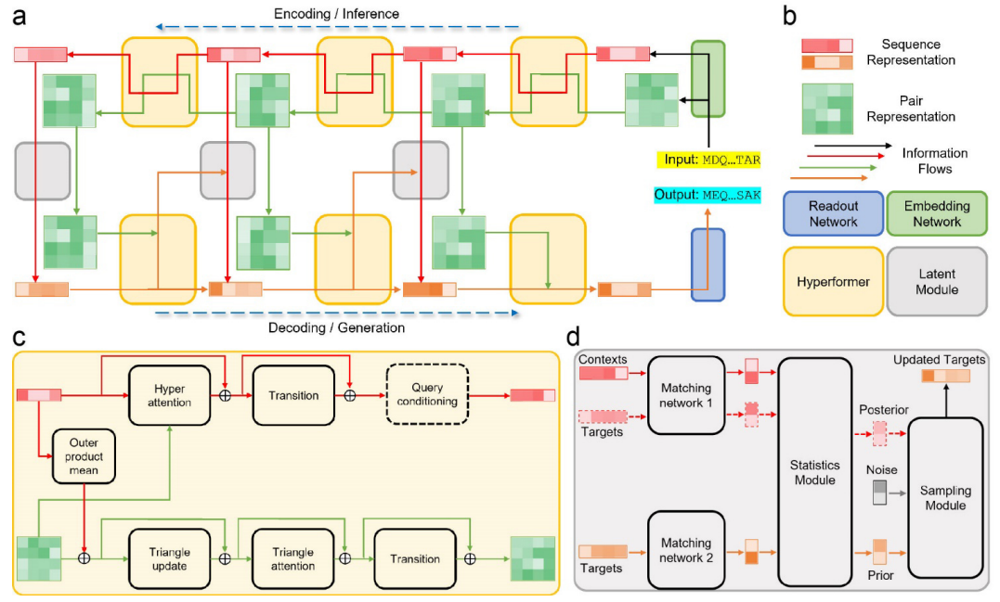

# MEGAProtein

## 模型介绍

MEGA-Protein是由高毅勤老师团队与MindSpore科学计算团队共同开发的蛋白质结构预测工具。克服了[AlphaFold2](https://www.nature.com/articles/s41586-021-03819-2)数据前处理耗时过长，缺少MSA时预测精度不准确，缺乏通用评估结构质量工具的问题。

MEGA-Protein主要由蛋白质结构预测工具MEGA-Fold，MSA生成修正工具MEGA-EvoGen，蛋白质结构评分工具MEGA-Assessment三部分共同组成。

### 蛋白质结构预测工具MEGA-Fold

MEGA-Fold的网络模型部分与AlphaFold2相同，在数据预处理的多序列对比环节采用了[MMseqs2](https://www.biorxiv.org/content/10.1101/2021.08.15.456425v1.full.pdf)进行序列检索，相比于原版端到端速度提升2-3倍；同时借助内存复用大幅提升内存利用效率，同硬件条件下支持更长序列的推理（基于32GB内存的Ascend910运行时最长支持3072长度序列推理）。

### MSA生成修正工具MEGA-EvoGen

MSA生成修正工具MEGA-EvoGen能显著提升单序列的预测速度，并且能够在MSA较少（few shot）甚至没有MSA（zero-shot，即单序列）的情况下，帮助MEGA-Fold/AlphaFold2等模型维持甚至提高推理精度，突破了在「孤儿序列」、高异变序列和人造蛋白等MSA匮乏场景下无法做出准确预测的限制。MEGA-EvoGen的模型构架图如下。



### 蛋白质结构评分工具MEGA-Assessment

蛋白质结构评分工具MEGA-Assessment可以评价蛋白质结构每个残基的准确性以及残基-残基之间的距离误差，同时可以基于评价结果对蛋白结构作出进一步的优化。

## 数据集

MEGA-Fold训练数据集为[PSP蛋白质结构数据集](http://ftp.cbi.pku.edu.cn/psp/)，数据集大小为1.6TB，解压后为25TB。
MEGA-Assessment训练数据集为PSP数据集中的[PSP lite](http://ftp.cbi.pku.edu.cn/psp/psp_lite/)。

```shell
.
└─PSP
  ├─true_structure_dataset
  | ├─pkl
  | | └─256 pkl packages
  | ├─pdb
  | | └─256 pdb packages
  | └─true_structure_data_statistics_729.json
  ├─distillation_dataset
  | ├─pkl
  | | └─256 pkl packages
  | ├─pdb
  | | └─256 pdb packages
  | └─distill_data_statistics_729.json
  ├─new_validation_dataset
  | ├─pkl.tar.gz
  | ├─pdb.tar.gz
  | └─nv_data_statistics.json
  └─psp_lite
    ├─true_structure_mini
    | ├─pkl
    | | └─32 pkl packages
    | └─true_structure_mini.pdb.tar.gz
    └─distillation_mini
      ├─pkl
      | └─32 pkl packages
      └─distillation_mini.pdb.tar.gz
```

## 如何使用

mindsponge.PipeLine中分别提供了三个模型的推理流程，在使用时，可将氨基酸序列输入MEGA-EvoGen中获取该蛋白的特征，将特征输入MEGA-Fold中进行蛋白质的结构预测，最后将蛋白质特征与结构信息共同输入MEGA-Assessment中进行打分评估。以CASP14蛋白质T1082-D1为例，整体推理流程如下所示。

```bash
import numpy as np
import mindspore as ms
from mindsponge import PipeLine

ms.set_context(mode=ms.GRAPH_MODE)

# MEGA-EvoGen推理获取蛋白质生成MSA后的特征
fasta = "GYDKDLCEWSMTADQTEVETQIEADIMNIVKRDRPEMKAEVQKQLKSGGVMQYNYVLYCDKNFNNKNIIAEVVGE"
msa_generator = PipeLine(name="MEGAEvoGen")
msa_generator.set_device_id(0)
msa_generator.initialize(key="evogen_predict_256")
msa_generator.model.from_pretrained()
msa_feature = msa_generator.predict(fasta)

# MEGA-Fold推理获取蛋白质结构信息
fold_prediction = PipeLine(name="MEGAFold")
fold_prediction.set_device_id(0)
fold_prediction.initialize(key="predict_256")
fold_prediction.model.from_pretrained()
final_atom_positions, final_atom_mask, aatype, _, _ = fold_prediction.model.predict(msa_feature)

# MEGA-Assessment对蛋白质结构进行评价
protein_assessment = PipeLine(name = "MEGAAssessment")
protein_assessment.set_device_id(0)
protein_assessment.initialize("predict_256")
protein_assessment.model.from_pretrained()
msa_feature['decoy_aatype'] = np.pad(aatype, (0, 256 - aatype.shape[0]))
msa_feature['decoy_atom_positions'] = np.pad(final_atom_positions, ((0, 256 - final_atom_positions.shape[0]), (0, 0), (0, 0)))
msa_feature['decoy_atom_mask'] = np.pad(final_atom_mask, ((0, 256 - final_atom_mask.shape[0]), (0, 0)))

res = protein_assessment.predict(msa_feature)
print("score is:", np.mean(res))
```

### 使用场景

MEGAEvoGen，MEGAFold，MEGAAssessment均支持多种不同场景下的不同输入格式进行推理，详情如下：

为方便说明使用场景，默认下载好config文件，通过修改内置参数的方式选择不同场景，用户使用时也可按照如下方式执行，若未提前下载config文件，可通过替换样例内代码的方式下载的同时进行config的修改与加载。

- MEGAEvoGen

  - 序列作为输入，样例如下：

  ```bash
  from mindsponge import PipeLine
  from mindsponge.common.config_load import load_config

  fasta = "GYDKDLCEWSMTADQTEVETQIEADIMNIVKRDRPEMKAEVQKQLKSGGVMQYNYVLYCDKNFNNKNIIAEVVGE"
  msa_generator = PipeLine(name="MEGAEvoGen")

  # 未获取config文件时，执行如下两行命令即可自动下载config文件，之后所有案例同理替换，仅提供代码样例，不做相同说明
  # from mindsponge.pipeline.pipeline import download_config
  # conf = download_config(msa_generator.config["evogen_predict_256"], msa_generator.config_path + "evogen_predict_256.yaml")

  conf = load_config({YOUR_CONFIG_PATH})
  conf.use_pkl = False
  msa_generator.initialize(conf=conf)
  msa_generator.model.from_pretrained()
  feature = msa_generator.predict(fasta)
  print(feature.shape, feature.dtype)
  ```

  - 序列搜索MSA后所获得的pickle文件作为输入，样例如下：
  
  ```bash
  import pickle
  from mindsponge import PipeLine

  with open({YOUR_PICKLE_PATH}, "rb") as f:
      data = pickle.load(f)
  msa_generator = PipeLine(name="MEGAEvoGen")

  # from mindsponge.pipeline.pipeline import download_config
  # conf = download_config(msa_generator.config["evogen_predict_256"], msa_generator.config_path + "evogen_predict_256.yaml")

  conf = load_config({YOUR_CONFIG_PATH})
  conf.use_pkl = True
  msa_generator.initialize(conf=conf)
  msa_generator.model.from_pretrained()
  feature, mask = msa_generator.predict(data)
  print(feature.shape, feature.dtype)
  ```

- MEGAFold

  - 使用搜索后所得pickle文件作为输入，样例如下：

  ```bash
  import pickle
  import mindspore as ms
  from mindsponge import PipeLine
  ms.set_context(mode=ms.GRAPH_MODE)

  with open({YOUR_PICKLE_PATH}, "rb") as f:
      feature = pickle.load(f)
  fold_prediction = PipeLine(name="MEGAFold")
  fold_prediction.set_device_id(0)
  fold_prediction.initialize(key="predict_256")
  fold_prediction.model.from_pretrained()
  protein_structure = fold_prediction.predict(feature)
  print(protein_structure)
  ```

  - 单序列进行MSA检索并进行推理（完整流程），其中MSA检索配置请参考之前所提供指令。检索完成后使用pickle进行推理场景与上述另一场景完全相同，不重复提供代码。

  - 后续MEGAFold会支持将蛋白质序列与template作为输入，不提供MSA进行推理的场景。

- MEGAAssessment

  - MEGAAssessment仅支持序列搜索所得pickle文件和MEGAFold推理所得pdb作为输入单场景，样例如下：

  ```bash
  import pickle
  import numpy as np
  from mindspore import context
  from mindsponge import PipeLine
  from mindsponge.common.config_load import load_config
  from mindsponge.common.protein import from_pdb_string

  protein_assessment = PipeLine(name="MEGAAssessment")
  protein_assessment.set_device_id(0)

  # from mindsponge.pipeline.pipeline import download_config
  # conf = download_config(protein_assessment.config["predict_256"], protein_assessment.config_path + "predict_256.yaml")

  conf = load_config({YOUR_CONFIG_PATH})
  protein_assessment.initialize(key="predict_256")
  protein_assessment.model.from_pretrained()

  # load raw feature
  f = open({YOUR_PICKLE_PATH}, "rb")
  raw_feature = pickle.load(f)
  f.close()

  # load decoy pdb
  with open({YOUR_PDB_PATH}, 'r') as f:
      decoy_prot_pdb = from_pdb_string(f.read())
      f.close()
  raw_feature['decoy_aatype'] = decoy_prot_pdb.aatype
  raw_feature['decoy_atom_positions'] = decoy_prot_pdb.atom_positions
  raw_feature['decoy_atom_mask'] = decoy_prot_pdb.atom_mask

  res = protein_assessment.predict(raw_feature)
  print("score is:", np.mean(res))
  ```

## 训练过程

Pipeline中提供了MEGAFold和MEGAAssessment两个模型的训练代码。MEGAFold的训练集为PSP数据集，MEGAAssessment的训练集为PSP lite数据集。

MEGAFold的训练样例代码如下所示：

```bash
import mindspore as ms
from mindsponge import PipeLine

ms.set_context(mode=ms.GRAPH_MODE)

pipe = PipeLine(name="MEGAFold")
pipe.set_device_id(0)
pipe.initialize(key="initial_training")
pipe.train({YOUR_DATA_PATH}, num_epochs=1)
```

MEGAAssessment的训练样例代码如下所示：

```bash
from mindsponge import PipeLine

pipe = PipeLine(name="MEGAAssessment")
pipe.set_device_id(0)
pipe.initialize(key="initial_training")
pipe.train({YOUR_DATA_PATH}, num_epochs=1)
```

## 使用限制

在使用模型前，推荐进行数据库检索配置。

- 配置MSA检索

  首先安装MSA搜索工具**MMseqs2**，该工具的安装和使用可以参考[MMseqs2 User Guide](https://mmseqs.com/latest/userguide.pdf)，安装完成后运行以下命令配置环境变量：

  ``` shell
  export PATH=$(pwd)/mmseqs/bin/:$PATH
  ```

  然后下载MSA所需数据库：

  - [uniref30_2103](http://wwwuser.gwdg.de/~compbiol/colabfold/uniref30_2103.tar.gz)：压缩包68G，解压后375G
  - [colabfold_envdb_202108](http://wwwuser.gwdg.de/~compbiol/colabfold/colabfold_envdb_202108.tar.gz)：压缩包110G，解压后949G

  下载完成后需解压并使用MMseqs2处理数据库，数据处理参考[colabfold](http://colabfold.mmseqs.com)，主要命令如下：

  ``` bash
  tar xzvf "uniref30_2103.tar.gz"
  mmseqs tsv2exprofiledb "uniref30_2103" "uniref30_2103_db"
  mmseqs createindex "uniref30_2103_db" tmp1 --remove-tmp-files 1

  tar xzvf "colabfold_envdb_202108.tar.gz"
  mmseqs tsv2exprofiledb "colabfold_envdb_202108" "colabfold_envdb_202108_db"
  mmseqs createindex "colabfold_envdb_202108_db" tmp2 --remove-tmp-files 1
  ```

- 配置MSA检索加速(可选)

    下载MSA加速缓存工具：
    - [FoldMSA.tar.gz](https://download.mindspore.cn/mindscience/mindsponge/msa_tools/Fold_MSA.tar.gz)：按照工具内说明操作进行MSA搜索加速。

- 配置模板检索

  首先安装模板搜索工具[**HHsearch**](https://github.com/soedinglab/hh-suite)
  与[**kalign**](https://msa.sbc.su.se/downloads/kalign/current.tar.gz)，然后下载模板检索所需数据库：

  - [pdb70](http://wwwuser.gwdg.de/~compbiol/data/hhsuite/databases/hhsuite_dbs/old-releases/pdb70_from_mmcif_200401.tar.gz)：压缩包19G，解压后56G
  - [mmcif database](https://ftp.rcsb.org/pub/pdb/data/structures/divided/mmCIF/)： 零散压缩文件～50G，解压后～200G，需使用爬虫脚本下载，下载后需解压所有mmcif文件放在同一个文件夹内。
  - [obsolete_pdbs](http://ftp.wwpdb.org/pub/pdb/data/status/obsolete.dat)：140K

  *数据库下载网站均为国外网站，下载速度可能较慢，需要自行配置VPN*。

  - 配置数据库检索config

  根据数据库安装情况配置`config/data.yaml`中数据库搜索的相关配置`database_search`，相关参数含义如下：

  ```bash
  # configuration for template search
  hhsearch_binary_path   HHsearch可执行文件路径
  kalign_binary_path     kalign可执行文件路径
  pdb70_database_path    pdb70文件夹路径
  mmcif_dir              mmcif文件夹路径
  obsolete_pdbs_path     PDB IDs的映射文件路径
  max_template_date      模板搜索截止时间，该时间点之后的模板会被过滤掉，默认值"2100-01-01"
  # configuration for Multiple Sequence Alignment
  mmseqs_binary          MMseqs2可执行文件路径
  uniref30_path          uniref30文件夹路径
  database_envdb_dir     colabfold_envdb_202108文件夹路径
  a3m_result_path        mmseqs2检索结果(msa)的保存路径，默认值"./a3m_result/"
  ```

## 引用

- 结构预测工具MEGA-Fold与训练数据集PSP

```bash
@misc{https://doi.org/10.48550/arxiv.2206.12240,
doi = {10.48550/ARXIV.2206.12240},
url = {https://arxiv.org/abs/2206.12240},
author = {Liu, Sirui and Zhang, Jun and Chu, Haotian and Wang, Min and Xue, Boxin and Ni, Ningxi and Yu, Jialiang and Xie, Yuhao and Chen, Zhenyu and Chen, Mengyun and Liu, Yuan and Patra, Piya and Xu, Fan and Chen, Jie and Wang, Zidong and Yang, Lijiang and Yu, Fan and Chen, Lei and Gao, Yi Qin},
title = {PSP: Million-level Protein Sequence Dataset for Protein Structure Prediction},
publisher = {arXiv},
year = {2022},
copyright = {Creative Commons Attribution 4.0 International}
}
```

- MSA生成修正工具MEGA-EvoGen

```bash
@article{zhang2022few,
    title={Few-shot learning of accurate folding landscape for protein structure prediction},
    author={Zhang, Jun and Liu, Sirui and Chen, Mengyun and Chu, Haotian and Wang, Min and Wang, Zidong and Yu, Jialiang and Ni, Ningxi and Yu, Fan and Chen, Diqing and others},
    journal={arXiv preprint arXiv:2208.09652},
    year={2022}
  }
```