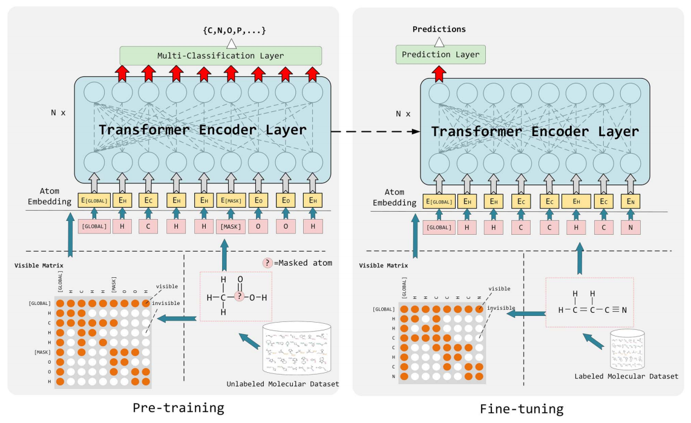

# MG-BERT

## 模型介绍

MG-BERT(Molecular-Graph-BERT)是分子性质预测模型。MG-BERT将GNN集成到BERT中，提出了分子图BERT（MG-BERT）模型，利用非监督学习的方式学习小分子的原子表示，之后再将该预训练模型应用到分子属性预测下游任务中。

图神经网络存在一个缺陷，在学习时容易变得过平滑，即无论特征矩阵的初始状态如何，多次卷积后，同一连通分量内所有节点的特征都趋于一致。在模型中将GNN与BERT结合，克服了过平滑的问题，使得模型具备提取深层特征的能力。并且MG-BERT可以通过BERT的attention机制关注目标性质相关的原子和子结构。MG-BERT的网络架构如下所示：



MG-BERT与BERT存在一些不同点：

1. 在embedding layer，word token变成了atom token，由于分子中的原子没有顺序关联，因此不需要指定位置信息。

2. global attention变为了local attention based on chemical bonds。在自然语言句子中，一个单词可能与其他任何单词相关，但是在分子中，原子主要通过化学键与相邻原子相关联，因此，在模型中使用邻接矩阵来控制分子中的交换信息。

3. 为每个分子添加了可以连接到所有原子的超节点(supernode)，一方面，超节点可以与其他节点交换信息，在一定程度上解决了长距离依赖问题。另一方面，超节点可以被视为最终分子表示，用于解决下游任务。

MG-BERT的训练共分为两个阶段：

1. 预训练（pre-train）阶段，使用非监督学习让MG-BERT学习小分子的原子表示，输入无标签的小分子SMILES式，对输入分子中的原子进行mask并且进行预测。

2. 微调（fine-tune）阶段，基于第一阶段的预训练模型，输入带有标签的小分子数据进行训练，预测小分子的性质，完成分类和回归任务。

## 数据集

预训练阶段所使用数据集为ChEMBL数据库，从中随机抽取数据库中170万个化合物作为训练数据，数据集可从[此处](https://ftp.ebi.ac.uk/pub/databases/chembl/ChEMBLdb/releases/chembl_31/)下载。

微调阶段使用从ADMETlab和MoleculeNet中收集的16个数据集对MG-BERT进行训练和评估，共包含8个用于回归任务的数据集，8个用于分类任务的数据集。将数据集按8：1：1的比列分为训练、验证和测试数据集。并使用SMILES长度分层抽象，使数据集的分裂更加均匀。回归和分类所用数据集可从[此处](https://gitee.com/lytgogogo/project_data/tree/master/data)下载。

## 如何使用

MG-BERT支持分类任务和回归任务推理，输入为txt文件，在文件中存放小分子SMILES式即可。

分类任务推理代码如下所示：

```bash
from mindsponge import PipeLine

data = {YOUR_TXT_PATH}
pipe = PipeLine(name="MGBert")
pipe.set_device_id(0)
pipe.initialize("mgbert_classification")
pipe.model.from_pretrained()
pipe.predict(data)
```

回归任务推理代码如下所示：

```bash
from mindsponge import PipeLine

data = {YOUR_TXT_PATH}
pipe = PipeLine(name="MGBert")
pipe.set_device_id(0)
pipe.initialize("mgbert_regression")
pipe.model.from_pretrained()
pipe.predict(data)
```

## 训练过程

MG-BERT共提供了3种训练，预训练，分类任务的微调，回归任务的微调。

预训练代码如下所示：

```bash
from mindsponge import PipeLine

pipe = PipeLine(name="MGBert")
pipe.initialize("mgbert_pretrain")
result = pipe.train({YOUR_DATA_PATH}+"chembl_31_chemreps.txt",num_epochs=1)
```

分类任务微调代码如下所示：

```bash
from mindsponge import PipeLine

pipe = PipeLine(name="MGBert")
pipe.initialize("mgbert_classification")
result = pipe.train({YOUR_DATA_PATH}+'Pgp_sub.txt',num_epochs=1)
```

回归任务微调代码如下所示：

```bash
from mindsponge import PipeLine

pipe = PipeLine(name="MGBert")
pipe.initialize("mgbert_regression")
result = pipe.train({YOUR_DATA_PATH}+'logS.txt',num_epochs=1)
```

## 引用

```bash
@article{zhang2021mg,
  title={MG-BERT: leveraging unsupervised atomic representation learning for molecular property prediction},
  author={Zhang, Xiao-Chen and Wu, Cheng-Kun and Yang, Zhi-Jiang and Wu, Zhen-Xing and Yi, Jia-Cai and Hsieh, Chang-Yu and Hou, Ting-Jun and Cao, Dong-Sheng},
  journal={Briefings in bioinformatics},
  volume={22},
  number={6},
  pages={bbab152},
  year={2021},
  publisher={Oxford University Press}
}
```
