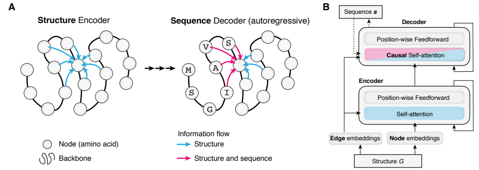
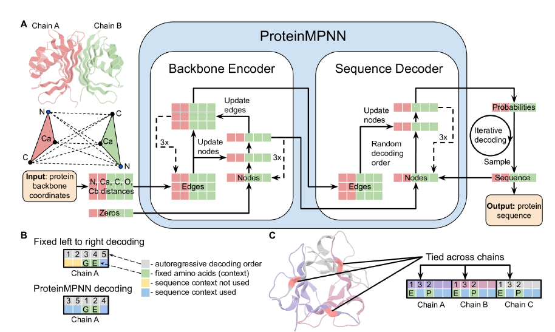

# ProteinMPNN

## 模型介绍

ProteinMPNN是一种基于深度学习的蛋白质序列设计方法，给定一个蛋白质的backbone结构，预测能折叠成该结构的氨基酸序列。ProteinMPNN模型利用不同位置的氨基酸序列可以在单链或多链之间耦合，使其能够应用在当前的蛋白质设计中，其广泛适用于单体、环状低聚物、蛋白质纳米颗粒等设计。

ProteinMPNN的原始网络架构源于[Structure Transformer](https://proceedings.neurips.cc/paper/2019/file/f3a4ff4839c56a5f460c88cce3666a2b-Paper.pdf)，并且在其基础上做了进一步的修改。

Structure Transformer的构架如下所示：



ProteinMPNN主要做了如下几点改进：

1. 新增全原子距离信息，引入N, CA, CB, C, O的距离信息并进行采样，将距离转化为16种特征向量，使得每一个残基都有5个原子，对应的边的特征向量shape为 $5 \times 5 \times 16$ 。

2. MPNN在decoder中引入随机位点的解码机制（随机打乱顺序），而非传统地语言模型按顺序的进行N->C序列设计。

3. 在同源多聚体的任务中，同一位点的氨基酸可以被偶联被同时解码。

4. 训练时引入主链的高斯噪音，增强模型的泛化能力，同时让模型更加关注整体的拓扑结构信息而不是过度关注局部环境的信息。

ProteinMPNN使用了3层encoder，3层decoder和128层隐藏层，ProteinMPNN结构如下所示：



## 使用限制

ProteinMPNN暂未提供大批量原始数据处理脚本，因此模型暂不支持训练。但是支持使用单个蛋白质PDB文件作为输入进行推理。

## 如何使用

本模型中支持使用单个蛋白质PDB文件作为输入进行氨基酸序列预测，样例代码如下所示：

```bash
from mindsponge import PipeLine

pipe = PipeLine(name = "Proteinmpnn")
pipe.set_device_id(0)
pipe.initialize("proteinmpnnpredict")
pipe.model.from_pretrained()
res = pipe.predict({YOUR_PDB_PATH})
print(res)
```

## 引用

```bash
@article{dauparas2022robust,
  title={Robust deep learning--based protein sequence design using ProteinMPNN},
  author={Dauparas, Justas and Anishchenko, Ivan and Bennett, Nathaniel and Bai, Hua and Ragotte, Robert J and Milles, Lukas F and Wicky, Basile IM and Courbet, Alexis and de Haas, Rob J and Bethel, Neville and others},
  journal={Science},
  volume={378},
  number={6615},  
  pages={49--56},
  year={2022},
  publisher={American Association for the Advancement of Science}
}
```
