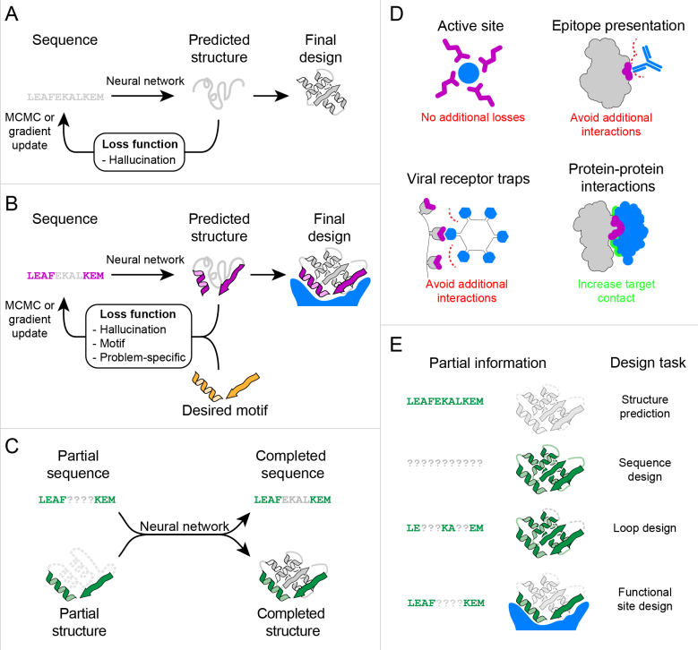

# ColabDesign

## 模型介绍

对于一个骨架结构位置坐标已知但氨基酸种类未知的蛋白质，假定它的长度为n，该序列共有20的n次方种可能性，然而自然界中现存的蛋白质样本只占这庞大集合中的一小部分，难以通过遍历的方式筛选到合理的氨基酸序列。因此，蛋白质设计任务即为通过计算的方式，找到可以形成该pdb结构的蛋白质氨基酸序列。

ColabDesign是蛋白质设计模型，通过输入蛋白质骨架坐标的pdb文件，基于蛋白质结构预测模型来预测整个蛋白质序列，被称为Hallucination and Inpainting。

通常设计具有某种特定功能的蛋白质共需要2个步骤：

- 识别特定功能的可能活性位点的几何形状与氨基酸种类，如酶的活性位点，蛋白抑制剂等。
- 设计一个包含这些特定活性位点的氨基酸序列，并折叠成对应三维结构。

步骤2为ColabDesign主要解决的问题，用固定位点或者骨架作为输入，产生完整序列。

最早对该项目进行探索的方法为[trDesign](https://www.biorxiv.org/content/10.1101/2020.07.23.218917v1.abstract)，使用了trDesign和Rosetta结合的方式。之后[Hallucination](https://www.nature.com/articles/s41586-021-04184-w)基于trDesign，借鉴了DeepDream模型，以Hallucination+trDesign的设计方式进一步提升了效果。在融合功能[Motif](https://www.biorxiv.org/content/10.1101/2020.11.29.402743v1.abstract)设计方法出现之后，将trDesign和Hallucination相结合，解决了对预先生成的scaffold数据库的依赖问题。

在这之后，ColabDesign以RoseTTAFold为核心进行实验，在AlphaFold2上进行交叉验证，基于这两个模型的Hallucination被称为“RFdesign”和“AFdesign”。RoseTTAFold显式地利用了三维结构坐标，相比trRosetta只利用二维特征信息，它有着更多地信息来定义各类loss，解决更多之前不可解决的问题，大幅提升了实验精度。



A图为Free hallucination，将序列传入trRosetta或者RoseTTAFold预测3D结构，使用MCMC迭代优化loss函数来产生序列。B图为Constrained hallucination，使用与A图相同的方式，但是loss函数除了结构信息之外还包含了Motif重述和其他特定任务信息。C图为缺失信息恢复任务，通过输入部分序列或者部分结构信息来补齐完整序列或结构。D图为可以通过约束幻觉和相应的损失函数，即本文的方法来解决的设计问题。E图为本文方法概览，本文中的蛋白质设计挑战为多种场景下的缺失信息恢复任务。

## 使用限制

该Pipeline中的ColabDesign与最初的ColabDesign不同，没有基于RoseTTAFold和AlphaFold 2，而是基于MEGA-Protein实现了Hallucination和fixbb两个功能。

该模型目前只支持推理，即输入蛋白质pdb文件，输出设计后地氨基酸序列。暂未提供模型训练方法与训练数据集。

## 如何使用

可使用PDB文件作为模型推理输入，样例代码如下所示：

```bash
from mindsponge import PipeLine

pipe = PipeLine(name = "ColabDesign")
pipe.set_device_id(0)
pipe.initialize("fold_design")
pipe.model.from_pretrained()
res = pipe.predict({YOUR_PDB_PATH})
print(res)
```

## 引用

```bash
@article{wang2021deep,
  title={Deep learning methods for designing proteins scaffolding functional sites},
  author={Wang, Jue and Lisanza, Sidney and Juergens, David and Tischer, Doug and Anishchenko, Ivan and Baek, Minkyung and Watson, Joseph L and Chun, Jung Ho and Milles, Lukas F and Dauparas, Justas and others},
  journal={BioRxiv},
  pages={2021--11},
  year={2021},
  publisher={Cold Spring Harbor Laboratory}
}
```
