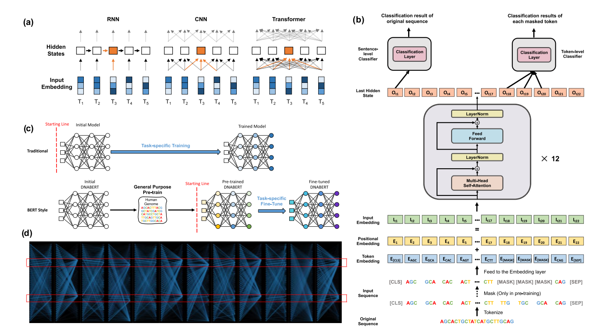

# DNABERT

## 模型介绍
DNABERT 是基于基因组中 DNA 语言的预训练双向编码器表示模型。其主要目标是破译非编码 DNA 的语言，这在基因组研究中具有重要意义。由于基因调控机制的复杂性，传统的信息学方法在数据稀缺的情况下难以捕捉同义多义性和远距离语义关系。

DNABERT 模型通过结合上下文捕获 DNA 序列的整体语义，表现出在启动子、剪接位点和转录因子结合位点预测任务上的先进性能。经过简单微调后，DNABERT 能够在多个下游任务中取得优异表现。更重要的是，DNABERT 还可以用于直接可视化输入序列中的核苷酸水平的重要性和语义关系，从而提高可解释性。预训练的 DNABERT 模型甚至可以应用于其他生物体的基因组分析，并保持卓越的性能。



## 训练过程

### 预训练
- 使用 6-mer 掩码方法进行预训练
- 数据集：人类参考基因组
- 任务：对掩码部分进行预测

### 微调
- 在启动子序列预测任务上进行微调
- 任务类型：Sentence-Level 二分类

## 数据
- **预训练数据**：使用人类参考基因组数据集，下载链接：[预训练数据集](https://github.com/jerryji1993/DNABERT/tree/master/examples/sample_data/pre)，数据集放在 `pre` 文件夹下
- **微调数据**：使用未掩码的完整数据集，下载链接：[微调数据集](https://github.com/jerryji1993/DNABERT/tree/master/examples/sample_data/ft/6)，数据集放在 `data` 文件夹下
- **词汇表**：下载链接：[词汇表](https://huggingface.co/zhihan1996/DNA_bert_6/resolve/main/vocab.txt?download=true)，放在 `pre` 文件夹下
- **预训练模型权重**：下载链接：[模型权重](https://download-mindspore.osinfra.cn/mindscience/mindsponge/DNABert/checkpoint/)，与代码放在同一目录下

## 如何使用
代码位于`mindscience\MindSPONGE\src\mindsponge\pipeline\models\dnabert`中

### 预训练
1. 下载预训练数据和 `vocab.txt` 文件，确保环境配置完成
2. 运行 `pretrain.py` 开始预训练
3. 预训练模型权重默认保存在 `checkpoints` 文件夹下

### 微调
1. 下载微调数据和预训练模型权重
2. 运行 `finetune.py` 开始微调
3. 微调后的模型同样默认保存在 `checkpoints` 文件夹下
4. Training results for the first epoch: Validation Results: Accuracy: 97.8%, Avg loss: 0.076891
## 引用


```bibtex
@article{ji2021dnabert,
    author = {Ji, Yanrong and Zhou, Zhihan and Liu, Han and Davuluri, Ramana V},
    title = "{DNABERT: pre-trained Bidirectional Encoder Representations from Transformers model for DNA-language in genome}",
    journal = {Bioinformatics},
    volume = {37},
    number = {15},
    pages = {2112-2120},
    year = {2021},
    month = {02},
    issn = {1367-4803},
    doi = {10.1093/bioinformatics/btab083},
    url = {https://doi.org/10.1093/bioinformatics/btab083},
    eprint = {https://academic.oup.com/bioinformatics/article-pdf/37/15/2112/50578892/btab083.pdf},
}
