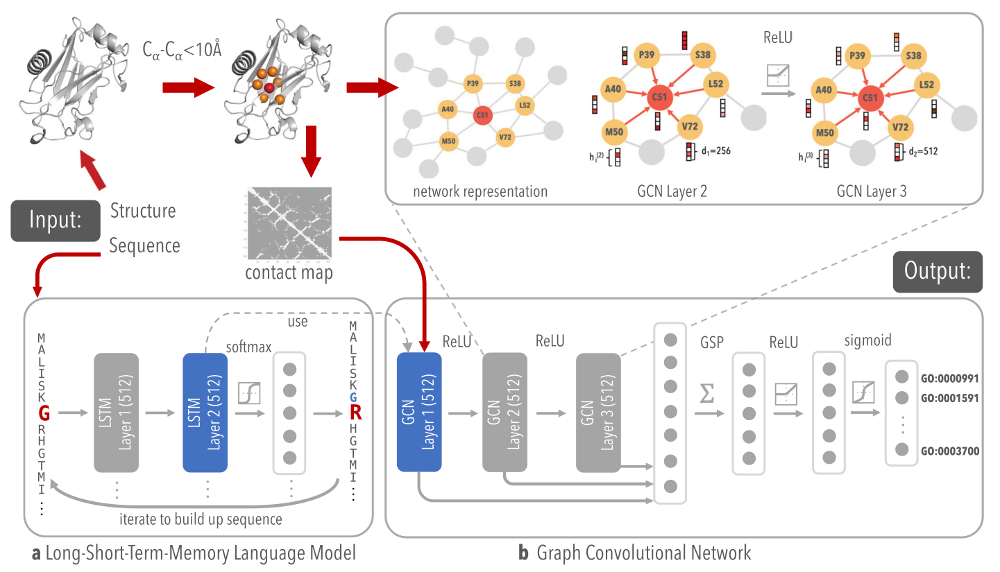

# DeepFRI

## 模型介绍

DeepFRI是一种图形卷积网络，通过利用从蛋白质语言模型和蛋白质结构中提取的序列特征来预测蛋白质功能。 它可以对蛋白质进行四个方面的预测： 分子功能（Molecular Function, MF）、细胞组分（Cellular Component, CC）、生物过程（Biological Process, BP）、EC编号（Enzyme Commission, EC）。

- MF、CC、BP是Gene Ontology（基因本体论）的三大独立的本体论词汇表。GO是一个国际标准化的基因功能分类体系， 提供了一套动态并可控的词汇表来全面描述生物体中基因和基因产物的属性，它由一组预先定义好的GO术语（GO term）组成，这组术语对基因产物的功能进行限定和描述。 GO terms是对基因的产物而不是基因本身进行描述，因为基因的产物有时候不止一种，而GO name则是该GO term的具体名称。 DeepFRI将输出MF、CC、BP对应的GO term与GO name。

- EC编号或EC号是酶学委员会（Enzyme Commission）为酶所制作的一套编号分类法，是以每种酶所催化的化学反应为分类基础。 这套分类法亦同时会为各种酶给予一个建议的名称，所以亦称为酶学委员会命名法。 针对EC，DeepFRI将直接输出其EC编号。



## 数据集

训练所用数据集分别为从PDB数据库和SWISS-MODEL数据库中挑选的条目构建的集合。选取带有注释的PDB链与SWISS-MODEL链，删除相同和相似的序列， 通过在95%序列同一性（即序列比对中残基总数中相同残基的数量）下对所有PDB链和SWISS-MODEL链（能够检索到contact map）进行聚类来创建非冗余集。

- PDB蛋白质结构数据库(Protein Data Bank,简称PDB)是美国Brookhaven国家实验室于1971年创建的，由结构生物信息学研究合作组织(Research Collaboratory for Structural Bioinformatics,简称RCSB)维护。

- SWISS-MODEL知识库是一个蛋白质3D结构数据库，库中收录的蛋白质结构都是使用SWISS-MODEL同源建模方法（homology-modelling）得来的。

## 使用限制

该模型基于SWISS-MODEL数据库中数据进行训练，但是由于数据集链接失效无法获取数据集，因此该模型在PipeLine中不提供训练功能。

## 如何使用

可使用PDB文件作为模型推理输入，通过改变初始化时所使用的key，即可选择不同的任务，样例代码如下所示：

```bash
import mindspore as ms
from mindsponge import PipeLine

ms.set_context(mode=ms.GRAPH_MODE)

pipe = PipeLine(name="DeepFri")
pipe.set_device_id(0)

# 可选任务共三种，MF，CC和BP
pipe.initialize(key="deepfri_mf")
# pipe.initialize(key="deepfri_cc")
# pipe.initialize(key="deepfri_bp")

pipe.model.from_pretrained()
result = pipe.predict({YOUR_PDB_PATH})
print(result)
```

## 引用

```bash
@article{gligorijevic2021structure,
  title={Structure-based protein function prediction using graph convolutional networks},
  author={Gligorijevi{\'c}, Vladimir and Renfrew, P Douglas and Kosciolek, Tomasz and Leman, Julia Koehler and Berenberg, Daniel and Vatanen, Tommi and Chandler, Chris and Taylor, Bryn C and Fisk, Ian M and Vlamakis, Hera and others},
  journal={Nature communications},
  volume={12},
  number={1},
  pages={3168},
  year={2021},
  publisher={Nature Publishing Group UK London}
}
```
