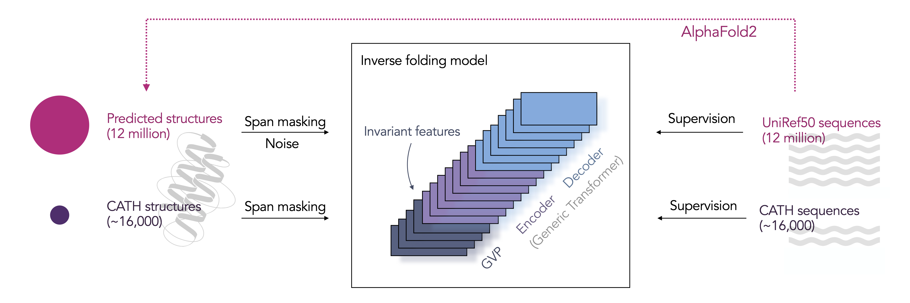
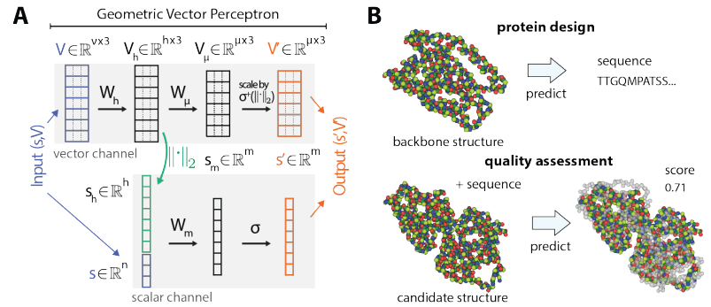

# ESM-IF1

## 模型介绍

ESM-IF1为反向折叠模型，通过蛋白质骨架的原子坐标预测蛋白质序列。论文将逆向折叠定义为sequence-to-sequence问题，并使用自回归的编码解码架构进行建模，论文中模型的任务是从蛋白质骨架坐标中预测出它的蛋白质序列，流程如下图所示：



设计出具有所需特性的蛋白质的氨基酸序列，称为从头蛋白质设计，是生物工程的核心挑战。近期，业界出现了一系列基于神经网络生成式模型来预测结构的序列或直接建模序列的方法。但是由于实验确定的蛋白质结构数量较少，已确定的结构对已知蛋白质序列空间的覆盖率不足0.1%，导致深度学习方法受到了很大的限制。

在ESM-IF1中，模型使用通过AlphaFold2对UniRef50中1200万蛋白质序列进行预测所获得的结构作为自己的训练数据，将训练集的规模增加了三个数量级。

论文中使用Geometric Vector Perceptron(GVP)层来学习向量特征的等变转换和标量特征的不变变换。共提供了GVP-GNN，GVP-GNN-large，由GVP-GNN结构编码器和通用Transformer组成的混合模型三种模型，GVP-GNN和GVP-Transformer都满足以下特征：给定输入坐标的旋转平移变换T，输出应该关于这些变换不变，GVP可参考[论文](https://arxiv.org/abs/2009.01411)，GVP模型结构如下：



## 数据集

ESM-IF1所使用数据集主要为CATH v4.3数据集，包含蛋白质序列信息以及骨架坐标。

| 文件名            | 大小  | 描述                                | Data URL                                                    |
| ----------------- | ----- | ----------------------------------- | ------------------------------------------------------------ |
| `chain_set.jsonl` | 512MB | CATH v4.3数据集蛋白质骨架坐标和序列 | [下载链接](https://dl.fbaipublicfiles.com/fair-esm/data/cath4.3_topologysplit_202206/chain_set.jsonl) |
| `splits.json`     | 197kB | CATH v4.3数据集划分                 | [下载链接](https://dl.fbaipublicfiles.com/fair-esm/data/cath4.3_topologysplit_202206/splits.json) |

## 如何使用

ESM-IF1支持使用单个pdb文件进行推理，推理过程如下：

```bash
from mindsponge import PipeLine
from mindsponge.common.config_load import load_config

pipe = PipeLine(name="ESM_IF1")
pipe.set_device_id(0)

# 第一次使用时未获取config文件，执行如下指令模型可自动下载config文件，后续使用可手动修改所需内容
# from mindsponge.pipeline.pipeline import download_config
# conf = download_config(pipe.config["sampling"], pipe.config_path + "sampling.yaml")
# pipe.initialize(conf=conf)

pipe.initialize(key="sampling")
pipe.model.from_pretrained()
res = pipe.predict(data={YOUR_PDB_PATH})
print(res)
```

## 训练过程

以论文中所提供训练集进行训练，模型训练方法如下：

```bash
from mindsponge import PipeLine

pipe = PipeLine(name="ESM_IF1")
pipe.set_device_id(0)
pipe.initialize("training")
pipe.train({YOUR_DATA_PATH}+"train_chain_set.jsonl", num_epochs=1)
```

## 引用

```bash
@InProceedings{pmlr-v162-hsu22a,
    title =    {Learning inverse folding from millions of predicted structures},
    author =   {Hsu, Chloe and Verkuil, Robert and Liu, Jason and Lin, Zeming and Hie, Brian and Sercu, Tom and Lerer, Adam and Rives, Alexander},
    booktitle = {Proceedings of the 39th International Conference on Machine Learning},
    pages =    {8946--8970},
    year =     {2022},
    editor =   {Chaudhuri, Kamalika and Jegelka, Stefanie and Song, Le and Szepesvari, Csaba and Niu, Gang and Sabato, Sivan},
    volume =   {162},
    series =   {Proceedings of Machine Learning Research},
    month =    {17--23 Jul},
    publisher =    {PMLR},
    pdf =      {https://proceedings.mlr.press/v162/hsu22a/hsu22a.pdf},
    url =      {https://proceedings.mlr.press/v162/hsu22a.html},
}
```
