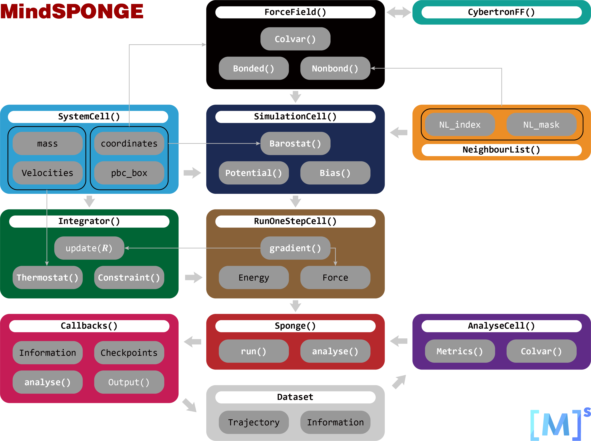
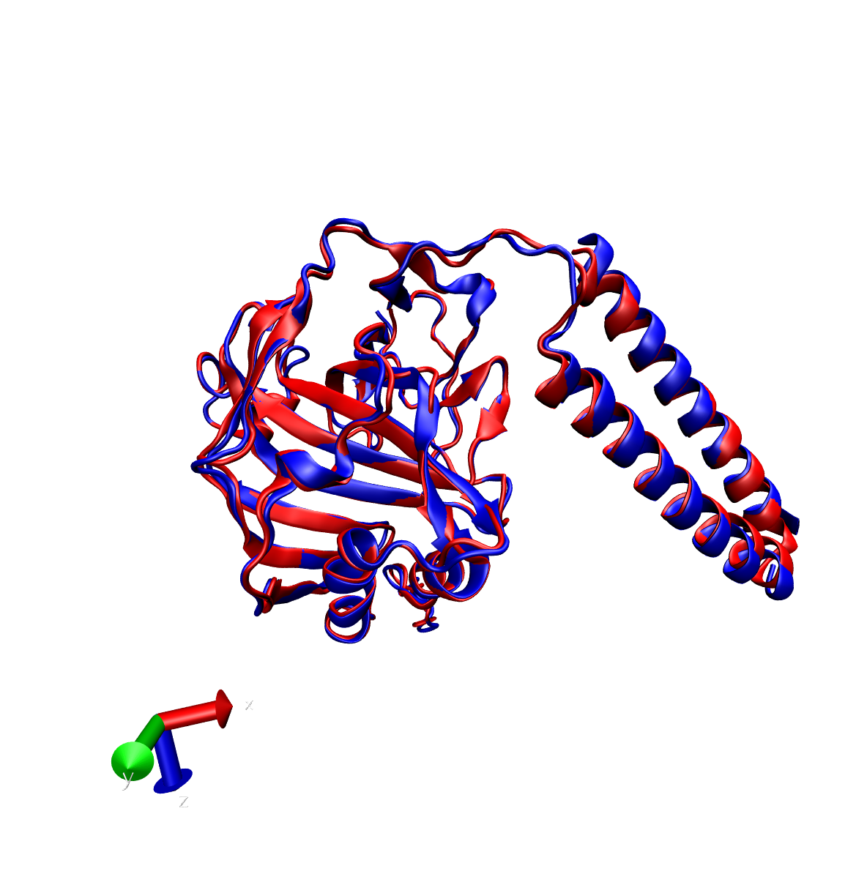

# 猴痘病毒蛋白的松弛

给定一个蛋白质分子，可以是预测的结果也可以是真实的结构，由于此时很大可能不是处于一个稳定态，
因此如果直接执行分子动力学模拟算法，步长稍大就有可能导致梯度爆炸的问题，
也就无法继续正常的执行分子动力学模拟。因此对蛋白质分子的前处理是必须的，
一般在执行分子动力学模拟之前，我们都需要对蛋白质分子执行能量最小化过程，也就是蛋白质松弛。
而MindSponge是基于MindSpore深度学习框架来实现的下一代分子动力学模拟平台，
正是得益于框架的兼容性（如下图所示），我们不仅可以用MindSponge来执行分子动力学模拟的任务，
还可以直接调用MindSpore原生的优化器来对蛋白质实现能量最小化的操作。



## 案例背景

这里为了演示MindSponge中蛋白质松弛的功能，我们选取了近期引起广泛关注的猴痘病毒中的一个蛋白片段`Q8V4Y0`作为示例。
猴痘是一种病毒性人畜共患病（一种从动物传播给人类的病毒），其症状与过去在天花患者中看到的症状非常相似，但在临床上不那么严重。
人间猴痘首次发现于1970年刚果民主共和国的一名9岁男童身上，但它不仅仅影响着非洲国家，还影响世界其他地区。
根据最新的数据显示，猴痘已经蔓延全球75个国家和地区，累计向世界卫生组织报告了超1.6万病例。
其中美国、西班牙、英国和法国所报告的猴痘病例，均超过了1000例。以下是世界卫生组织已经公布的关于猴痘的一些重要事实：

- 猴痘是由猴痘病毒引起的，该病毒是痘病毒科正痘病毒属的一种。
- 猴痘是一种病毒性人畜共患病，主要发生在中非和西非的热带雨林地区，偶尔输出到其它地区。
- 猴痘在临床上的典型表现为发热、皮疹和淋巴结肿大，并可能导致一系列并发症。
- 猴痘通常是一种自限性疾病，症状持续2至4周。可能会发生严重病例。近年来，病死率约为3-6%。
- 猴痘病毒通过与受感染的人或动物密切接触，或与被病毒污染的物体接触而传播给人类。
- 猴痘病毒通过密切接触皮肤损伤、体液、呼吸道飞沫和被褥等受污染物体在人与人之间传播。
- 猴痘的临床表现类似于天花，后者是一种相关的正痘病毒感染，于1980年在全球范围内宣布被消灭。猴痘的传染性不如天花，引起的疾病也没有那么严重。
- 在消灭天花的规划期间使用的疫苗对猴痘也有保护作用。已经研发出较新的疫苗，其中一种已被批准用于预防猴痘。
- 为治疗天花而开发的一种抗病毒药物也已获得许可用于治疗猴痘。

而猴痘病毒的核心蛋白之一：`E8L`，在病毒入侵宿主完成复制的过程中作为猴痘病毒的细胞表面结合蛋白与细胞表面的硫酸软骨素结合，
以提供病毒粒子附着在靶细胞上。因此，通过对E8L的分子动力学研究，我们可以进一步了解猴痘病毒与细胞相结合的机理，进而给出阻断方案。

## E8L蛋白松弛案例

E8L蛋白一共有304个氨基酸组成，以下是具体的序列信息：

```bash
>sp|Q8V4Y0|CAHH_MONPZ Cell surface-binding protein OS=Monkeypox virus (strain Zaire-96-I-16) OX=619591 GN=E8L PE=2 SV=1
MPQQLSPINIETKKAISDTRLKTLDIHYNESKPTTIQNTGKLVRINFKGGYISGGFLPNEYVLSTIHIYWGKEDDYGSNHLIDVYKYSGEINLVHWNKKKYSSYEEAKKHDDGIIIIAIF
LQVSDHKNVYFQKIVNQLDSIRSANMSAPFDSVFYLDNLLPSTLDYFTYLGTTINHSADAAWIIFPTPINIHSDQLSKFRTLLSSSNHEGKPHYITENYRNPYKLNDDTQVYYSGEIIRA
ATTSPVRENYFMKWLSDLREACFSYYQKYIEGNKTFAIIAIVFVFILTAILFLMSQRYSREKQN
```

我们只需要给定这样的一条序列，就可以使用基于MindSpore的蛋白质预测平台MEGAProtein对其结构进行预测，得到一个具备三维结构的蛋白质pdb文件。
一般生成出来的pdb文件不带氢原子，可以通过MindSponge给该pdb文件补氢，然后在MindSponge中对完整的蛋白质构象进行力场建模、
能量极小化以及分子动力学的模拟等一系列操作。如下图所示是一个E8L蛋白松弛的前后构象对比，其中蓝色表示松弛前的构象，红色表示松弛后的构象，
从该结构中我们可以看到松弛前后蛋白质二级结构的一些变化。



## 蛋白质松弛代码

因为蛋白质松弛背后所对应的能量极小化的算法是有多种多样的，还可以结合各种优化策略使用，并没有明确的数据显示哪一种优化策略具有明显的优势。
因此本节仅介绍基本的蛋白质松弛的操作，以及相应的常用接口，赋能MindSponge用户独立设计蛋白质松弛策略的能力。

### 创建一个蛋白质实例

MindSponge中既支持了Molecule分子层面的实例化，也支持了Protein这样封装好的蛋白质的实例化，可分别应用于不同的场景，比如这里我们使用的是蛋白质：

```python
from mindsponge import Protein
pdb_name = 'pdb/case2.pdb'
system = Protein(pdb=pdb_name)
```

### 力场建模

在构建好蛋白质实例之后，我们可以基于该实例所对应的系统，创建一个力场空间。一般场景下，在后续系统的演进过程中，力场空间总是保持不变的。

```python
from mindsponge import ForceField
energy = ForceField(system, 'AMBER.FF14SB')
```

### 设定优化器/积分器

MindSpore作为一个深度学习框架，内置了众多的优化器可以使用，比如ADAM算法可以这样调用：

```python
from mindspore import nn
learning_rate = 1e-03
opt = nn.Adam(system.trainable_params(), learning_rate=learning_rate)
```

虽然本文不会用到分子动力学模拟，但是如果需要，也可以在MindSponge中用一样的方法调用积分器：

```python
from mindsponge import DynamicUpdater
from mindsponge.control import LeapFrog
integrator = LeapFrog(system)
opt = DynamicUpdater(system, integrator=integrator, time_step=1e-3)
```

### 封装Sponge实例

在定义了分子系统、力场参数模型和优化器之后，可以构建一个Sponge实例将这些模块封装起来并开始运行。比如以下案例，定义了一个500步的步数，
并且通过RunInfo信息输出模块指定了每隔100步输出一个中间构象的能量、温度等参数，便于我们了解运行中间过程的状态。

```python
from mindsponge import Sponge
from mindsponge.callback import RunInfo
md = Sponge(system, energy, opt)
run_info = RunInfo(100)
md.run(500, callbacks=[run_info])
```

如果在运行过程中，我们需要调整其优化器，在Sponge实例中也支持了该切换功能：

```python
md.change_optimizer(new_opt)
md.run(500, callbacks=[run_info])
```

当然，如果需要保存蛋白质松弛过程中的轨迹，也可以用Callback中的WriteH5MD进行保存：

```python
from mindsponge.callback import WriteH5MD
cb_h5md = WriteH5MD(system, 'example.h5md', save_freq=100, write_velocity=True, write_force=True)
md.run(500, callbacks=[run_info, cb_h5md])
```

### 完整示例

根据上述的基础MindSponge代码使用介绍，我们可以将其整合成一个示例，来具体演示一下如何使用MindSponge对蛋白质进行松弛。

```python
# example_relax.py
from mindsponge import Protein
from mindsponge import ForceField
from mindspore import nn
from mindsponge import Sponge
from mindsponge.callback import RunInfo, WriteH5MD

pdb_name = 'Q8V4Y0_unrelaxed.pdb'
system = Protein(pdb=pdb_name)
energy = ForceField(system, 'AMBER.FF14SB')
learning_rate = 1e-03
opt = nn.Adam(system.trainable_params(), learning_rate=learning_rate)
md = Sponge(system, energy, opt)
run_info = RunInfo(50)
cb_h5md = WriteH5MD(system, 'example.h5md', save_freq=10, write_velocity=True, write_force=True)
md.run(500, callbacks=[run_info, cb_h5md])
```

运行输出结果如下：

```bash
$ python3 example_relax.py
1 H-Adding task complete.
Step: 0, E_pot: 293502.75,
Step: 50, E_pot: 8617.799,
Step: 100, E_pot: -9117.585,
Step: 150, E_pot: -16084.797,
Step: 200, E_pot: -19855.645,
Step: 250, E_pot: -22055.75,
Step: 300, E_pot: -23588.682,
Step: 350, E_pot: -24745.182,
Step: 400, E_pot: -25619.227,
Step: 450, E_pot: -26282.828,
```

此时也可以在指定路径下找到生成的h5md格式的轨迹文件，一般可以用VMD之类的可视化工具来进行可视化，可以看到效果如下：


### 进阶优化器的使用

除了使用单个的简单优化器之外，MindSponge用户还可以自定义一些组合优化策略，比如配置能量选项、修改能量系数、多种优化器混合使用等等。
在MindSponge的案例中我们内置了一个优化策略，通过使用该优化策略，我们不仅可以降低蛋白质系统的势能，还能够极大程度上的保持其原始结构特征。

1. 下载MindSponge的蛋白质优化策略。

```bash
git clone https://gitee.com/mindspore/mindscience.git && cd mindscience/MindSPONGE/applications/molecular_dynamics/protein_relaxation/
```

2. 作为脚本使用MindSponge的蛋白质优化策略。

```bash
python3 protein_relax.py -i input.pdb -o optimized.pdb
```

3. 如果优化过程中显示`violation loss`值为`0.0`，则表示优化成功，否则需要重新制定优化策略。

## 参考文献

1. https://www.who.int/zh/news-room/fact-sheets/detail/monkeypox

## 致谢

本案例中所使用到的初始E8L蛋白质构象，是由[MEGAProtein](https://gitee.com/mindspore/mindscience/tree/9ec9fa5fe1ea3f9fa77ef734326ca94797913c81/MindSPONGE/applications/MEGAProtein)根据氨基酸序列所预测出来的。
