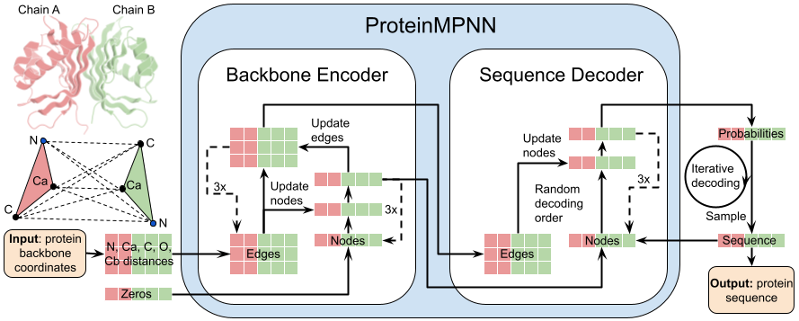

# ProteinMPNN

<p align="center">
  
</p>

## 描述

ProteinMPNN 是一个开源的深度学习方法，用于在给定蛋白质骨架上进行序列设计。它能够快速生成可折叠到目标三维结构的高质量氨基酸序列，适用于从单体设计到抗体序列设计的广泛应用，详见 [ProteinMPNN 论文](https://www.science.org/doi/10.1126/science.add2187)。

本仓库提供了基于 MindSpore 的 ProteinMPNN 实现，改写自原始的 [ProteinMPNN](https://github.com/dauparas/ProteinMPNN) 仓库，并与 [RFantibody](https://github.com/RosettaCommons/RFantibody) 中的抗体相关工具进行集成。

---

## 快速开始 / 安装

基础环境要求：

```text
python >= 3.11
mindspore >= 2.7.1
CANN >= 8.2.RC1
```

克隆 MindScience 仓库：

```bash
git clone https://gitee.com/mindspore/mindscience.git
```

下载模型权重到 ProteinMPNN 目录：

```bash
cd mindscience/MindSPONGE/applications/proteinmpnn
bash scripts/download_weights.sh
```

### 配置 Python 环境

安装依赖包：

```bash
pip install -r requirements.txt
```

---

### 获取示例 PDBs

为了运行示例，我们提供了部分示例 PDB 文件。
需要先解压：

```bash
unzip examples/example_inputs.zip -d examples/
```

---

## 使用方法

### ProteinMPNN 基本用法

以下示例可在仓库根目录运行：

- 单体设计：

  ```bash
  bash examples/submit_example_1.sh
  ```

  解析单体 PDB 并为每个目标设计 2 条序列，输出到 `examples/example_outputs/example_1_outputs`。

- 选择链进行复合体设计：

  ```bash
  bash examples/submit_example_2.sh
  ```

  解析复合体并设置固定链；仅为链 `A B` 进行设计。

- 单个复合体 PDB 设计：

  ```bash
  bash examples/submit_example_3.sh
  ```

  为单个 PDB 中的链 `A B` 进行序列设计。

- 仅评分（PDB）：

  ```bash
  bash examples/submit_example_3_score_only.sh
  ```

  对原始序列进行模型评分，不生成新序列。

- 仅评分（FASTA+PDB）：

  ```bash
  bash examples/submit_example_3_score_only_from_fasta.sh
  ```

  对 FASTA 文件中的序列进行评分。

- 固定/非固定残基：

  ```bash
  bash examples/submit_example_4.sh
  bash examples/submit_example_4_non_fixed.sh
  ```

  使用 `helper_scripts/make_fixed_positions_dict.py` 固定残基（不设计）或仅设计指定残基。

- 跨链绑定位点：

  ```bash
  bash examples/submit_example_5.sh
  ```

  使用 `helper_scripts/make_tied_positions_dict.py` 在多个链上的指定位置采样相同氨基酸。

- 同源寡聚体的绑定位点设计：

  ```bash
  bash examples/submit_example_6.sh
  ```

  通过 `--homooligomer 1` 在相同链的等价位置上进行绑定位点设计。

- 仅输出非条件概率：

  ```bash
  bash examples/submit_example_7.sh
  ```

  输出每个位置的非条件对数概率（结果在 `unconditional_probs_only` 下）。

- 全局氨基酸偏置（例如：极性偏置）：

  ```bash
  bash examples/submit_example_8.sh
  ```

  生成偏置字典，并通过 `--bias_AA_jsonl` 参与设计。

- 基于 PSSM 的引导设计：

  ```bash
  bash examples/submit_example_pssm.sh
  ```

  将 ProteinMPNN 的 logits 与 PSSM 概率进行混合。使用 `--pssm_multi` 控制全局混合（0=不使用 PSSM，1=仅使用 PSSM），并通过 `helper_scripts/make_pssm_input_dict.py` 设置每个残基的系数。通过 `--pssm_bias_flag` 启用偏置分布。

### 来自 RFantibody 的抗体 CDR 设计

对 HLT 格式的 .pdb 进行 CDR 设计，运行：

```bash
python proteinmpnn_interface_design.py \
    -pdbdir /path/to/inputdir \
    -outpdbdir /path/to/outputdir
```

该命令将对所有 CDR 环进行设计，并为每个输入结构生成 1 条序列。更多参数可通过查看：

```bash
python proteinmpnn_interface_design.py --help
```

示例命令：

```bash
bash examples/ab_pdb_example.sh
```

> Modified from [ProteinMPNN](https://github.com/dauparas/ProteinMPNN)  
> Original license: MIT License
