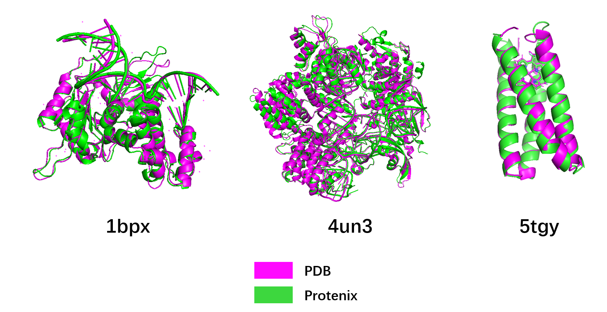

# Protenix (MindSpore)

[中文版](./README_CN.md)



**Protenix** is an open-source reproduction of [AlphaFold 3](https://www.nature.com/articles/s41586-024-07487-w) developed by ByteDance, implemented in PyTorch. [Code Repository](https://github.com/bytedance/Protenix). This project is the **MindSpore** reproduction version.

It is designed for high-accuracy structure prediction and serves as a scalable research tool for the computational biology community. Protenix aims to provide researchers with a powerful platform for predicting biomolecular structures, including proteins, nucleic acids, small molecules, ions, and modified residues.

## 📖 Model Overview

Protenix is currently the strongest open-source model in the field of biomolecular structure prediction, capable of predicting the 3D structures of complex biomolecular assemblies with unprecedented accuracy. Protenix faithfully reproduces this capability on the MindSpore framework, enabling:

- **Multi-component Structure Prediction**: Predict structures containing proteins, RNA, DNA, ligands, ions, and modified residues
- **High Accuracy**: Achieves comparable accuracy to AlphaFold 3 on benchmark datasets
- **Scalable Training**: Leverages MindSpore's distributed training capabilities for efficient model training

**Key Features:**

- Full reproduction of Protenix architecture including Pairformer, Diffusion, Confidence and other modules
- Support for Multiple Sequence Alignment (MSA)
- Configurable diffusion sampling with customizable number of cycles, steps, and samples
- Training and fine-tuning capabilities on custom datasets

## 🌟 Related Projects

- **[MindScience](https://atomgit.com/mindspore-lab/mindscience)**: Scientific computing suite based on MindSpore
- **[AlphaFold 3](https://www.nature.com/articles/s41586-024-07487-w)**: Original AlphaFold 3 paper

## 🛠 Installation

### Hardware support

- Atlas 800T A2

### Software Requirements

- Python >= 3.11
- MindSpore >= 2.7.0
- CANN >= 8.2.RC1 (for Ascend NPU)
- Other dependencies listed in `requirements.txt`

### Step 1: Clone Repository

```bash
git clone https://gitcode.com/mindspore-lab/mindscience.git
cd mindscience/MindSPONGE/applications/protenix
```

### Step 2: Install Dependencies

```bash
pip install -r requirements.txt
```

### Step 3: Download Model Weights

Download the model [checkpoint](https://tools.mindspore.cn/dataset/workspace/mindspore_ckpt/ckpt/Protenix/ms_model_v0.5.0.ckpt).Then put the checkpoint in`./release_data/checkpoint`.

### Step 4: Set Env Variable

Run the following command to set PYTHONPATH：

```bash
source set_path.sh
```

## 🚀 Inference

### Basic Usage

Run inference with default parameters:

```bash
python inference.py \
  --seeds 42 \
  --dump_dir ./output \
  --input_json_path /PATH/TO/INPUT/FILE/input.json \
  --use_msa true
```

### Input Format

Create an input JSON file specifying your biomolecular system. Example:

```json
[
  {
    "sequences": [
      {
        "proteinChain": {
          "sequence": "SEFEKLRQTGDELVQAFQRLREIFDKGDDDSLEQVLEEIEELIQKHRQLFDNRQEAADTEAAKQGDQWVQLFQRFREAIDKGDKDSLEQLLEELEQALQKIRELAEKKN",
          "count": 1
        }
      }
    ],
    "name": "5tgy"
  }
]
```

### Key Parameters

| Parameter | Description | Default |
|-----------|-------------|---------|
| `--seeds` | Random seed(s) for reproducibility | 42 |
| `--dump_dir` | Output directory for predictions | Required |
| `--input_json_path` | Path to input JSON file | Required |
| `--use_msa` | Whether to use MSA search | `true` |
| `--n_samples` | Number of samples to generate | 5 |
| `--load_checkpoint_path` | checkpoint path | `"./release_data/checkpoint/ms_model_v0.5.0.ckpt"` |

### Advanced Options

**Controlling Sampling:**

```bash
python inference.py \
  --seeds 42 \
  --dump_dir ./output \
  --input_json_path /PATH/TO/INPUT/FILE/input.json \
  --n_sample 10
```

**Running without MSA (Possibly Low Accuracy):**

```bash
python inference.py \
  --seeds 42 \
  --dump_dir ./output \
  --input_json_path /PATH/TO/INPUT/FILE/input.json \
  --use_msa false
```

### Output Files

Inference produces the following outputs in the specified `dump_dir`:

1. **CIF Files**: Final predicted structures (one per sample)
    - Format: `sample_<N>.pdb`
    - Contains 3D coordinates of all atoms

2. **Confidence Scores**:
    - `confidence_scores.json`: Per-residue pLDDT scores and PAE matrices
    - Higher pLDDT indicates higher confidence (range: 0-100)

## 🧬 Training

### Data Preprocessing

Downloaded CIF-format data must be preprocessed before it can be used for model training. Use the following script to run preprocessing:

```bash
python scripts/prepare_training_data.py -i /PATH/TO/MMCIF/FILES -o /PATH/TO/OUTPUT/DATA.csv.gz -b /PATH/TO/PROCESSED/DATA -d
```

if use MSA:

```bash
python scripts/prepare_training_data.py -i /PATH/TO/MMCIF/FILES -o /PATH/TO/OUTPUT/DATA.csv.gz -b /PATH/TO/PROCESSED/DATA -d --use_msa
```

### Data Preprocessing Parameter Descriptions

| Parameter | Description | Default |
|-----------|-------------|---------|
| `-i` | Input data directory | Required |
| `-o` | CSV output file path | Required |
| `-b` | Processed data output directory | Required |
| `-d` | Whether to perform extra processing (e.g., removing water and hydrogen atoms) | No value needed |
| `--use_msa` | Whether to perform msa search | No value needed |
| `-m` | Path to MSA files | None |

The training logic is contained in `train.py`.

```bash
python train.py --run_name protenix_train --seed 42 --base_dir ./output --diffusion_batch_size 48 --checkpoint_interval 400 --train_crop_size 384 --lr 0.001 --data.msa.enable false --load_checkpoint_path /PATH/TO/YOUR/CHECKPOINT --data.train_sets weightedPDB_before2109_wopb_nometalc_0925 --data.test_sets weightedPDB_before2109_wopb_nometalc_0925 --data.weightedPDB_before2109_wopb_nometalc_0925.base_info.pdb_list /PATH/TO/YOUR/DATASET/PDB_LIST.txt --data.weightedPDB_before2109_wopb_nometalc_0925.base_info.mmcif_dir /PATH/TO/YOUR/MMCIF_DIR --data.weightedPDB_before2109_wopb_nometalc_0925.base_info.indices_fpath /PATH/TO/YOUR/INDICES_FILE.csv --data.weightedPDB_before2109_wopb_nometalc_0925.base_info.bioassembly_dict_dir /PATH/TO/BIOASSEMBLY_DIR
```

### Key Training Parameters

| Parameter | Description |Default |
|-----------|-------------|------------------|
| `--run_name` | Name for this training run | Required |
| `--seed` | Random seed for reproducibility | `42` |
| `--base_dir` | Base directory for outputs | Required |
| `--diffusion_batch_size` | Batch size for diffusion training | `48` |
| `--checkpoint_interval` | Steps between checkpoints | `400` |
| `--train_crop_size` | Cropping size for training samples | `384` |
| `--lr` | Learning rate | `0.0018` |
| `--data.msa.enable` | Enable/disable MSA features | `True` |
| `--load_checkpoint_path` | Path to checkpoint for fine-tuning | `""` |
| `--data.train_sets` | Name of training dataset | `weightedPDB_before2109_wopb_nometalc_0925`, Details can be found in configs.configs_data |
| `--data.test_sets` | Name of test dataset | `recentPDB_1536_sample384_0925`, Details can be found in configs.configs_data |
| `--data.msa.enable` | Enable/disable MSA features | `True` |
| `--data.msa.prot.pdb_mmseqs_dir` | Path to MSA Files | `DATA_ROOT_DIR/mmcif_msa` |
| `--data.msa.prot.seq_to_pdb_idx_path` | Path to seq_to_pdb_idx.json | `DATA_ROOT_DIR/seq_to_pdb_index.json` |

### Dataset Path Configuration

The training command requires specifying paths to dataset files:

- `--data.[DATASET_NAME].base_info.pdb_list`: Path to PDB list file
- `--data.[DATASET_NAME].base_info.mmcif_dir`: Directory containing mmCIF files
- `--data.[DATASET_NAME].base_info.indices_fpath`: Path to indices CSV file
- `--data.[DATASET_NAME].base_info.bioassembly_dict_dir`: Directory for bioassembly data

Replace `[DATASET_NAME]` with the dataset name (e.g., `weightedPDB_before2109_wopb_nometalc_0925`).

## License

This project is released under the Apache 2.0 License.

## Citing Protenix

If you use Protenix in your research, please cite the following:

```bibtex
@article{chen2025protenix,
  title={Protenix - Advancing Structure Prediction Through a Comprehensive AlphaFold3 Reproduction},
  author={Chen, Xinshi and Zhang, Yuxuan and Lu, Chan and Ma, Wenzhi and Guan, Jiaqi and Gong, Chengyue and Yang, Jincai and Zhang, Hanyu and Zhang, Ke and Wu, Shenghao and Zhou, Kuangqi and Yang, Yanping and Liu, Zhenyu and Wang, Lan and Shi, Bo and Shi, Shaochen and Xiao, Wenzhi},
  year={2025},
  doi = {10.1101/2025.01.08.631967},
  journal = {bioRxiv}
}
@article{abramson2024accurate,
  title={Accurate structure prediction of biomolecular interactions with AlphaFold 3},
  author={Abramson, Josh and Adler, Jonas and Dunger, Jack and Evans, Richard and Green, Tim and Pritzel, Alexander and Ronneberger, Olaf and Willmore, Lindsay and Ballard, Andrew J and Bambrick, Joshua and others},
  journal={Nature},
  volume={630},
  number={8016},
  pages={493--500},
  year={2024},
  publisher={Nature Publishing Group UK London}
}
@article{ahdritz2024openfold,
  title={OpenFold: Retraining AlphaFold2 yields new insights into its learning mechanisms and capacity for generalization},
  author={Ahdritz, Gustaf and Bouatta, Nazim and Floristean, Christina and Kadyan, Sachin and Xia, Qinghui and Gerecke, William and O’Donnell, Timothy J and Berenberg, Daniel and Fisk, Ian and Zanichelli, Niccol{\`o} and others},
  journal={Nature Methods},
  volume={21},
  number={8},
  pages={1514--1524},
  year={2024},
  publisher={Nature Publishing Group US New York}
}
@article{mirdita2022colabfold,
  title={ColabFold: making protein folding accessible to all},
  author={Mirdita, Milot and Sch{\"u}tze, Konstantin and Moriwaki, Yoshitaka and Heo, Lim and Ovchinnikov, Sergey and Steinegger, Martin},
  journal={Nature methods},
  volume={19},
  number={6},
  pages={679--682},
  year={2022},
  publisher={Nature Publishing Group US New York}
}
```
