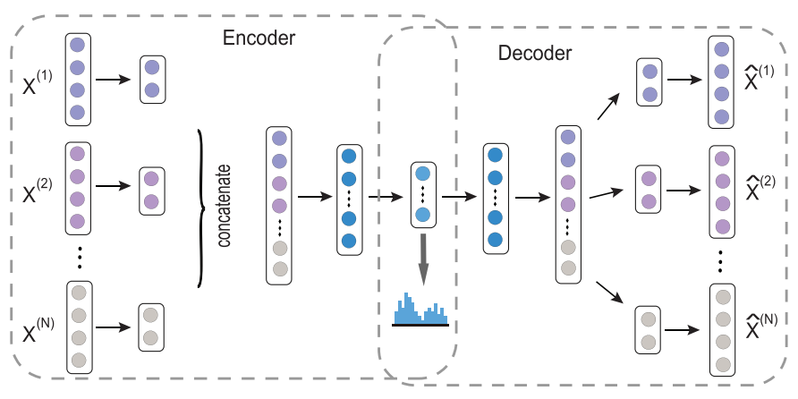

# DeepDR

## Introduction

DeepDR is a network-based deep-learning approach, for in silico drug repurposing by integrating 10 networks: one drug–disease, one drug-side-effect, onedrug–target and seven drug–drug networks. DeepDR uncovers the potential associations between drugs anddiseases. DeepDR first fuses diverse information from a multitude of different network types into a compact, low-dimensional feature representation and then the learned low-dimensional representation of drug features together with known drug–disease interaction pairs are fed into a variational autoencoder to predict new drug–disease associations. Theoretically, deepDR learns high-level features of drugs from the heterogeneous networks by a multi-modal deep autoencoder (MDA). Further, deepDR is able to preserve the non-linear network structure by applying multiple layers of non-linear functions. It also complements the sparse ratings with drug features, as feeding side information into the same VAE increases the number of samples for training, which also acts like a pretraining step. Specifically, drug–disease associations and drug features are different sources of information, both are information with drugs, so they can be encoded and decoded collectively through the same inference network and generation network.Then the learned low-dimensional representation of drugs together with clinically reported drug–disease pairs are encoded and decoded collectively via a variational autoencoder (cVAE) to infer candidates for approved drugs for which they were not originally approved. DeepDR revealed high performance, outperforming conventional network-based or machine learning-based approaches.

Multi-modal deep autoencoder：


Collective variational autoencoder：


## Environment

This project is run on Nvidia RTX3090 and adopts Mindspore framework. This project can deploy in other hardware environments by configuring its own environment.

The version of the environment used in this project is:

mindspore-gpu 1.8.0；

python 3.7；

## Code organization

- src：Data preprocessing and model scripts;
- train_mda：training script of MDA;
- train_cvae：training script of cVAE;
- eval：inference script of MDA and cVAE.

## Datasets and Checkpoint

This project provides datasets and checkpoint files, which is available at [this link](https://gitee.com/bling__bling/deep-dr.git) for developers to download.
The datasets mainly include：

1. drug–disease network by assembling data from two commonly used databases: DrugBank and repoDB, nine networks mainly include: (i) clinically reported drug–drug interactions, (ii) drug–target interactions, (iii) drug-side-effect associations, (iv) chemical similarities, (v) therapeutic similarities derived from the Anatomical Therapeutic Chemical Classification System, (vi) drugs’ target sequence similarities, (vii) Gene Ontology (GO) biological process, (viii) GO cellular component and (ix) GO molecular function. They are stored in the datasets/drugNets directory.
2. 6677 clinically reported drug–disease pairs connecting 1519 drugs and 1229 diseases were further collected for building predictive deep learning models. They are stored in datasets/drugDisease.txt.
3. PPMI matrix obtained by data preprocessing script. The data is stored in the datasets/PPMI directory.

## conda environment configuration

```conda
- conda create --name deepdr
- conda activate deepdr
- conda install mindspore-gpu=1.8.1 cudatoolkit=11.1 -c mindspore -c conda-forge
```

## Run

Pipeline of deepDR: (1) deepDR generates random walk-based network representation from a complicated heterogeneous network that contains 10 drug-related networks; (2) deepDR uses cVAE to infer potential associations between drugs and diseases. Specifically, it feeds highquality features extracted from the second step to the VAE for pretraining, and then refines the VAE by feeding the drug–disease association network.

Example running training script of MDA.

```text
- cd  /root/DeepDR
- python train_mda.py --epochs 150 --batch_size 64 --noise_factor 0.5
```

Example running inference script of MDA.

```text
- cd  /root/DeepDR
- python eval.py --model 'mda'
```

Example running training script of cVAE.
pretraining:

```text
- cd  /root/DeepDR
- python train_cvae.py --a 6 --b 0.1 --m 300 --batch 100 --save --learn_rate 0.001
```

refinement：

```text
- cd  /root/DeepDR
- python train_cvae.py --a 15 --b 3 --load 1 --m 300 --batch 100 --rating --save --learn_rate 0.001
```

Example running inference script of cVAE.

```text
- cd  /root/DeepDR
- python eval.py --model 'cvae'
```