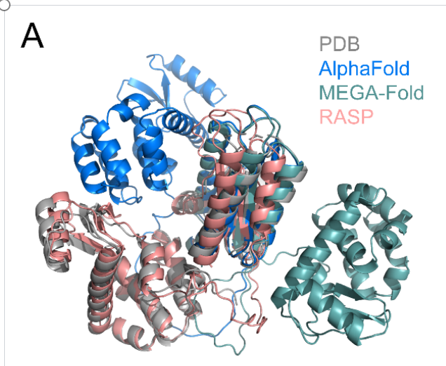
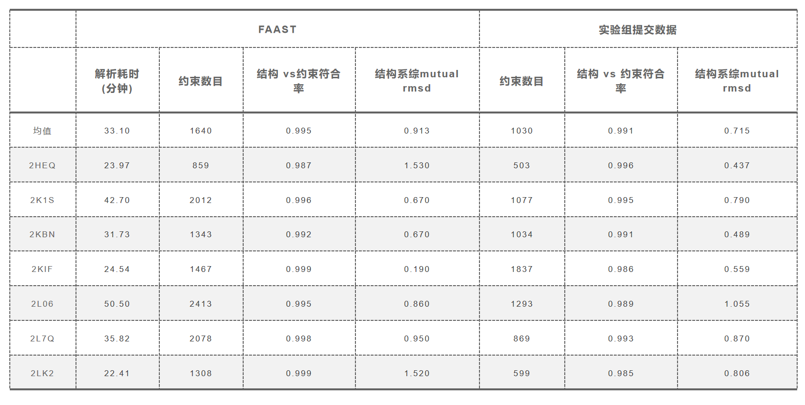

ENGLISH|[简体中文](README_CN.md)

# FAAST and RASP

NMR experiments can detect in situ structures and dynamic interactions, but the NMR assignment process requires expertise and is time-consuming, thereby limiting its applicability. Deep learning algorithms have been employed to aid in experimental data analysis. In this work, we developed a RASP model which can enhance structure prediction with restraints. Based on the Evoformer and structure module architecture of AlphaFold, this model can predict structure based on sequence and a flexible number of input restraints. Moreover, it can evaluate the consistency between the predicted structure and the imposed restraints. Based on this model, we constructed an iterative NMR NOESY peak assignment pipeline named FAAST, to accelerate assignment process of NOESY restraints and obtaining high quality structure ensemble. The RASP model and FAAST pipeline not only allow for the leveraging of experimental restraints to improve model prediction, but can also facilitate and expedite experimental data analysis with their integrated capabilities.

Please check our paper ["Assisting and Accelerating NMR Assignment with Restrained Structure Prediction"](https://www.biorxiv.org/content/10.1101/2023.04.14.536890v1) for detailed information.

A simple test cases is provided through Google Colab [FAAST_DEMO](https://colab.research.google.com/drive/1uaki0Ui1Y_gqVW7KSo838aOhXHSM3PTe?usp=sharing) for quick start. Since the RASP model and FAAST method are developed on the MindSpore+Ascend platform, this method works on both Ascend and GPU, and it would have better performance with this platform.

<details><summary>Cite us</summary>

```bibtex
@article{Liu2023AssistingAA,
title={Assisting and Accelerating NMR Assignment with Restrainted Structure Prediction},
author={Sirui Liu and Haotian Chu and Yuantao Xie and Fangming Wu and Ningxi Ni and Chenghao Wang and Fangjing Mu and Jiachen Wei and Jun Zhang and Mengyun Chen and Junbin Li and F. Yu and Hui Fu and Shenlin Wang and Changlin Tian and Zidong Wang and Yi Qin Gao},
journal={bioRxiv},
year={2023}
}
```

</details>

<details><summary>Contents</summary>

<!-- TOC -->

- [FAAST and RASP](#faast-and-rasp)
    - [Environment](#environment)
        - [Hardware and Framework](#hardware-and-framework)
        - [Installation and requirements](#installation-and-requirements)
    - [Code Contents](#code-contents)
    - [Example](#example)
        - [RASP inference](#rasp-inference)
        - [FAAST pipeline](#faast-pipeline)
            - [**Examples of command**](#examples-of-command)
            - [**Examples of runlog**](#examples-of-runlog)
            - [**Comparison of Results**](#comparison-of-results)
    - [Reference](#reference)
    - [Acknowledgement](#acknowledgement)

<!-- /TOC -->

</details>

## Environment

### Hardware and Framework

RASP and FAAST are based on the computational biology library [MindSPONGE](<https://gitee.com/mindspore/mindscience/tree/master/MindSPONGE>) and MindSpore framework. MindSpore of version 2.0 and later are required. The installation of MindSpore refers to [MindSpore installation page](https://www.mindspore.cn/install). This toolkit works on either Ascend910 or GPU with more than 16GB RAM. Running with Ascend910 calls mixed precision by default, while full precision calculations is called for GPU .

### Installation and requirements

- MindSpore installation:
    Download mindspore package:

    PlatForm | Link
    ----------|----------
    Ascend-910 ARM  | <https://ms-release.obs.cn-north-4.myhuaweicloud.com/2.0.0rc1/MindSpore/unified/aarch64/mindspore-2.0.0rc1-cp37-cp37m-linux_aarch64.whl>
    Ascend-910  x86 | <https://ms-release.obs.cn-north-4.myhuaweicloud.com/2.0.0rc1/MindSpore/unified/x86_64/mindspore-2.0.0rc1-cp37-cp37m-linux_x86_64.whl>
    GPU x86   | <https://ms-release.obs.cn-north-4.myhuaweicloud.com/2.0.0rc1/MindSpore/unified/x86_64/mindspore-2.0.0rc1-cp37-cp37m-linux_x86_64.whl>

    Installation on Ascend requires hardware driver package:Ascend Data Center Solution 23.0.RC1,[Install Guide](<https://www.mindspore.cn/install>)
    Installation on GPU requires Nvidia CUDA version 11.1-11.8. Please refer to the [Installation Link](<https://developer.nvidia.com/cuda-toolkit-archive>)

- Install MindSPONGE:
    Download Mindscience ：

    ``` shell
    git clone https://gitee.com/mindspore/mindscience.git
    ```

    compile MindSPONGE wheel package：

    ``` shell
    cd ./mindscience/MindSPONGE/
    ```

    if on Ascend910 platform

    ``` shell
    bash build.sh -e ascend -j 8
    ```

    if on GPU platform

    ``` shell
    bash build.sh -e gpu -j 8
    ```

    Install wheel package

    ``` shell
    pip install ./output/mindsponge*.whl
    ```

- Install other requirements：
    FAAST and RASP rely on searching and alignment tools such as HHSearch and Kalign. A one-click installation script is provided for easy use.

    ``` shell
    cd ./mindscience/MindSPONGE/applications/research/FAAST
    sh ./install.sh
    ```

## Code Contents

<details><summary><font size=4 color="blue">Code Contents</font></summary>

```bash
├── FAAST
    ├── main.py                            // FAAST Main Script
    ├── run_rasp.py                        // RASP Main Script
    ├── README.md                          // FAAST README English Version
    ├── README_CN.md                       // FAAST README Chinese Version
    ├── extract_restraints.py              // Extract The Restraint Sample File From The pdb
    ├── search.py                          // Call Mmseqs Online Search For MSA And Templates
    ├── install.sh                         // Install The Shell Script For Install Dependencies
    ├── assign
        ├── assign.py                      //Iterative Assignment
        ├── init_assign.py                 //Initial Assignment
    ├── commons
        ├── analysis.py                    //Result Analysis Tool
        ├── nmr_hydrogen_equivariance.txt  //Hydrogen Equivalence
        ├── res_constants.py               //Hydrogen Equivalence Dictionary
    ├── config
        ├── data.yaml                      //Data Process Config
        ├── model.yaml                     //Model Config
    ├── data
        ├── dataset.py                     // Dataset
        ├── hhsearch.py                    // HHsearch Tool
        ├── kalign.py                      // Kalign Tool
        ├── msa_query.py                   // MSA Processing Tool
        ├── parsers.py                     // Mmcif Processing
        ├── preprocess.py                  // Data Processing
        ├── protein_feature.py             // MSA and Template Feature Search and Integration script
        ├── templates.py                   // Template Processing Scripts
        ├── utils.py                       // Common Func Scripts
    ├── model
        ├── fold.py                        // Main RASP Model
    ├── module
        ├── evoformer.py                   // Evoformer Module
        ├── fold_wrapcell.py               // Wrapper
        ├── head.py                        // Heads
        ├── structure.py                   // Structure Module
        ├── template_embedding.py          // Template Module
    ├── nmr_relax
        ├── model  
            ├── structure_violation.py     //Calculate Whether The Structure Conforms To Physical Laws
            ├── utils.py                   //Common Tools For Relaxtion
        ├── relax
            ├── amber_minimize.py          //OpenMM Amber Force Field Minimization
            ├── cleanup.py                 //Cleanup
            ├── relax.py                   //Relaxation Scripts
            ├── utils.py                   //Common tools for OpenMM
```

</details>

## Example

### RASP inference

The RASP model trained weights can be downloaded at [RASP.ckpt](<https://download.mindspore.cn/mindscience/mindsponge/FAAST/checkpoint/RASP.ckpt>) and
the sample files can be downloaded in [example](<https://download.mindspore.cn/mindscience/mindsponge/FAAST/example/>)，running following command to start inference.

```bash
Usage:python run_rasp.py --run_platform PLATFORM --use_pkl False --restraints_path RESTRAINTS_PATH
            --input_path INPUT_FILE_PATH --checkpoint_file CHECKPOINT_FILE --use_template True --use_custom False
            --a3m_path A3M_PATH --template_path TEMPLATE_PATH

option:
--restraints_path    Path for the restraint information folder.Restraint information for each sample is stored in separate txt files with the same name as sequence/MSA.
--run_platform       The operating platform, can be Ascend or GPU
--input_path         The path for input .fasta/.pkl files. Multiple samples with different file names can be stored in one single folder.
--checkpoint_file    Model weight file path
--use_pkl            whether to use pkl file as input,default:False.
--use_template       whether to use template,default:True.
--use_custom         Whether to use custom MSA and template information provided by user, default:False.
--a3m_path           The MSA folder path for MSAs saved after searching, or custom MSAs provided by user.
--template_path      The template folder path for templates saved after searching, or custom templates provided by user.
```

RASP supports three types of input.

1. Protein fasta sequence as input: in this mode the MSA and template are generated by online mmseqs search. Enter a3m_path and template_path to save the search results, use_pkl and use_custom need to be set to False in this mode.
2. MSA and template files as input: MSA should be in .a3m format and template in .cif format. The MSA and templates can be searched with other tools by user or provided according to prior knowledge (e.g. known structure templates). To use this mode set use_pkl to False and use_custom to True, and enter the user-provided MSA and template paths a3m_path and template_path.
3. Pre-processed feature(.pkl file) as input. use_pkl needs to be set to True. a3m_path and template path are not required. Preprocessed feature generation can refer to `./data/protein_feature.py:monomer_feature_generate`. It mainly deals with the characteristic information of the input sequence, the searched msa information and the template information, and saves the corresponding pkl file in `./pkl_file/` after each run of RASP model.

**Restraint information**

The model requires restraint information as input, and the restraint information takes the form of a (N,2) text file describing which residue pairs are close in 3-dimentional space like `[[1,2],... [2,10]]`, etc. Restraint information comes from various sources, including Nuclear Magnetic Resonance(NMR), Cross-Linking Mass Spectrometry (XL-MS) and so on. A sample script is provided to extract restraint information from the pdb, as shown below.

```bash
Usage:python extract_restraints.py --pdb_path PDB_PATH --output_file OUTPUT_FILE
option:
--pdb_path         A pdb file that provides restraint information.
--output_file      Location of the file to output restraint information.
```

The following is an example file of restraint information. Each line is the spatial location of a pair of amino acids. Each location is separated by a space.

``` log
51 74
46 60
.. ..
36 44
70 46
18 68
```

Predicted structures are stored in './result/ '.

```log
{confidence of predicted structrue :89.23, time :95.86，restraint recall :1.0}
```

<div align=center>

</div>

For multi-domain structure 6XMV, both AlphaFold and MEGA-Fold provide inaccurate relative domain positions, however with restraint RASP is able to fix the inter-domain structure.

### FAAST pipeline

#### **Examples of command**

The RASP model trained weights can be downloaded at [RASP.ckpt](<https://download.mindspore.cn/mindscience/mindsponge/FAAST/checkpoint/RASP.ckpt>) and
the sample files can be downloaded in [example](<https://download.mindspore.cn/mindscience/mindsponge/FAAST/example/>)，running following command to start inference. For custumization of the pipeline, please check the `assign_settings.py` for all settings.

```bash
Usage: python main.py --run_platform PLATFORM --use_pkl True --peak_and_cs_path PEAKLIST_PATH
            --input_path INPUT_FILE_PATH --checkpoint_file CHECKPOINT_FILE --use_template True --use_custom False
            --a3m_path A3M_PATH --template_path TEMPLATE_PATH

option:
--peak_and_cs_path   Path of NOESY spectral data and chemical shift tables.
--run_platform       The operating platform, can be Ascend or GPU
--input_path         The path for input .fasta/.pkl files. Multiple samples with different file names can be stored in one single folder.
--checkpoint_file    Model weight file path
--use_pkl            whether to use pkl file as input, default:False.
--use_template       whether to use template, default:True.
--use_custom         Whether to use custom MSA and template information provided by user, default:False.
--a3m_path           The MSA folder path for MSAs saved after searching, or custom MSAs provided by user.
--template_path      The template folder path for templates saved after searching, or custom templates provided by user.
```

The input form supported by this method is the same as that of RASP model. Compared with RASP, it does not require restraint information, but requires chemical shift table and NOESY spectral peak list. The chemical shift table and NOESY spectral peak list of each protein sequence should be stored in an independent folder. For the file organization, refer to the sample file.

**NOESY peak list** : The NOESY list file name must be `.txt` file whose names are beginning with `noelist_`. Each NOESY list file contains four columns of data separated by spaces. The first column is the resonance frequency of the heavy atom, the third column is the resonance frequency of the hydrogen atom connected with the heavy atom, the second column is the resonance frequency of the other hydrogen atom, and the fourth column is the peak intensity (volume). If multiple NOESY spectra exist, separate them into multiple `.txt` files for independent storage. Currently, only 3D-NOESY spectra are supported, as shown in the following example:

``` log
w1 w3 w2 volume
119.73 4.584 8.102 7689.0
119.73 3.058 8.102 1084.0
119.73 3.057 8.102 1084.0
119.73 7.005 8.102 317.0
120.405 8.102 7.857 945.0
......
```

The first list is heavy atom, the second list is hydrogen atom connected with heavy atom, the third list is H hydrogen atom connected with N, and the fourth list is peak intensity (volume). If there are multiple NOESY spectra, they need to be divided into multiple pkl files for independent storage. Currently, only 3D-NOESY spectral data is supported.

**Chemical shift table** : The file name is named `chemical_shift_aligneds.txt` and contains five columns of data which are delimited by spaces, in order of atom name, atom type, chemical shift, residue number, and residue type, where the numbering of chemical shift must be aligned with the protein sequence in input_path, as shown in the following example:

``` log
atom_name atom_type chem_shift res_idx res_type
HA H 4.584 10 HIS
HB2 H 3.058 10 HIS
HB3 H 3.057 10 HIS
HD2 H 7.005 10 HIS
CA C 56.144 10 HIS
......
```

#### **Examples of runlog**

As shown in  following runlog example, FAAST runs multiple iterations(iteration), each of which runs the RASP model (repeat) several times, using randomly sampled partial constraint information to compute the protein structure. The 0th iteration is repeated only once, and the structure obtained is used to filter the poor constraint information obtained from the initial assignment. Starting from the first iteration, the RASP will be repeated several times for each iteration. The generated structure ensemble will be used for NOESY peak assignment. An evaluation of the assignment structure will be output at the same time. For details of the method of this pipeline, please refer to the methods section of the paper.

```log
# Initial structure prediction without restraint
>>>>>>>>>>>>>>>>>>>>>>Protein name: 5W9F, iteration: 0, repeat: 0, number of input restraint pair: 0, confidence: 84.58, input restraint recall: 1.0,
Violation of structure after relaxation:  0.0

# Initial assignment
Initial assignment:
C       2L33 noelist_17169_spectral_peak_list_2.txt 4644 4626
N       2L33 noelist_17169_spectral_peak_list_1.txt 1366 1210
Filtering restraint with given structure.

......

# Structure prediction with RASP
>>>>>>>>>>>>>>>>>>>>>>Protein name: 5W9F, iteration: 8, repeat: 0, number of input restraint pair: 62, confidence: 75.21, input restraint recall: 1.0,
Violation of structure after relaxation:  0.0

>>>>>>>>>>>>>>>>>>>>>>Protein name: 5W9F, iteration: 9, repeat: 1, number of input restraint pair: 56, confidence: 65.50, input restraint recall: 1.0,
Violation of structure after relaxation:  0.0

......

# Assignment
1st calibration and calculation of new distance-bounds done (calibration factor: 6.546974e+06)
Time: 0.019391536712646484s
Violation analysis done: 664 / 4447 restraints (14.9 %) violated.
Time: 14.645306587219238s
Final calibration and calculation of new distance-bounds done (calibration factor: 5.004552e+06).
Time: 0.015628814697265625s
Partial assignment done.
Time: 15.671599626541138s

......

# Evaluation of assignment
Iteration 1:
protein name:  2L33
restraints number per residue:  31.48
long restraints number per residue:  7.67
restraints-structure coincidence rate:  0.977
long restraints structure coincidence rate:  0.9642

......
```

- Protein name is the name of the protein;
- Number of input restraint pair is the amount of input effective restraint pair;
- Confidence is the credibility of the structure, where 0 is not at all trustworthy and 100 is very trustworthy. Credibility is positively correlated with the structure quality (correlation coefficient > 0.65).
- Input restraint recall refers to the coincidence rate between inferred structures and input restraint information
- Long restraints refer to the restraint information of residues pair with sequence separation greater than or equal to 4 inside primary restraints.

#### **Comparison of Results**

<div align=center>

</div>

The figure above compares the resolution time and accuracy of the FAAST model to the traditional model. The Ascend 910 aarch64 system, for example, is deployed in about half an hour in an environment where the hardware driver package is already installed. The single sequence FAAST model runs on average half an hour, which means that even zero-based whitewashed nmr data can be analyzed in as little as one day, which would otherwise take several months or more.

## Reference

[1] Jumper J, Evans R, Pritzel A, et al. Applying and improving AlphaFold at CASP14[J].  Proteins: Structure, Function, and Bioinformatics, 2021.

[2] Liu S, Zhang J, Chu H, et al. PSP: million-level protein sequence dataset for protein structure prediction[J]. arXiv preprint arXiv:2206.12240, 2022.

[3] Terwilliger T C, Poon B K, Afonine P V, et al. Improved AlphaFold modeling with implicit experimental information[J]. Nat Methods, 2022.

## Acknowledgement

FAAST uses or references the following open source tools:

- [ARIA](<http://aria.pasteur.fr/documentation>)
- [ColabFold](https://github.com/sokrypton/ColabFold)
- [AlphaFold2](https://github.com/deepmind/alphafold)
- [Biopython](https://biopython.org)
- [HH Suite](https://github.com/soedinglab/hh-suite)
- [Kalign](https://msa.sbc.su.se/cgi-bin/msa.cgi)
- [ML Collections](https://github.com/google/ml_collections)
- [NumPy](https://numpy.org)
- [OpenMM](<https://github.com/openmm/openmm>)

We thank all the contributors and maintainers of these open source tools!
