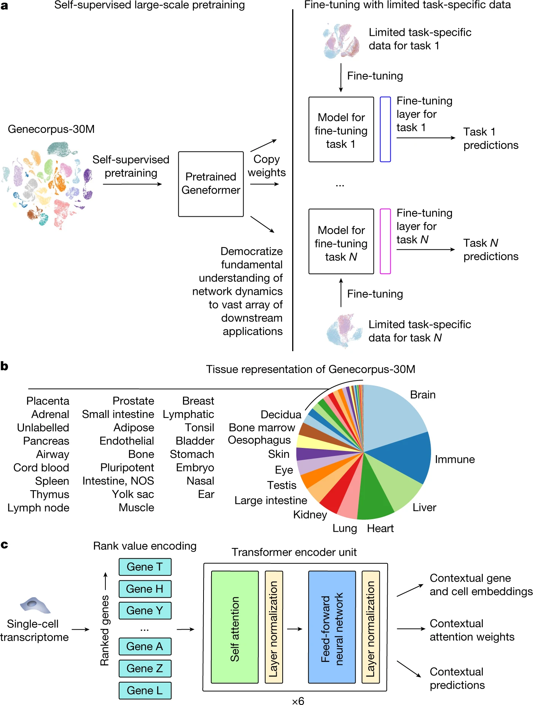
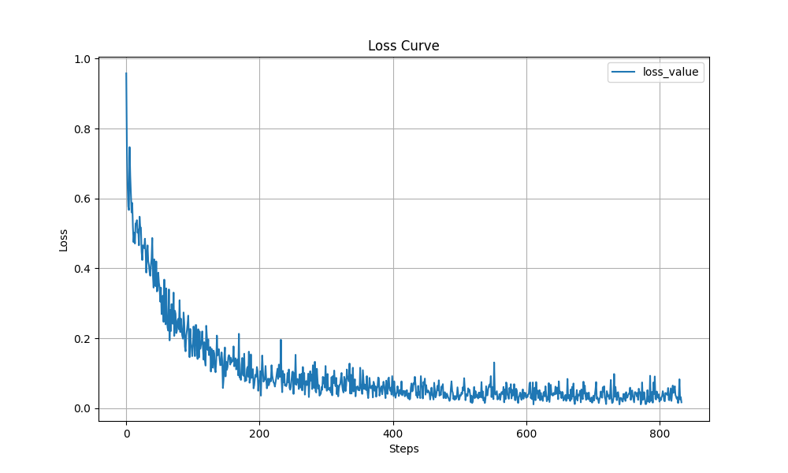

## Geneformer模型classification下游任务

## 概述

基因网络的映射依赖于大量的转录组数据，但在罕见疾病或临床难以接触的组织中，这样的数据往往非常有限。数据稀缺阻碍了网络修正型药物的发现，因此需要一种能够在有限数据环境下进行有效预测的方法。如何在数据有限的环境下有效地映射基因网络结构并发现关键调控因子和潜在治疗靶标。这个问题源于基因网络的复杂性以及数据的稀缺性，特别是在罕见疾病或临床难以接触的组织中。

研究者借鉴迁移学习的成功经验，开发了一种名为Geneformer的上下文感知、基于注意力机制的深度学习模型。该模型在大规模转录组数据上进行了预训练，获得了对网络动态的基本理解。Geneformer通过有限的特定任务训练示例进行微调，能够适用于与染色质和网络动态相关的多样化下游任务，提高了预测准确性。Geneformer的出现不仅解决了当前数据有限的问题，还为未来的基因网络研究和药物发现提供了新的方向和可能。它有望推动基因网络研究的发展，并为罕见疾病和复杂疾病的治疗提供新的希望。

### 方法

Geneformer是一个基于大规模人类组织单细胞转录组数据预训练的Transformer基础模型。该模型最初于2021年6月在包含约3000万个单细胞转录组的Genecorpus-30M数据集上进行预训练。为了促进解释，排除了具有高突变负荷的细胞（如恶性肿瘤细胞和永生化细胞系），因为这些细胞可能导致网络大规模重构，而缺少相应的基因组测序。然后，在2024年4月，Geneformer在约9500万个非癌转录组上进行了预训练，随后在约1400万个癌转录组上进行了持续学习，从而得到了一个针对癌症领域的调优模型。

每个单细胞的转录组通过排序值编码的方式呈现给模型，其中基因根据其在该细胞中的表达量相对于整个Genecorpus-30M数据集中的表达量进行排序。排序值编码提供了该细胞转录组的非参数表示，并利用预训练数据集中每个基因表达的多次观察结果，优先考虑能够区分细胞状态的基因。具体来说，这种方法会降低普遍高表达的管家基因的优先级（将其排名降低），而像转录因子这样虽然表达量低但高度区分细胞状态的基因，在编码中的排名会提高。此外，这种基于排序的方法可能对技术伪影具有更强的鲁棒性，这些伪影可能会系统地影响绝对转录计数值，但每个细胞内基因的相对排序总体保持稳定。

每个单细胞转录组的排序值编码随后通过N层Transformer编码器单元进行处理，其中N根据模型大小而变化。预训练是通过掩码学习目标实现的，其中每个转录组中有15%的基因被掩码，模型被训练为使用剩余未掩码基因的上下文来预测每个掩码位置应该是哪个基因。这种方法的主要优势在于它是完全自监督的，可以在完全未标记的数据上完成，从而允许包含大量训练数据，而不受伴随标签样本的限制。

在预训练过程中，Geneformer获得了对网络动力学的基本理解，并以完全自监督的方式在模型的注意力权重中编码了网络层次结构。通过零样本学习和使用有限的任务特定数据进行微调，Geneformer在与染色质和网络动力学相关的一系列下游任务中持续提高了预测准确性。通过零样本学习的计算机模拟扰动，在心肌细胞中鉴定了一种新的转录因子，并通过实验验证其对心肌细胞产生收缩力的能力至关重要。使用有限的患者数据进行计算机模拟治疗，发现了心肌病候选治疗靶点，并在疾病的诱导多能干细胞（iPSC）模型中实验验证了这些靶点能显著改善心肌细胞产生收缩力的能力。总体而言，Geneformer是一个基于大规模人类单细胞转录组数据预训练的基础深度学习模型，它获得了对网络动力学的基本理解，现在可以将这一理解应用于广泛的下游任务，以加速发现关键网络调节因子和候选治疗靶点。

如下图所示，在初始自监督大规模预训练的迁移学习时需将预训练的权重复制到每个微调任务的模型中，添加微调层，并使用有限的数据对特定的每个下游任务进行微调。通过在可推广的学习目标上进行单一的初始自监督大规模预训练，该模型获得了学习领域的基本知识，然后将其应用于与预训练学习目标不同的大量下游应用，将知识迁移到新任务中。



在预训练的Geneformer架构。每个单细胞转录组被编码成排序值编码[秩编码]，然后通过6层transformer编码器单元进行编码，参数如下：输入大小为2048（完全代表Geneformer-30M中排序值编码的93%），256个嵌入维度，每层四个注意力头，前馈大小为512。Geneformer在2048的输入大小上使用full dense 自注意力。可提取的输出包括上下文基因和细胞嵌入编码、上下文注意力权重和上下文预测。[排序值编码，基因是根据其在该细胞中的表达进行排序]。

### 数据准备

part1: 使用的数据集为Genecorpus-30M数据集，数据集下载路径为 https://huggingface.co/datasets/ctheodoris/Genecorpus-30M。

part2: 下载**.pkl文件并拷贝到src目录下，下载路径为 https://huggingface.co/ctheodoris/Geneformer/tree/main/geneformer 。

part3: 获取模型原始训练文件，获取路径为 https://huggingface.co/ctheodoris/Geneformer/tree/main/fine_tuned_models/gf-6L-30M-i2048_CellClassifier_cardiomyopathies_220224。

### 目录结构

```shell

     geneformer                                    # 模型名
       ├── README.md                               # 模型说明文档
       ├── scripts                                 # 脚本文件
       │   ├── run.sh                              # 分布式执行脚本
       │   ├── run_8p.sh                           # 单卡执行脚本
       │   ├── main.py                             # 单卡python脚本
       │   └── convert_weight.py                   # 模型转换脚本
       ├── src                                     # 模型定义源码目录
       │   ├── __init__.py                         # 输入数据集处理
       │   ├── classifier.py                       # 训练验证函数定义
       │   ├── classifier_utils.py                 # 计算处理
       │   ├── preparedata.py                      # 数据处理
       │   └── perturber_utils.py                  # 模型加载
       └── configs                                 # 案例配置目录
           ├── geneformer_config.yaml              # geneformer传参配置
           └── run_geneformer_args.yaml            # 案例配置yaml文件

```

### 参数配置

```shell

model:                                          # 模型参数
  model_config:                                 # 模型配置参数
    type: BertConfig                            # config种类
    use_one_hot_embeddings: False               # 是否使用one_hot编码
    num_labels: 2                               # 标签种类
    dropout_prob: 0.02                          # dropout概率参数
    batch_size: 16                              # 批次大小
    seq_length: 2048                            # 语句最大长度
    vocab_size: 25426                           # 词汇表大小
    hidden_size: 256                            # 隐藏层维度
    num_hidden_layers: 6                        # 隐藏层层数
    num_attention_heads: 4                      # 多头注意力头数
    hidden_act: "relu"                          # 隐藏层激活函数
    checkpoint_name_or_path: ""                 # 加载模型权重路径
  arch:
    type: BertForPreTraining                    # 任务种类
lr_schedule:                                    # 学习率参数
  type: LinearWithWarmUpLR                      # 学习率策略
  learning_rate: 0.00005                        # 初始学习率
  lr_end: 0.0000000001                          # 最小学习率
  layer_decay: 0.65                             # 权重参数值
optimizer:                                      # 优化器参数
  type: adamw                                   # 优化器种类
  weight_decay: 0.001                           # 权重衰减力度
callbacks:
    type: MFLossMonitor                         # loss回调
    type: CheckpointMonitor                     # 权重保存回调
    prefix: "mindformers"                       # 权重名前缀
    keep_checkpoint_max: 100                    # 保存最大数量
    save_checkpoint_steps: 100                  # 保存权重步数

```

### 快速开始

step1: 使用convert_weight.py文件将模型原始训练文件转为mindspore框架的.ckpt文件（根据实际模型层数修改layers参数，torch_path和mindspore_path分别对应原始训练文件和转换之后的mindspore框架文件）。

```shell
python3 scripts/convert_weight.py  --layers 6  --torch_path pytorch_model.bin  --mindspore_path ./out_model/geneformer_mindspore.ckpt
```

step2: 修改config/geneformer_config.yaml中的model_output目录为step1中的输出文件目录执行python脚本完成训练和验证。

```shell
cd scripts && bash run_8p.sh
```

### 结果展示

将loss数据保存绘图后得到loss曲线如下所示：



### 性能指标

|           参数           |                                                                Ascend                                                                |
| :----------------------: | :----------------------------------------------------------------------------------------------------------------------------------: |
|         硬件资源         |                                                           昇腾AI处理器                                                          |
|      框架版本      |                                                                mindspore 2.3.1                                                                |
|          数据集          | Genecorpus-30M |
|          参数量          |                                                                6L-30M-i2048                                                                 |
|         训练参数         |                                        batch_size=12, <br>steps_per_epoch=835, <br>epochs=1                                         |
|         测试参数         |                                                            batch_size=16                                                             |
|          优化器          |                                                                AdamW                                                                 |
|   Train steps/s   |                                                                12.34                                                                |
|   Train runtimes   |                                                                9.60                                                               |
| Eval accuracy |                                                                0.70                                                                |
|     Eval F1    |                                                                 0.80                                                                 |

### 引用

[1] C V Theodoris#, L Xiao, A Chopra, M D Chaffin, Z R Al Sayed, M C Hill, H Mantineo, E Brydon, Z Zeng, X S Liu, P T Ellinor#. Transfer learning enables predictions in network biology. Nature, 31 May 2023. (#co-corresponding authors)

[2] H Chen*, M S Venkatesh*, J Gomez Ortega, S V Mahesh, T Nandi, R Madduri, K Pelka†, C V Theodoris†#. Quantized multi-task learning for context-specific representations of gene network dynamics. bioRxiv, 19 Aug 2024. (*co-first authors, †co-senior authors, #corresponding author)