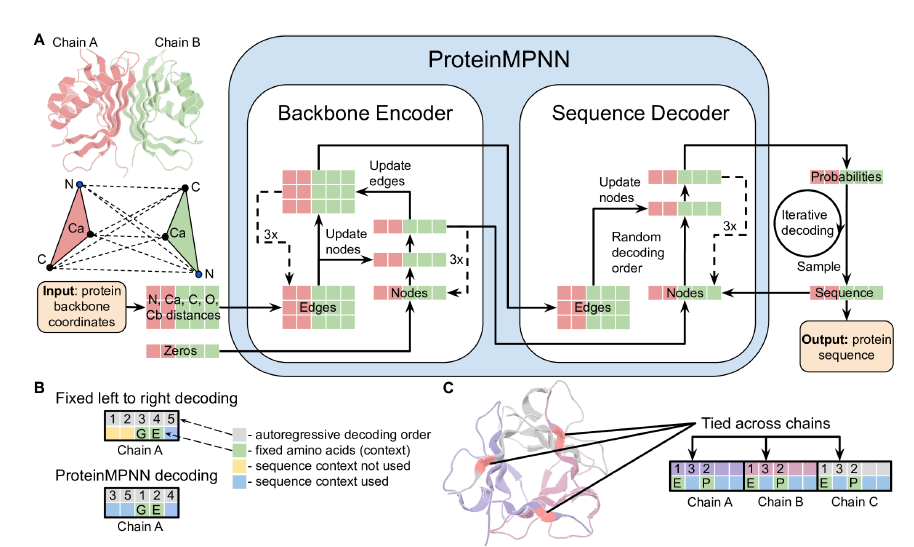

# ProteinMPNN

## 介绍

本项目使用Mindspore框架对ProteinMPNN模型进行复现。ProteinMPNN是一种基于深度学习的蛋白质序列设计方法，其广泛应用于当前的蛋白质设计挑战，并在实验测试中显示出了突出的性能。ProteinMPNN模型利用不同位置的氨基酸序列可以在单链或多链之间耦合，使其能够应用在当前的蛋白质设计中，其广泛适用于单体、环状低聚物、蛋白质纳米颗粒等设计，其利用消息传递神经网络(MPNN)的3层编码器，3层解码器和128个隐藏维度结构预测蛋白质序列，使用蛋白质主链特征(Ca-Ca原子之间的距离、相对Ca-Ca-Ca方向和旋转以及主链二面角)作为输入，以自回归的方式预测从N端到C端的蛋白质序列。

参考论文的地址为：[Robust deep learning based protein sequence design using ProteinMPNN](http://www.biorxiv.org/content/10.1101/2022.06.03.494563v1)

## 环境

本项目运行于Nvidia RTX3090和Ascend 910计算平台，采用MindSpore深度学习框架。本项目可以通过自行配置运行环境使其部署于不同的硬件环境。

本项目使用环境版本为：

mindspore-gpu 1.8.0；

mindspore-ascend 1.9.0

python 3.8；

## 组织架构

- src：数据处理，模型和工具脚本；
- train.py: 模型训练脚本；
- eval.py：模型推理脚本；
- example_bash：项目运行文件；
- ascend310_infer：Ascend 310推理脚本。

## conda环境配置

```conda环境配置
- conda create --name proteinmpnn
- conda activate proteinmpnn
- conda install mindspore-ascend=1.9.0 -c mindspore -c conda-forge
```

## 数据集

本项目采用多链训练数据 (16.5 GB, PDB biounits, 2021 August 2)对模型进行训练，该数据集可以通过链接[multi-chain training data](https://files.ipd.uw.edu/pub/training_sets/pdb_2021aug02.tar.gz)进行下载。为了便于对训练数据进行解析，本项目提供经过预处理的训练数据[parsed training data](https://pan.baidu.com/s/1pbJNaADmO_mOuVTo5KqE4Q?pwd=xfrp)。对于模型推理任务，本项目提供用于模型推理的示例数据pdb文件和对应解析后的jsonl文件[PDB_monomers](https://gitee.com/bling__bling/protein-mpnn/tree/master/datasets/PDB_monomers)，[PDB_homooligomers](https://gitee.com/bling__bling/protein-mpnn/tree/master/datasets/PDB_homooligomers)和[
PDB_complexes](https://gitee.com/bling__bling/protein-mpnn/tree/master/datasets)。

## 运行

### 模型训练

```text
python train.py --path_for_pkl "pdb_dict_train.pkl" --path_for_outputs "./outputs/" --num_epochs 100 --max_protein_length 1000 --backbone_noise 0.2 --device_id 0
```

本项目提供预训练模型文件，可以通过链接[pretrained model weights](https://gitee.com/bling__bling/protein-mpnn/tree/master/checkpoint)进行下载用于模型推理、模型部署等任务。

### 模型推理

```text
python eval.py --path_to_model_weights "model_weights" --model_name "pretrained_model_020" --save_score 0 --save_probs 0 --score_only 0 --conditional_probs_only 0 --conditional_probs_only_backbone 0 --unconditional_probs_only 0 --num_seq_per_target 2 --batch_size 1 --sampling_temp "0.1" --out_folder 'PDB_monomers/example_1_outputs' --jsonl_path 'PDB_monomers/example_1_outputs/parsed_pdbs.jsonl' --device_id 0
```

本项目提供8个不同的示例推理任务，执行命令的bash脚本存放于./example_bash/目录下。

推理脚本`eval.py`输入参数示例：

```python
- argparser.add_argument("--path_to_model_weights", type=str, default="vanilla_model_weights", help="Path to model weights folder;")
- argparser.add_argument("--model_name", type=str, default="v_48_020",help="ProteinMPNN model name: v_48_002, v_48_010, v_48_020, v_48_030; v_48_010=version with 48 edges 0.10A noise")
- argparser.add_argument("--save_score", type=int, default=0, help="0 for False, 1 for True; save score=-log_prob to npy files")
- argparser.add_argument("--save_probs", type=int, default=0, help="0 for False, 1 for True; save MPNN predicted probabilities per position")
- argparser.add_argument("--score_only", type=int, default=0, help="0 for False, 1 for True; score input backbone-sequence pairs")
- argparser.add_argument("--conditional_probs_only", type=int, default=0, help="0 for False, 1 for True; output conditional probabilities p(s_i given the rest of the sequence and backbone)")
- argparser.add_argument("--conditional_probs_only_backbone", type=int, default=0, help="0 for False, 1 for True; if true output conditional probabilities p(s_i given backbone)")
- argparser.add_argument("--unconditional_probs_only", type=int, default=0, help="0 for False, 1 for True; output unconditional probabilities p(s_i given backbone) in one forward pass")
- argparser.add_argument("--backbone_noise", type=float, default=0.00, help="Standard deviation of Gaussian noise to add to backbone atoms")
- argparser.add_argument("--num_seq_per_target", type=int, default=2, help="Number of sequences to generate per target")
- argparser.add_argument("--batch_size", type=int, default=1, help="Batch size; can set higher for titan, quadro GPUs, reduce this if running out of GPU memory")
- argparser.add_argument("--max_length", type=int, default=20000, help="Max sequence length")
- argparser.add_argument("--sampling_temp", type=str, default="0.1", help="A string of temperatures, 0.2 0.25 0.5. Sampling temperature for amino acids, T=0.0 means taking argmax, T>>1.0 means sample randomly. Suggested values 0.1, 0.15, 0.2, 0.25, 0.3. Higher values will lead to more diversity.")
- argparser.add_argument("--out_folder", type=str, default='PDB_monomers/example_1_outputs', help="Path to a folder to output sequences.")
- argparser.add_argument("--pdb_path", type=str, default='', help="Path to a single PDB to be designed")
- argparser.add_argument("--pdb_path_chains", type=str, default="", help="Define which chains need to be designed for a single PDB ")
- argparser.add_argument("--jsonl_path", type=str, default='PDB_monomers/example_1_outputs/parsed_pdbs.jsonl', help="Path to a folder with parsed pdb into jsonl")
- argparser.add_argument("--chain_id_jsonl", type=str, default='', help="Path to a dictionary specifying which chains need to be designed and which ones are fixed, if not specified all chains will be designed.")
- argparser.add_argument("--fixed_positions_jsonl", type=str, default='', help="Path to a dictionary with fixed positions.")
- argparser.add_argument("--omit_AAs", type=list, default='X', help="Specify which amino acids should be omitted in the generated sequence, e.g. 'AC' would omit alanine and cystine.")
- argparser.add_argument("--bias_AA_jsonl", type=str, default='', help="Path to a dictionary which specifies AA composion bias if neededi, e.g. {A: -1.1, F: 0.7} would make A less likely and F more likely.")
- argparser.add_argument("--bias_by_res_jsonl", default='', help="Path to dictionary with per position bias.")
- argparser.add_argument("--omit_AA_jsonl", type=str, default='', help="Path to a dictionary which specifies which amino acids need to be omitted from design at specific chain indices")
- argparser.add_argument("--pssm_jsonl", type=str, default='', help="Path to a dictionary with pssm")
- argparser.add_argument("--pssm_multi", type=float, default=0.0, help="A value between [0.0, 1.0], 0.0 means do not use pssm, 1.0 ignore MPNN predictions")
- argparser.add_argument("--pssm_threshold", type=float, default=0.0, help="A value between -inf + inf to restric per position AAs")
- argparser.add_argument("--pssm_log_odds_flag", type=int, default=0, help="0 for False, 1 for True")
- argparser.add_argument("--pssm_bias_flag", type=int, default=0, help="0 for False, 1 for True")
- argparser.add_argument("--tied_positions_jsonl", type=str, default='', help="Path to a dictionary with tied positions")
- argparser.add_argument('--device_target', help='device target', type=str, default="GPU")
- argparser.add_argument('--device_id', help='device id', type=int, default=0)
```

推理脚本运行示例。以example 1的推理脚本运行为例：

```text
- cd  /root/ProteinMPNN
- bash example_bash/submit_example_1.sh
```

example 1的输出示例为：

```text
>5L33, score=1.6066, fixed_chains=[], designed_chains=['A'], model_name=v_48_020, git_hash=unknown
HMPEEEKAARLFIEALEKGDPELMRKVISPDTRMEDNGREFTGDEVVEYVKEIQKRGEQWHLRRYTKEGNSWRFEVQVDNNGQTEQWEVQIEVRNGRIKRVTITHV
>T=0.1, sample=0, score=0.7977, seq_recovery=0.4528
SIDEEEKKALDFIEALEKADPELMAKVITPDTEMEVNGKKYKGEEIVEFVKKLAEEGVKYKLKSYKKEGDKYVFTVEKSKDGKTKTVTITVEVKDGKVKEIKIEEK
>T=0.1, sample=0, score=0.8433, seq_recovery=0.4434
SVDEDTKKALDFIKALEEADPELMKKVITPDTKMTVNGKEYKGEEIVDFVKELKKKGVKYTLKSYKKEGDKYVFTVTKSYNGKTYTITIEIEVKDGKVEKIVITEN
```


