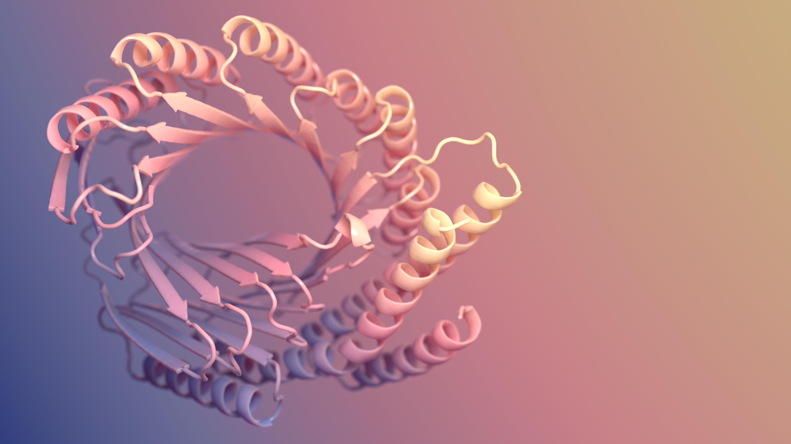
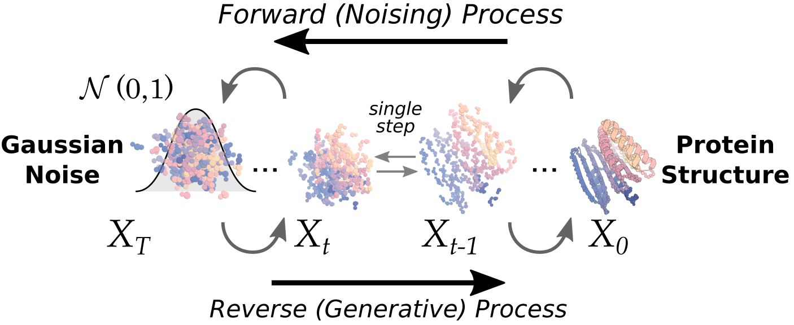
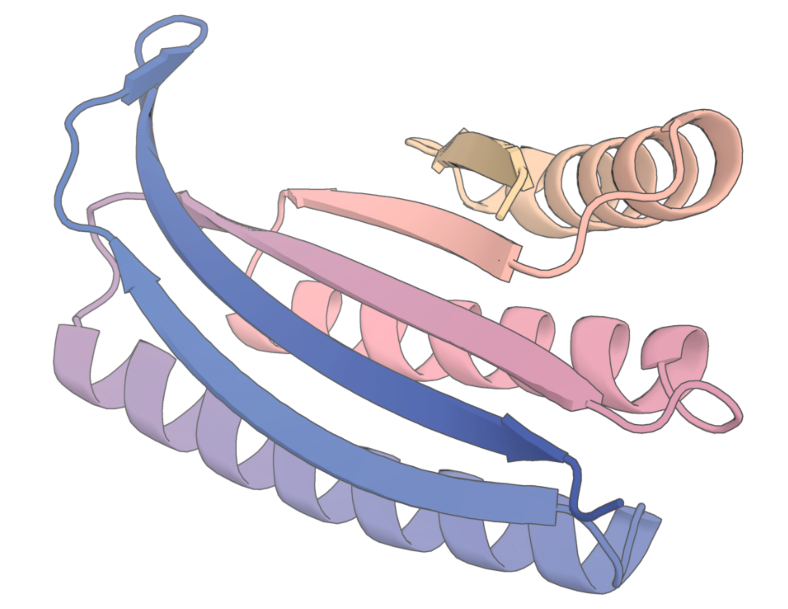
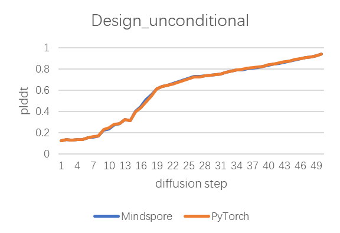
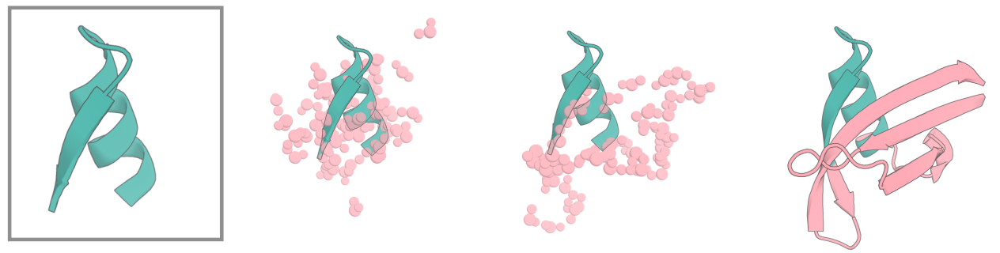
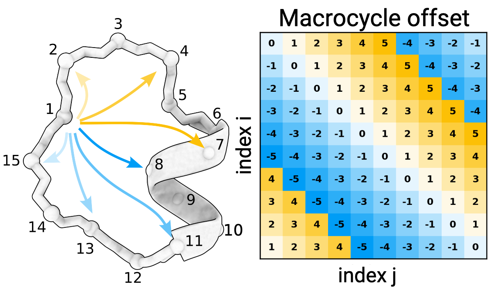
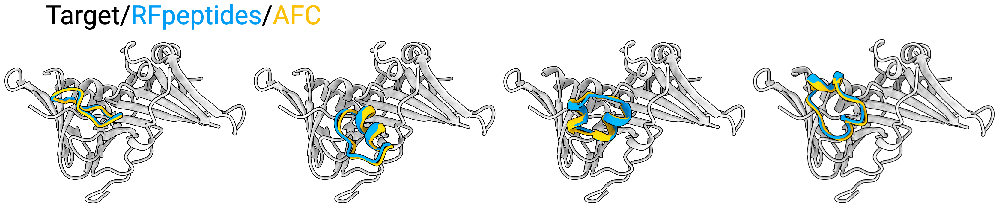

# RFdiffusion

<p align="center">
  
</p>

图片来源：Ian C. Haydon / UW Institute for Protein Design

## 模型介绍

RFdiffusion 是一种开源的蛋白质结构生成方法，可在有条件（如给定基序、目标、抗体框架等）或无条件的情况下运行。它能够完成多种蛋白质设计任务，详见论文：

- [RFdiffusion 论文](https://www.biorxiv.org/content/10.1101/2022.12.09.519842v1)
- [RFantibody 论文](https://www.biorxiv.org/content/10.1101/2024.03.14.585103v2)

本仓库为RFdiffusion基于原仓库[RFdiffusion](https://github.com/RosettaCommons/RFdiffusion)在Mindspore上的实现，并集成了[RFantibody](https://github.com/RosettaCommons/RFantibody)中针对抗体设计的功能模块；

**RFdiffusion可以做的事情**

- 无条件蛋白质生成
- 基序支架（Motif Scaffolding）
- 对称无条件生成（目前支持循环、二面体和四面体对称）
- 对称基序支架
- 结合体（Binder）设计
- 抗体/纳米抗体设计（RFantibody）
- 设计多样化（“部分扩散”，围绕某个设计进行采样）

---

## 快速开始 / 安装

基础依赖：

```text
python >= 3.11
mindspore >= 2.7.0
CANN >= 8.2.RC1
```

克隆仓库：

```bash
git clone https://gitee.com/mindspore/mindscience.git
```

使用权重下载脚本将模型权重下载到 `RFdiffusion` 目录中：

```bash
cd mindscience/MindSPONGE/applications/rf_diffusion
bash scripts/download_models.sh
```

### 配置Python运行环境

`RFdiffusion` 使用 `se3_transformer` 和图神经网络库 `sharker`，`sharker` 需要通过以下命令下载：

```bash
git clone https://gitee.com/sunhaoneng/gnn.git
cp -r gnn/sharker env/
rm -r -f gnn
```

每次运行前，请先将 `env` 文件夹配置到 `PYTHONPATH` 中

```bash
export PYTHONPATH=$PYTHONPATH:$(pwd)/env
```

安装运行依赖python库：

```bash
pip install -r requirements.txt
```

#### TODO

- 待mindscience.gnn上库后将sharker依赖改为mindscience.gnn
- se3_transformer迁移至mindscience.models.se3_transformer

### 获取 PPI 支架示例

要运行示例，我们提供了示例pdb文件和支架文件等。请先解压：

```bash
tar -xvf examples/ppi_scaffolds_subset.tar.gz -C examples/
tar -xvf examples/antibody_pdbs.tar.gz -C examples/
tar -xvf examples/input_pdbs.tar.gz -C examples/
tar -xvf examples/target_folds.tar.gz -C examples/
tar -xvf examples/tim_barrel_scaffold.tar.gz -C examples/
```

---

## 用法

本节将演示如何运行扩散。

<p align="center">
  
</p>

### 运行扩散脚本

实际执行的脚本为 `run_inference.py`，其运行方式由 Hydra 配置决定。配置的默认值会直接从模型权重文件中读取。这意味着 `configs/inference/base.yml` 中的默认值可能与推理时实际使用的值不同，具体取决于所选的权重文件。

---

### 无条件单体设计



首先我们看看如何进行长度为 150aa 的无条件蛋白质设计。只需指定三件事：

1. 蛋白质长度
2. 输出文件写入的位置
3. 设计的数量

```bash
python run_inference.py 'contigmap.contigs=[150-150]' inference.output_prefix=test_outputs/test inference.num_designs=10
```

contigmap.contigs 字符串允许指定长度范围，但此处我们只需要长度为 150aa 的蛋白质，因此指定 `[150-150]` 即可;
这条命令将运行 10 条扩散轨迹，并将输出保存到你指定的输出文件夹。

注意：第一次运行 RFdiffusion 时，会花一些时间在“Calculating IGSO3”。完成后结果会被缓存，之后运行会更快！更多无条件单体生成示例可在仓库中的 `./examples/design_unconditional.sh` 中查看。

在固定随机种子（如 numpy.random）条件下，对无条件生成任务进行测试：将本实现与原版输出的最终 diffusion 步各张量对比，余弦相似度 >0.998，L1 误差 <0.001；每步 pLDDT 变化趋势完全一致，因此精度与原版持平。

| 输出张量  | state    | msa      | lddt     | pair     | logis_aa | xyz      |
|-------|----------|----------|----------|----------|----------|----------|
| 余弦相似度 | 0.998332 | 0.999854 | 0.999951 | 0.998851 | 0.998289 | 0.998529 |
| L1距离    | -0.00051 | 0.000532 | -0.00053 | -0.00076 | -0.0009 | 0.000836 |



---

### 基序支架

RFdiffusion 可用于基序支架，其方式类似于[受限幻觉与 RFjoint Inpainting](https://www.science.org/doi/10.1126/science.abn2100#:~:text=The%20binding%20and%20catalytic%20functions%20of%20proteins%20are,the%20fold%20or%20secondary%20structure%20of%20the%20scaffold.)。总体而言，RFdiffusion 的效果显著优于受限幻觉与 RFjoint Inpainting。
<p align="center">
  
</p>

在进行蛋白质基序支架时，需要指定要支架的某些输入蛋白片段（来自 `.pdb` 文件的一段或多段），并能指定这些片段如何连接、连接残基数目以及在新的支架蛋白中如何组织。此外，我们通常事先并不精确知道连接残基需要多少，因此希望能对连接长度进行采样。上述输入的指定由 contigmap 完成。
简要规则：

- 以字母为前缀表示该片段是基序，字母对应输入 pdb 文件中的链 ID。例如 `A10-25` 指输入 pdb 中链 A 的残基 10 到 25。
- 没有字母前缀的片段表示需要“构建”的蛋白区间，可以以长度范围的形式输入。每次 RFdiffusion 推理迭代时，这些长度范围会随机采样。
- 用 `/0` 指定链断裂（chain break）。

比如，如果希望支架输入 pdb 中链 A 的残基 10-25，可以这样写：`'contigmap.contigs=[5-15/A10-25/30-40]'`。这表示在 A10-25 前构建 5-15 个残基（每次推理随机采样），在其后构建 30-40 个残基（同样随机采样）。如果希望总长度始终为 55 个残基，可设置 `contigmap.length=55-55`。此外需要提供 pdb 路径：`inference.input_pdb=path/to/file.pdb`。需要注意的是，输入 pdb 中存在你不希望支架的残基并不重要——contig map 定义了哪些残基作为“基序”参与支架。换言之，即使 pdb 中有 B 链，以及 A 链上的其他残基，只有 A10-25 会被提供给 RFdiffusion。

如果要在存在另一条链的情况下进行 inpainting，可以如下指定：

```bash
'contigmap.contigs=[5-15/A10-25/30-40/0 B1-100]'
```

请仔细观察。`/0` 表示链断裂。注意这里的空格很重要。这会在输入中加入一个大的残基跳跃（200aa），使模型将第一条链视为与第二条链相互分离的独立链。

基序支架示例可在 `./examples/design_motifscaffolding.sh` 中找到。

### “活性位点”模型可固定很小的基序

在 RFdiffusion 预印本中我们提到，对于非常小的基序，RFdiffusion 倾向于无法将其在输出中完全保持固定。因此，对于如酶活性位点这样小的位点，我们针对相似任务微调了 RFdiffusion，使其更好地固定较小的基序并获得更好的计算成功率。如果你的功能性基序很小，建议使用该模型，设置方式如下：
`inference.ckpt_override_path=models/ActiveSite_ckpt.pt`

### `inpaint_seq` 标记

对熟悉 RFjoint Inpainting 的用户而言，`contigmap.inpaint_seq` 的用法与其等价。其动机在于：例如当融合两个蛋白时，原本在蛋白表面的残基（通常是极性）可能需要在融合后被打包到蛋白核心中，因此我们希望它们转变为疏水残基。与其直接将这些残基突变为疏水，我们可以“掩蔽”它们的序列身份，让 RFdiffusion 隐式地推断它们的序列，从而更好地与之打包。这需要一个不同于“基础”扩散模型的模型（已针对这种范式进行训练），但推理脚本会自动处理（无需额外操作）。

要指定需要隐藏序列的氨基酸，可使用如下语法：

```bash
'contigmap.inpaint_seq=[A1/A30-40]'
```

此处我们掩蔽了 A 链第 1 个残基的序列身份，以及 A30 到 A40（包含端点）所有残基的序列身份。

使用 `contigmap.inpaint_seq` 的基序支架示例位于 `./examples/design_motifscaffolding_inpaintseq.sh`。

### 关于 `diffuser.T` 的说明

RFdiffusion 最初在 200 个离散时间步上训练。然而最近的改进使我们在推理时可以减少时间步数。在很多情况下，使用约 20 个时间步即可获得与 200 步相当的计算质量（约 10 倍加速）。当前默认设置为 50 步。

---

### 部分扩散

我们可以对一个结构进行部分加噪和去噪，以围绕某个总体折叠产生多样性。该方法效果非常好（参见 [Vazquez-Torres 等，BioRxiv 2022](https://www.biorxiv.org/content/10.1101/2022.12.10.519862v4.abstract)）。
该功能通过设置 `diffuser.partial_T`（即加噪的时间步）来实现。
<p align="center">
  
</p>
噪声越大，多样性越强。在 Vazquez-Torres 等（2022）中，我们通常使用 `diffuser.partial_T≈80`，当时总时间步为 200。现在默认 `diffuser.T=50`，需要相应调整 `diffuser.partial_T`。例如在 `diffuser.T=50` 时，等效于过去 80 步加噪的是 `diffuser.partial_T=20`。我们强烈建议针对你的具体问题对 `partial_T` 进行不同取值的采样，以找到最佳参数。

在进行部分扩散时，由于我们从一个已知结构出发，会引入某些约束。仍可使用 contig 输入，但其必须在长度上与输入蛋白质完全一致。例如，如果你有一个结合体：目标复合物，且希望多样化长度为 100、位于 A 链的结合体，则可输入：

```bash
'contigmap.contigs=[100-100/0 B1-150]' diffuser.partial_T=20
```

原因在于，如果输入蛋白只有 80 个氨基酸，但你指定了 100 的目标长度，我们不知道额外 20 个氨基酸应该从何处进行扩散，因此它们将不会落在 RFdiffusion 学到的去噪分布中。

部分扩散示例可在 `./examples/design_partialdiffusion.sh` 中找到！

你也可以在扩散的链上保持部分序列不变。例如在螺旋肽结合的场景中，如果你已经将肽序列套到理想螺旋上，并希望多样化该复合物（允许模型不再将该螺旋预测为理想螺旋），可以这样做：

```bash
'contigmap.contigs=[100-100/0 20-20]' 'contigmap.provide_seq=[100-119]' diffuser.partial_T=10
```

这里 20aa 的链是螺旋肽。`contigmap.provide_seq` 为 0 索引，可提供范围（如 100-119 是包含端点的范围，表示完全不掩蔽该肽的序列）。可以用逗号分隔多个范围，例如：`'contigmap.provide_seq=[172-177,200-205]'`。

注意：`provide_seq` 选项需要使用不同的模型检查点，但推理脚本会自动处理。

提供序列的部分扩散示例见 `./examples/design_partialdiffusion_withseq.sh`。指定多个序列范围的示例见 `./examples/design_partialdiffusion_multipleseq.sh`。

---

### 结合体设计

RFdiffusion 在结合体设计上表现出色，无论在计算和实验上都能成功地设计全新结合体。

<p align="center">
  
</p>

如果 B 链是你的目标，可以这样做：

```bash
python run_inference.py 'contigmap.contigs=[B1-100/0 100-100]' inference.output_prefix=test_outputs/binder_test inference.num_designs=10
```

这将生成长度为 100 的结合体，目标是 B 链的残基 1-100。

不过，这可能不是设计结合体的最佳方式。由于扩散计算量较大，我们需要尽可能加速。如果目标蛋白很大（很多目标如细胞表面受体都非常大），直接使用完整目标将使扩散非常慢。一个经过检验的加速方法是：围绕预期接口位置裁剪目标蛋白。但这会带来问题：若你裁剪了目标并暴露了原本埋在内部的疏水核心残基，如何保证设计出的结合体会去到目标蛋白表面的预期接口，而不是被你裁剪后“人工制造”的疏水斑块吸引？

我们通过向模型提供“热点残基（hotspot residues）”来解决这个问题。前文提到的复合物模型都在训练中使用了热点残基：在每个训练样本中，模型会被告知目标蛋白上与结合体接触的某些残基（即接口的一部分）。模型会学习到应当构建包含这些热点残基的接口。在推理时，我们可以提供自己的热点残基来定义结合体必须接触的区域。指定方式如下：`'ppi.hotspot_res=[A30,A33,A34]'`，其中 `A` 是输入 pdb 中热点残基所在的链 ID，数字是热点残基在该 pdb 中的残基序号。

最后，观察到默认 RFdiffusion 模型通常生成以螺旋为主的结合体。这类结构在计算与实验上都有很高的成功率。但在某些情况下，可能需要其他类型的拓扑。为此，我们提供了一个“beta”模型，它能生成更丰富的拓扑，但尚未得到广泛的实验验证，请谨慎尝试：

```bash
inference.ckpt_override_path=models/Complex_beta_ckpt.pt
```

RFdiffusion 结合体设计示例见 `./examples/design_ppi.sh`。

---

### RFantibody 抗体/纳米抗体设计

RFantibody 在 RFdiffusion 的基础上提供了针对抗体/纳米抗体专用的采样器（AbSampler），面向抗体 Fv/VHH（纳米抗体）接口设计与 CDR 环重设计。它支持在给定目标结构（`antibody.target_pdb`）与抗体框架结构（`antibody.framework_pdb`）的条件下，按需选择需要重设计的环段（`antibody.design_loops`），并可结合热点约束（`ppi.hotspot_res`）提升接口定向性。该配置位于 `config/inference/antibody.yaml`。

基本用法示例（抗体 Fv）：

```bash
python run_inference.py \
    --config-name antibody \
    antibody.target_pdb=./examples/antibody_pdbs/rsv_site3.pdb \
    antibody.framework_pdb=./examples/antibody_pdbs/hu-4D5-8_Fv.pdb \
    inference.ckpt_override_path=./models/RFdiffusion_Ab.ckpt \
    'ppi.hotspot_res=[T305,T456]' \
    'antibody.design_loops=[L1:8-13,L2:7,L3:9-11,H1:7,H2:6,H3:5-13]' \
    inference.num_designs=2 \
    diffuser.T=50 \
    inference.deterministic=True \
    inference.output_prefix=example_outputs/ab_des
```

纳米抗体（VHH）示例：

```bash
python run_inference.py \
    --config-name antibody \
    antibody.target_pdb=./examples/antibody_pdbs/rsv_site3.pdb \
    antibody.framework_pdb=./examples/antibody_pdbs/h-NbBCII10.pdb \
    inference.ckpt_override_path=./models/RFdiffusion_Ab.ckpt \
    'ppi.hotspot_res=[T305,T456]' \
    'antibody.design_loops=[L1:8-13,L2:7,L3:9-11,H1:7,H2:6,H3:5-13]' \
    inference.num_designs=2 \
    diffuser.T=50 \
    inference.deterministic=True \
    inference.output_prefix=example_outputs/nb_des
```

说明与建议：

- `antibody.framework_pdb` 指定抗体框架结构（Fv 或纳米抗体），`antibody.target_pdb` 指定结合的目标结构。
- `antibody.design_loops` 用于选定与采样 CDR 环重设计的长度（如 `L1:8-13` 表示对 L1 采样 8–13 个残基；多个环以逗号分隔）。
- `ppi.hotspot_res` 可以指定目标上的热点残基（链 ID+残基编号），用于引导接口定向。
- 建议使用专用权重 `RFdiffusion_Ab.ckpt`（通过 `inference.ckpt_override_path` 设置）。
- 完整脚本示例见 `./examples/antibody_pdbdesign.sh` 与 `./examples/nanobody_pdbdesign.sh`。

---

### 折叠条件化（Fold Conditioning）

在特定拓扑上进行条件化的结合体设计（或单体生成）效果非常好。这通过向模型（需训练支持条件化）提供（部分）二级结构与块邻接信息实现。
<p align="center">
  
</p>
推理时的使用示例如下：

```bash
python run_inference.py inference.output_prefix=./scaffold_conditioned_test/test scaffoldguided.scaffoldguided=True scaffoldguided.target_pdb=False scaffoldguided.scaffold_dir=./examples/ppi_scaffolds_subset
```

对于 PPI，需要提供目标蛋白以及其二级结构与块邻接文件。可通过追加以下参数实现：

```bash
scaffoldguided.target_pdb=True scaffoldguided.target_path=input_pdbs/insulin_target.pdb inference.output_prefix=insulin_binder/jordi_ss_insulin_noise0_job0 'ppi.hotspot_res=[A59,A83,A91]' scaffoldguided.target_ss=target_folds/insulin_target_ss.ms scaffoldguided.target_adj=target_folds/insulin_target_adj.ms
```

这将针对胰岛素目标生成三螺旋束（3HB）。

对于 PPI，建议加上以下标记：

```bash
scaffoldguided.mask_loops=False
```

这点非常重要。训练时，我们会掩蔽部分二级结构与块邻接。这很方便，因为在推理时可以轻松添加额外残基，而无需为每个残基精确定义二级结构。例如，如果你想构建一个很长的三螺旋束，可以掩蔽环并在该环上添加例如 20 个“掩蔽”标记。模型随后（可能）会选择将其中约 15 个残基设为螺旋（用于延长 3HB），并将约 5 个残基设为环。但你并不需要手动指定这些细节，十分便利。实现方式如下：

```bash
scaffoldguided.mask_loops=True scaffoldguided.sampled_insertion=15 scaffoldguided.sampled_N=5 scaffoldguided.sampled_C=5
```

这将在每次推理运行时，在输入的 3HB 的环中最多插入 15 个残基，并在 N 端与 C 端各插入最多 5 个残基。
如果你没有大量 pdb 来生成块邻接，该策略非常有用。例如我们展示了从单个起始 pdb 出发，通过该策略可以生成许多加长的 TIM 桶。然而对于 PPI，如果你使用提供的支架集合，则通常不必使用该策略（因为支架本身非常丰富，多样性已足够）。

最后，如果你有一个很大的块邻接/二级结构文件目录，但并不想使用全部，可以创建一个包含要使用文件名的 `.txt` 列表，并传入：

```bash
scaffoldguided.scaffold_list=path/to/list
```

对于 PPI，我们持续观察到在推理中降低加入的噪声会改善设计质量。虽然会牺牲多样性，但鉴于支架集合体量很大，这通常影响不大。因此建议降低噪声，`0.5` 是一个不错的折中：

```bash
denoiser.noise_scale_ca=0.5 denoiser.noise_scale_frame=0.5
```

该设置将我们在位移（`noise_scale_ca`）与旋转（`noise_scale_frame`）上加入的噪声缩放到此处的 0.5。

另一个关于折叠条件化的 PPI 示例见：`./examples/design_ppi_scaffolded.sh`

在 [Liu 等，2024](https://www.biorxiv.org/content/10.1101/2024.07.16.603789v1) 中，我们展示了 RFdiffusion 可用于设计与柔性肽结合的结合体，其中肽的 3D 坐标不需要指定，但其二级结构可以指定。这样用户可以设计与肽在螺旋或 β 构象下结合的结合体。

其原理是提供肽的输入 pdb 结构，但指定我们希望掩蔽其 3D 结构：

```bash
inference.input_pdb=input_pdbs/tau_peptide.pdb 'contigmap.contigs=[70-100/0 B165-178]' 'contigmap.inpaint_str=[B165-178]'
```

此处我们将针对 tau 肽（pdb 索引 B165-178）设计长度为 70-100 的结合体，并通过 `contigmap.inpaint_str` 掩蔽该肽的结构。随后可以指定其采用 β（链）二级结构：

```bash
scaffoldguided.scaffoldguided=True 'contigmap.inpaint_str_strand=[B165-178]'
```

或者也可以通过 `contigmap.inpaint_str_helix` 指定为螺旋！
示例见 `examples/design_ppi_flexible_peptide_with_secondarystructure_specification.sh`。

---

### 对称寡聚体的生成

我们将从 PPI 切换到 RFdiffusion 在另一项任务上的表现：对称寡聚体设计。其方法是在 t=T 时对采样的噪声进行对称化，并在每个时间步对输入进行对称化。目前已实现并可用的类型如下：

- 循环对称（Cyclic）
- 二面体对称（Dihedral）
- 四面体对称（Tetrahedral）

<p align="center">
  
</p>

示例：

```bash
python run_inference.py --config-name symmetry  inference.symmetry=tetrahedral 'contigmap.contigs=[360]' inference.output_prefix=test_sample/tetrahedral inference.num_designs=1
```

此处我们通过 `--config-name symmetry` 指定了不同的配置文件。鉴于对称扩散与上文的扩散有较大差异，我们将大量与对称相关的配置放入新的文件（见 `configs/inference/symmetry.yml`）。使用该配置文件会让扩散进入“对称模式（symmetry-mode）”。

对称类型通过 `inference.symmetry=` 指定。这里选择的是四面体（`tetrahedral`），也可选择循环（如 `c4`）或二面体（如 `d2`）。

`configmap.contigs` 的长度指寡聚体的“总长度”，因此它必须可以被链数 n 整除。

更多寡聚体设计示例见：`./examples/design_cyclic_oligos.sh`、`./examples/design_dihedral_oligos.sh`、`./examples/design_tetrahedral_oligos.sh`。

---

### 使用辅助势函数

看到用对称化噪声进行扩散，你可能会想到在去噪过程中加入其他外部干预以引导扩散。我们已实现的一项干预是“辅助势函数”。辅助势函数在引导推理过程中非常有用。例如，RFjoint inpainting 中我们几乎无法控制输出的最终形状，而在扩散中，我们可以很容易地强制网络生成一个装包良好的蛋白质。这通过在每个时间步的更新中加入偏置来实现。

简单回顾扩散过程：
在时间步 T（反向扩散推理的第一步），我们从已知的先验分布中采样噪声。模型随后预测最终结构应是什么样，并用当前噪声（t=T）与该预测（t=0）来反算 t=T-1 的状态。因此我们得到一个向量，表示每个坐标从时间 T 指向反算得到的时间 T-1 的位置。
但我们希望对该更新进行偏置，即将轨迹“推向”某个期望状态。这可以通过用另一个向量对该更新向量进行加权来实现，该向量指向一个能够减小你定义的“势函数损失”的位置。例如若希望使用 `monomer_ROG`（缩小蛋白的回转半径）势函数，当模型的 t=0 预测非常“拉长”时，越远的残基在对 `monomer_ROG` 相对于其位置求导时将具有更大的梯度。将这些梯度与相应缩放结合起来即可得到一个向量，然后与原更新向量结合，在该时间步形成一个“带偏置的更新”。

应用这些势函数时的具体参数非常重要。如果权重太大，最终不会得到一个好的蛋白；太小则几乎无效。我们在多个场景下探索过这些势函数，并给出了合理默认值，供你直接使用。但如果感觉太弱/太强，或想要探索，请在配置文件的 `potentials` 部分自行尝试调整参数。

势函数以字符串列表的形式指定，每个字符串对应一个势函数。参数名为 `potentials.guiding_potentials`。在每个字符串中可按以下语法指定该势函数的参数：`arg_name1:arg_value1,arg_name2:arg_value2,...,arg_nameN:arg_valueN`。每个势函数必须指定的唯一参数是势函数名称（类型），参数名为 `type`。某些势函数如 `olig_contacts` 与 `substrate_contacts` 接受全局参数，如 `potentials.substrate`。所有与势函数相关的全局参数可在 `config/inference/base.yml` 中查看。此外，让势函数的作用随轨迹逐渐“衰减”也很有用，例如开始时作用强度为 1x，结束时更弱。该衰减类型（`constant`、`linear`、`quadratic`、`cubic`）由 `potentials.guide_decay` 指定。

示例：

```bash
potentials.guiding_potentials=["type:olig_contacts,weight_intra:1,weight_inter:0.1"] potentials.olig_intra_all=True potentials.olig_inter_all=True potentials.guide_scale=2 potentials.guide_decay='quadratic'
```

我们仍在系统地刻画何时/如何使用势函数，强烈建议你自行探索不同参数，因为它们显然与具体问题相关。目前来看，势函数对基序支架与对称寡聚体生成是有帮助的。但在 PPI 中，它们与热点残基之间的交互较为复杂，我们认为知道原因，并将在未来改进适用于 PPI 的更好势函数。请注意，通常的好做法是从“无势函数”作为基线开始，然后逐步增强其强度。对于寡聚体接触势函数，建议从示例提供的参数开始，并注意 `intra` 链的权重通常应高于 `inter` 链。

我们已经实现了多种势函数，但添加更多也很容易，只要你希望将设计推向某个特定目标。唯一的要求是所编写的势函数必须可微。可参考 `potentials.potentials.py` 中已实现势函数的示例。

---

### 对称基序支架

可以将对称扩散与基序支架结合起来，在对称环境下进行基序支架。
当前我们支持的一种方式是：相对于对称轴指定基序的位置。

<p align="center">
  
</p>

**输入 .pdb 与 contig 的特殊要求**

目前要求用户在输入 pdb 中提供经过对称化的基序。原因有二：第一，模型的训练会将任何基序居中到原点，因此代码也会自动将基序居中。如果你的基序未对称化，这一步会导致非对称单元（asymmetric unit）与原点及对称轴重合（这会产生问题）。第二，扩散代码使用一组规范的对称轴（旋转矩阵）来传播基序的非对称单元。为防止在非预期的方式上传播基序，我们要求用户使用 RFdiffusion 的规范对称轴对输入进行对称化。

**RFdiffusion 规范对称轴**

| 对称群 | 轴 |
|:------:|:--:|
| 循环 | Z |
| 二面体（循环） | Z |
| 二面体（翻转/反射） | X |

**示例：相对于对称轴指定基序位置的对称基序支架输入**

示例脚本 `examples/design_nickel.sh` 可用于支架论文中展示的 C4 对称的镍结合结构域。它结合了本文前述的多个概念，包括对称寡聚体生成、基序支架以及引导势函数的使用。

注意：contigs 必须指定精确对称的结构。否则会出错。

---

### 使用 RFpeptides 设计大环肽


可使用 RFdiffusion 以原子级精度设计能与目标蛋白结合的大环肽（Rettie、Juergens、Adebomi 等，2025）。本节简要说明如何运行该推理流程。我们提供了两个示例：一个用于单体设计，一个用于结合体设计。

```bash
examples/design_macrocyclic_monomer.sh
examples/design_macrocyclic_binder.sh
```

#### RFpeptides 结合体设计



要设计与目标结合的大环肽，所需标记与经典结合体设计非常相似，但多了两个额外标记：

```bash
#!/bin/bash

prefix=./outputs/diffused_binder_cyclic2

# 注意：该 pdb 文件中 A 链的索引相对于 pdbID 7zkr 已整体 +2。

pdb='./input_pdbs/7zkr_GABARAP.pdb'

num_designs=10
python run_inference.py \
--config-name base \
inference.output_prefix=$prefix \
inference.num_designs=$num_designs \
'contigmap.contigs=[12-18 A3-117/0]' \
inference.input_pdb=$pdb \
inference.cyclic=True \
diffuser.T=50 \
inference.cyc_chains='a' \
ppi.hotspot_res=['A51','A52','A50','A48','A62','A65'] \
```

新增标记为 `inference.cyclic=True` 与 `inference.cyc_chains`。

`inference.cyclic` 仅表示用户希望至少将一条链设计为大环肽；`inference.cyc_chains` 是包含所有需要环化的链字母的字符串。在上述示例中，只有 A 链（`inference.cyc_chains='a'`）被环化；当然，如果 contigs 兼容，也可以指定为 `inference.cyc_chains='abcd'`。

#### RFpeptides 单体设计

对于单体设计，只需将 contigs 调整为仅包含一条生成链，例如 `contigmap.contigs=[12-18]`，同时保留 `inference.cyclic=True` 与 `inference.cyc_chains='a'` 即可开始生成单体。

---

### 输出文件说明

我们会输出多种文件：

1. `.pdb` 文件：模型的最终预测。注意所有设计残基输出为甘氨酸（仅设计主链），且不包含侧链。尽管 RFdiffusion 在输入基序中会对侧链进行条件化，但未对其预测施加损失，因此不应严格信赖。
2. `.trb` 文件：包含与该次运行相关的元数据，包括具体使用的 contig（如采样的长度范围）以及 RFdiffusion 的完整配置。文件中还包含一些其他信息：
    - 关于映射的细节（输入中的残基如何映射到输出）
        - `con_ref_pdb_idx` / `con_hal_pdb_idx`：两个数组，分别包含输入 pdb 的索引（`con_ref_pdb_idx`）和其在输出 pdb 中的位置（`con_hal_pdb_idx`）。仅包含发生 inpainting 的链（不包括固定的受体/目标链）。
        - `con_ref_idx0` / `con_hal_idx0`：与上类似，但为 0 索引且不含链信息。便于提取坐标以进行比对等。
        - `inpaint_seq`：详细说明推理期间被掩蔽的残基。
3. 轨迹文件：默认会将完整轨迹输出到 `/traj/` 文件夹。可用 PyMol 打开为多步 pdb。注意这些文件按“逆序”保存，因此第一个 pdb 实际上是最后一步（t=1）的预测。我们同时包含 `pX0` 预测（模型在每个时间步的预测）与 `Xt-1` 轨迹（每个时间步输入到模型的内容）。

> Modified from RFdiffusion (https://github.com/RosettaCommons/RFdiffusion)
> Original license: BSD License
