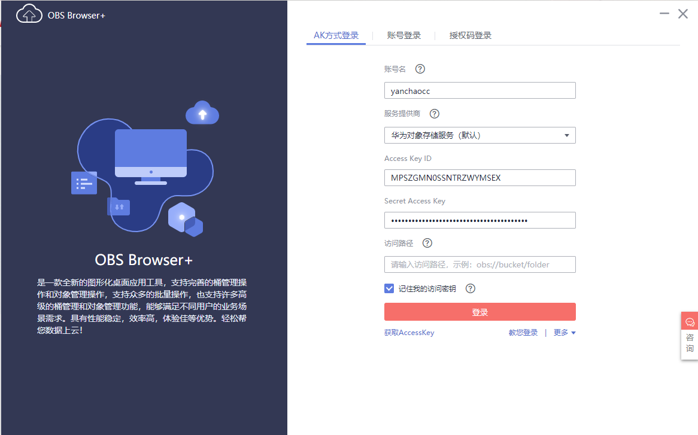
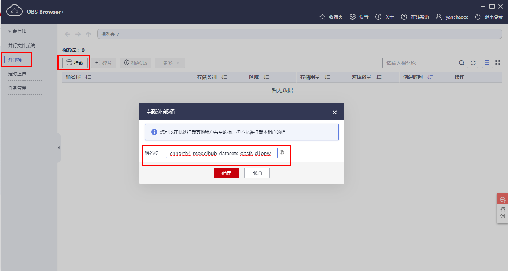
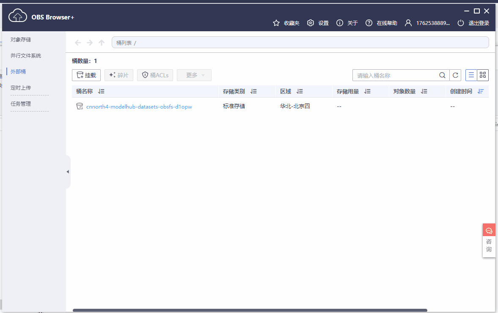
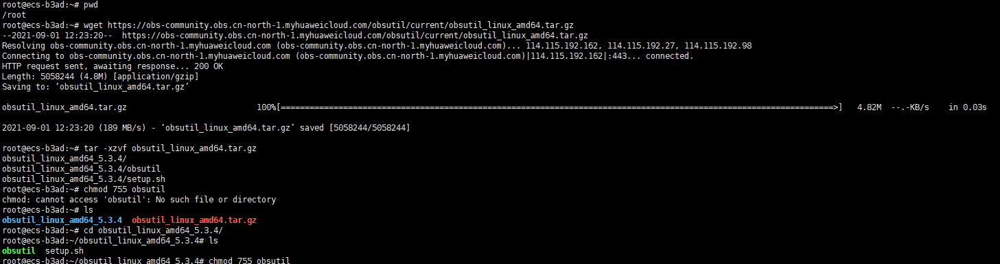
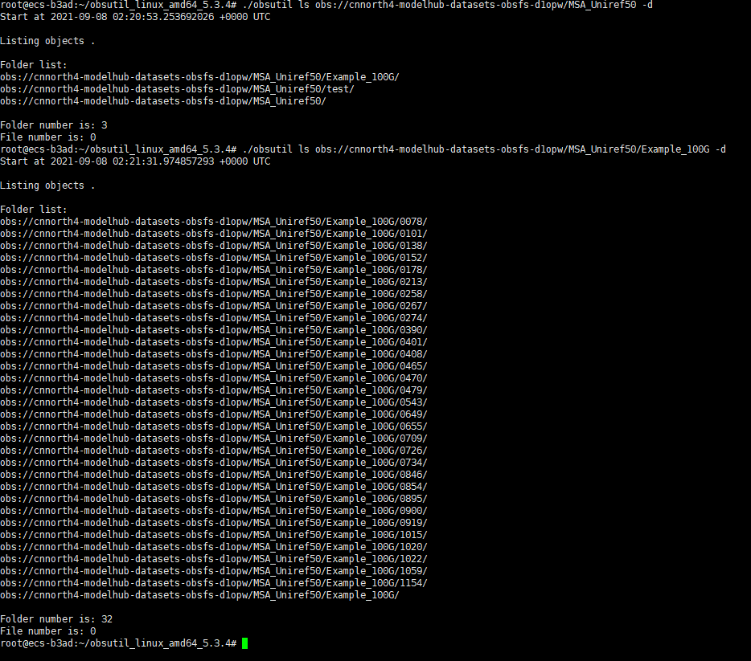
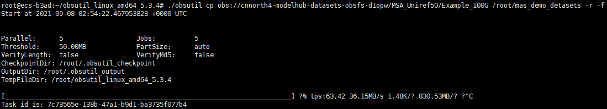
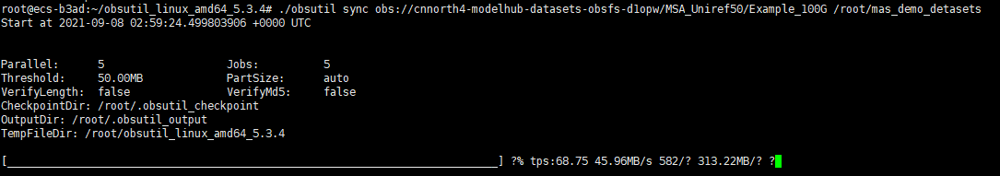
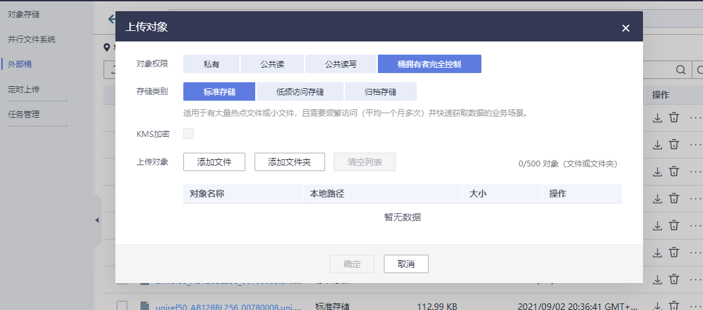

# Protein MSA数据库

## Protein MSA数据库简介

 针对蛋白质的[多序列比对](https://en.wikipedia.org/wiki/Multiple_sequence_alignment)（multiple sequence alignment; MSA）是研究蛋白质的结构、功能和进化关系等问题的重要方法。MSA数据中蕴含了构成蛋白质的氨基酸序列中的保守性质(conservation)、协同突变(co-evolution)和功能与物种进化关系(phylogenetics)的相关信息。


(Figure inspired by Sergey Ovchinnikov)
 人类已知的存在于自然界中的蛋白质序列数目已经上亿并在快速增长，但仅凭这些蛋白质单序列的数据很难了解蛋白之间的关系。Protein MSA数据库，就是一个对不同蛋白质序列之间的关系进行了标记的大规模“关系型”数据库，被标记为关联的蛋白质序列之间的相似度、进化关系和突变所在位点的分布等信息对蛋白质结构和功能的预测极为重要。例如在AlphaFold2模型[1]中，目标蛋白序列的MSA信息就是预测结构的必要输入信息之一。

## 数据库建立方法

 Protein MSA中的目标序列将几乎完全覆盖最新版本（2021.02发布）的[UniRef50数据库](https://www.uniprot.org/uniref/)中的蛋白质序列，而比对序列来自于最新版本的[UniClust30数据库](http://wwwuser.gwdg.de/~compbiol/uniclust/2020_06/)。对于每条来自UniRef50数据库中的目标序列，我们采用HHBlits算法在UniClust30数据库进行搜索和比对，并将检索以文本形式存放于Protein MSA数据仓库下Raw_Data目录下。
生成命令如下(参考https://github.com/soedinglab/hh-suite)：

```shell
hhblits -i <input-file>  -d <database-basename> -o <result-file> -oa3m <result-alignment> -cpu 4 -n 3 -v 0
```

## 数据库规模

 Protein MSA数据库中包含的目标序列约有50M条，之后还将继续扩展和更新。对于每条目标序列，其比对序列的平均条数（或MSA深度）大于1000，因此该数据集里以MSA的形式汇总了超过50B条蛋白质序列（包括了一些重复出现的比对序列）。

## 使用场景

 从科学应用的角度看，MSA的数量和质量很大程度上影响了目前最先进的结构模型的预测速度和精度，而且产生MSA的非参数化算法仍是诸多蛋白预测方法中主要决速步之一。因此，Protein MSA数据库本身可以作为这些结构模型的预训练材料，用来挖掘序列信息甚至快速生成新的序列特征，这对解决研究、设计蛋白质中所面临的高变异序列和孤儿序列等问题具有巨大的潜在价值。为了便于AI领域的研究人员直接使用，Protein MSA原始数据还会被转化为浮点数类型压缩存储，并对已有的AI框架如MindSpore上提供数据接口的支持。我们鼓励并期待来自生物信息学、数据科学和自然语言处理等AI研究领域的专家和人才充分碰撞与合作，引入、改进或设计全新的AI模型，来充分地挖掘Protein MSA数据集中所隐藏的“大自然的秘密”。

## 数据集下载方法

### 准备华为云账号并登录

- 注册华为云中国站账号后，登录华为云控制台(https://auth.huaweicloud.com)，如下图所示，进入“我的凭证”
- 如果你已经有华为云账号， 可直接访问 (https://console.huaweicloud.com)登录华为云控制台


### 使用客户端软件下载数据集

#### 安装数据上传客户端软件

当前华为云OBS对象存储服务，提供了2款客户端软件：含视窗操作界面的[OBS Browser+](https://support.huaweicloud.com/browsertg-obs/obs_03_1003.html), 命令行工具客户端 [obsutil](https://support.huaweicloud.com/utiltg-obs/obs_11_0001.html) 。请查看两款软件支撑的操作系统场景，自行选择。

#### 准备工作，获取账号ak/sk

在“我的凭证”页面，如下图所示，进入访问密钥的页签，可以创建生成ak/sk访问密钥，创建成功后，保存到本地(CSV文件)，后续需要用到。


#### 使用OBS Browser+客户端软件进行数据集的下载

##### 登录

打开OBS Browser+, 将事先准备好的 ak（即Access Key ID）、sk（Secret Access Key）（保存的CSV文件中） ， 按照下图填写，账号名仅用于区分您在本地登录OBS
Browser+的不同账号，与注册的云服务账号无关，也无需一致。



##### 挂载外部桶

如下图所示，输入桶名： cnnorth4-modelhub-datasets-obsfs-d1opw    进行挂载



##### 下载数据集

如下图所示，进入到MSA_Uniref50文件夹，并选中需要下载的数据集文件夹，进行下载



#### 使用obsutil命令行工具进行数据集的下载

##### 安装命令行工具

安装详细官方指导，请参考华为云文档资料：[https://support.huaweicloud.com/utiltg-obs/obs_11_0003.html](https://support.huaweicloud.com/utiltg-obs/obs_11_0003.html) 。 此处我们仅提供Ubuntu 18.04的操作系统上安装的流水账步骤:

打开你的Terminal，cd 到你期望的安装目录，依次执行如下四个命令：

```shell
wget https://obs-community.obs.cn-north-1.myhuaweicloud.com/obsutil/current/obsutil_linux_amd64.tar.gz

tar -xzvf obsutil_linux_amd64.tar.gz

cd obsutil_linux_amd64_*

chmod 755 obsutil
```

执行成功后，如下图所示：



##### 初始化配置

执行如下命令， 其中ak,  sk是你在之前步骤中已经准备好的账号鉴权信息。 endpoint固定为：https://obs.cn-north-4.myhuaweicloud.com

```shell
./obsutil config -i=ak -k=sk -e=endpoint
```

执行成功后，如下图所示：


##### 列表文件

详细官方指导，请参考华为云文档资料：[https://support.huaweicloud.com/utiltg-obs/obs_11_0014.html](https://support.huaweicloud.com/utiltg-obs/obs_11_0014.html)

此处我们仅提供Ubuntu 18.04的操作系统上的流水账步骤:

打开你的Terminal，cd 到你obsutil的安装目录，通过以下命令列表数据集内的文件/文件夹，执行效果如下图所示

```shell
./obsutil ls obs://cnnorth4-modelhub-datasets-obsfs-d1opw/MSA_Uniref50 -d
```



##### 递归下载目录

详细官方指导，请参考华为云文档资料：[https://support.huaweicloud.com/utiltg-obs/obs_11_0018.html](https://support.huaweicloud.com/utiltg-obs/obs_11_0018.html)

此处我们仅提供Ubuntu 18.04的操作系统上流水账步骤:

打开你的Terminal，cd 到你obsutil的安装目录，通过以下命令递归下载目录，执行效果如下图所示

```shell
./obsutil cp obs://cnnorth4-modelhub-datasets-obsfs-d1opw/MSA_Uniref50/Example_100G /root/mas_demo_detasets -r -f
```



##### 增量同步递归下载目录

使用场景：

- 当上述递归下载目录出现有些文件下载失败的场景，可以使用这个命令，自动检测缺失的文件，并下载
- 下载数据的电脑因为意外重启了，需要继续断点续传

详细官方指导，请参考华为云文档资料：[https://support.huaweicloud.com/utiltg-obs/obs_11_0043.html](https://support.huaweicloud.com/utiltg-obs/obs_11_0043.html)

此处我们仅提供Ubuntu 18.04的操作系统上流水账步骤:

打开你的Terminal，cd 到你obsutil的安装目录，通过以下命令增量同步递归下载目录，执行效果如下图所示

```shell
./obsutil sync obs://cnnorth4-modelhub-datasets-obsfs-d1opw/MSA_Uniref50/Example_100G /root/mas_demo_detasets
```



## 维护、更新与社区贡献方式

### 如何贡献数据集

#### 使用客户端进行数据集上传

按照下载数据集的方法进行客户端的安装获取，进入登录页面后可以直接选择本地数据集进行上传操作
注意点：

- 对象权限： 需要选择 “桶拥有者完全控制”
- 存储类别： 选择“标准存储”



#### 使用obsutil命令行工具进行数据集的上传

安装详情可参考：https://support.huaweicloud.com/utiltg-obs/obs_11_0003.html

下面以linux操作系统为例，进行配置：

##### 安装

打开命令行工具，cd 到你的安装目录，依次执行如下四个命令：

```shell
wget https://obs-community.obs.cn-north-1.myhuaweicloud.com/obsutil/current/obsutil_linux_amd64.tar.gz

tar -xzvf obsutil_linux_amd64.tar.gz

cd obsutil_linux_amd64_*

chmod 755 obsutil
```

执行成功后，如下图所示：


##### 初始化配置

执行如下命令， 其中ak, sk是你在之前步骤中已经准备好的账号鉴权信息。 endpoint固定为：https://obs.cn-north-4.myhuaweicloud.com

```shell
./obsutil config -i=ak -k=sk -e=endpoint
```

执行成功后，如下图所示：


 <h3>欢迎参与更多贡献，代码，文档不限<h3>

 ---

 ## 许可与引用

[CC BY-SA 4.0](https://creativecommons.org/licenses/by-sa/4.0/)
