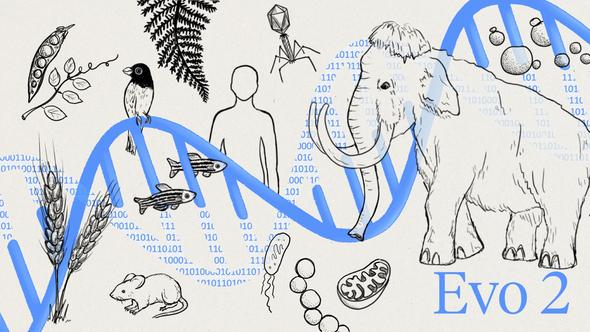

# Evo2-7B-MindSpore

## Introduction
[Evo2](https://github.com/arcinstitute/evo2) is the world’s largest open-source AI model for biology, jointly developed by Arc Institute, NVIDIA, Stanford University, UC Berkeley, and UCSF. It is known as the “DeepSeek of biology”. Evo2 introduces the generative AI paradigm to sequence-level modeling, complementing AlphaFold (structure-level modeling) to form a full-scale computational foundation for “gene-protein-function” research, providing universal infrastructure for precision medicine, synthetic biology, and gene therapy.



This project supports Evo2-7B inference using MindSpore.

### Hardware Requirements
- Atlas 800T2 A2

### Software Requirements
- Python >= 3.12
- CANN >= 8.2.rc1 (nnal package required)
- MindSpore >= 2.8.0

## Preparation
### Clone Repository
```
git clone https://atomgit.com/mindspore-lab/mindscience.git
cd mindscience/MindSPONGE/research/Evo2
```

### Install Dependencies
1. Create a new conda environment and install dependencies:
```shell
conda install -c conda-forge binutils=2.38 --yes
pip install pytest ninja sympy matplotlib pyyaml tqdm einops rich torch biopython
```

2. Install MindSpore >= 2.7.1:
```shell
pip install mindspore==2.7.1 -i https://repo.mindspore.cn/pypi/simple --trusted-host repo.mindspore.cn --extra-index-url https://repo.huaweicloud.com/repository/pypi/simple --force-reinstall
```

3. MindSpore FFT Dependencies
- Install CANN >= 8.2.rc1 nnal run package and set atb and asdsip environment variables:
```shell
# {PATH} is the CANN installation path
source {PATH}/nnal/atb/set_env.sh
source {PATH}/nnal/asdsip/set_env.sh
```

- Test FFT operator availability
```shell
# Clone MindScience repository
git clone https://gitee.com/mindspore/mindscience.git

# Verify FFT operator functionality; all cases should pass (show PASS)
cd mindscience/tests/sciops
pytest test_asd_fft.py
```
Appendix: Ascend FFT operator integration with MindSpore issue:
https://gitee.com/mindspore/mindscience/issues/ICX22I

4. Set Environment Variables
```bash
# {PATH} is the root directory of mindscience/MindSPONGE/research/Evo2
export PYTHONPATH={PATH}/evo2:{PATH}/vortex:{PATH}/mindscience
```

## Weight Acquisition
Two methods are provided to obtain MindSpore-compatible Evo2-7B checkpoint files.

- Online Download
Download `evo2_7b_base_ms.ckpt` from the Modelers community:
https://modelers.cn/models/chen25/evo2-7b

Note: Only `evo2_7b_base` (7B parameters, 8K context) is uploaded on Modelers. For the 7B-parameter, 1M-context version, use the weight conversion method below.

- Weight Conversion
Obtain `evo2_7b_base.pt` from [HuggingFace](https://huggingface.co/arcinstitute/evo2_7b_base), place it in the `evo2/evo2/ckpt` directory, and convert the PyTorch `.pt` file to a MindSpore `.ckpt` file (some layers can be excluded to control model scale; see `convert_ckpt.py` for details).

```bash
cd ckpt/
python convert_ckpt.py
```

After conversion, the `ckpt/` directory should contain three files:
```shell
evo2_7b_base.pt evo2_7b_base_ms.ckpt convert_ckpt.py
```

## Run Inference
Run commands under the `evo2/evo2/` directory:
```bash
cd evo2/evo2/
```

### Forward
Evo2 computes and outputs the probability (likelihood) of each base at every position on a given DNA sequence, enabling sequence scoring.
```shell
python ../../examples/test_evo2_forward.py
```

### Embeddings
Embeddings from Evo2 can be saved for downstream tasks. The paper reports that embeddings from middle layers perform better than those from the final layer; see the paper for details.
```shell
python ../../examples/test_evo2_embeddings.py
```

### Generation
Evo2 can generate DNA sequences based on a prompt.
```shell
python ../../examples/test_evo2_generation.py
```

### License
See the LICENSE file for details.

### References
- Brixi, G., Durrant, M.G., Ku, J. et al. Genome modelling and design across all domains of life with Evo 2. Nature (2026). https://doi.org/10.1038/s41586-026-10176-5

### Implementation Reference
- https://github.com/arcinstitute/evo2

### Contributors
longyangyang, wenziyi2025, wuruifang2025, wujunchi2025, chenzhihui2025