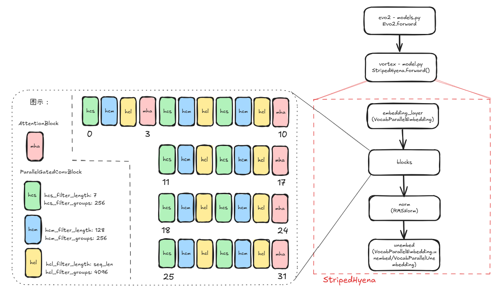

# Vortex中model.py及layers.py分析

## 目录结构
vortex/vortex/model/model.py
```
- AttentionBlock
- HyenaCascade
- ParallelGatedConvBlock
- StripedHyena
```
vortex/vortex/model/layers.py
```
- RMSNorm
- ParallelGatedMLP
- VocabParallelEmbedding
- VocabParallelUnembedding
- TELinear (not used by mindspore)
- FlexLinear (not used)
- Embedding (not used)
```

## Evo2算法结构

可见，StripedHyena为整个模型入口，Evo2最外层推理时直接调用StripedHyena类的forward。

算法pipeline主要由4大模块组成：
- Embedding层，对应vortex/vortex/model/layers.py中VocabParallelEmbedding。
- StripedHyena（混合MHA及长短卷积层，图中以"blocks"标识），对应vortex/vortex/model/model.py中的AttentionBlock（MHA）、ParallelGatedConvBlock（卷积层）。另外vortex/vortex/model/layers.py中ParallelGatedMLP也在其中使用。
- Norm层，对应vortex/vortex/model/layers.py中RMSNorm。
- Unembedding层，对应vortex/vortex/model/layers.py中VocabParallelEmbedding.unembed或VocabParallelUnembedding。

根据vortex/configs/evo2-7b-1m.yml中设置，各卷积和注意力block的排布为以下，如同上图所示：
```
hcl_layer_idxs: [2,6,9,13,16,20,23,27,30]
hcm_layer_idxs: [1,5,8,12,15,19,22,26,29]
hcs_layer_idxs: [0,4,7,11,14,18,21,25,28]
attn_layer_idxs: [3,10,17,24,31]
```