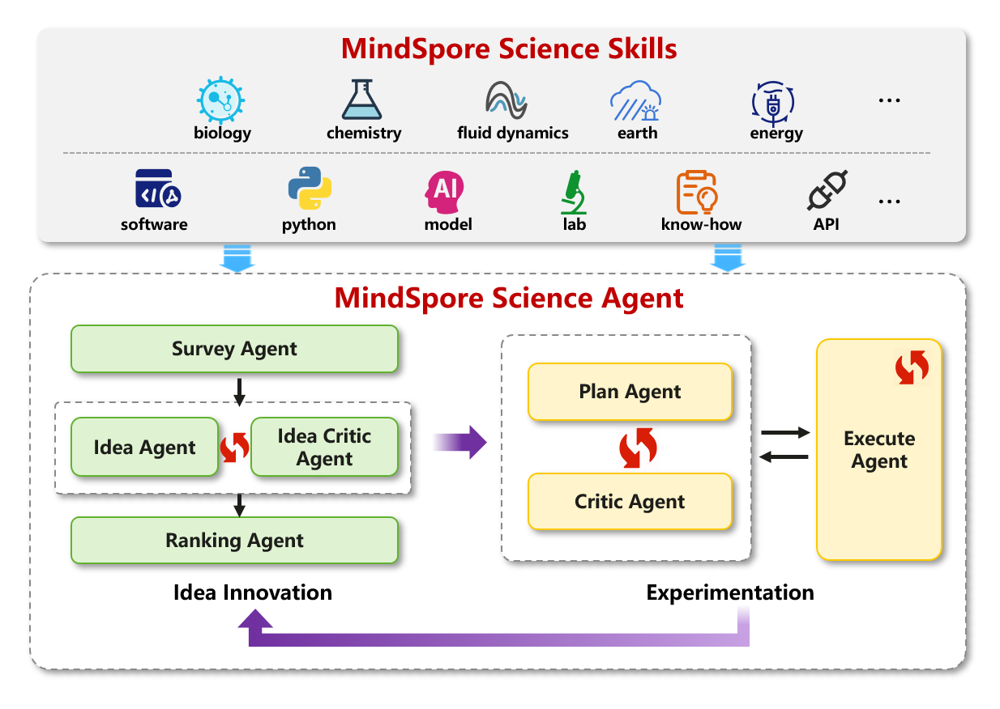
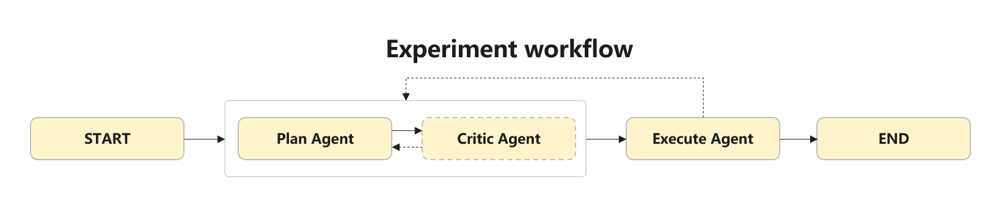
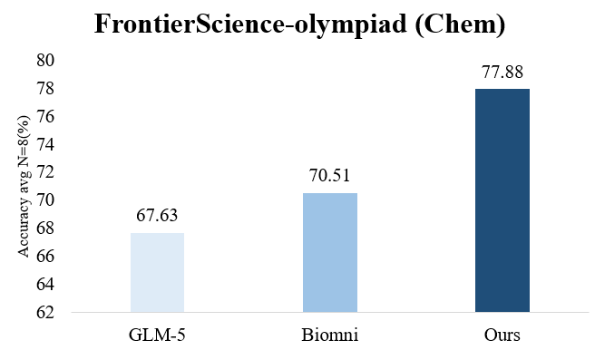
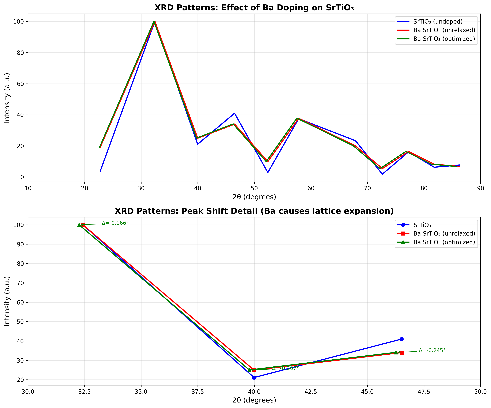
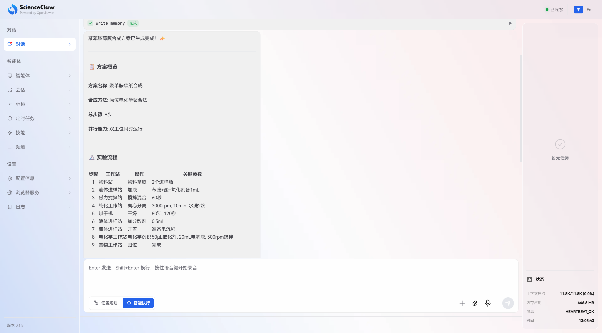

# 科研智能体MindSpore Science Agent preview：搭建你的专属AI科研助手

MindSpore Science Agent是一个面向科研全流程的开源科研智能体，通过将耗时且繁琐的科学全流程（文献阅读、假设提出、代码编写、实验试错和调优等）Agent化，消除了科研环节之间的“人工衔接成本”，大幅压缩科研周期。


## 🔥🔥News

🚀🚀**coming soon**：中国科学技术大学智能科学家团队发布并上线ScienceClaw

🚀🚀**2026.04.17**：科研智能体MindSpore Science Agent preview版本发布，覆盖端到端科研全流程

## 目录
- [整体设计](#整体设计)
- [快速开始](#快速开始)
  - [1. 安装依赖](#1-安装依赖)
  - [2. 配置文件](#2-配置文件)
  - [3. 设置工具API Key（可选）](#3-设置工具api-key可选)
  - [4. 运行 Experiment Workflow](#4-运行-experiment-workflow)
- [应用案例](#应用案例)
  - [一、调研分析类任务：FrontierScience Benchmark](#一调研分析类任务frontierscience-benchmark)
  - [二、计算仿真类任务：化学材料计算仿真](#二计算仿真类任务化学材料计算仿真)
  - [三、湿实验类任务：聚苯胺薄膜合成实验方案设计](#三湿实验类任务聚苯胺薄膜合成实验方案设计)
- [致谢](#致谢)
- [Roadmap](#roadmap)
- [社区](#社区)
- [许可证](#许可证)


## 整体设计

MindSpore Science Agent是MindSpore Science科研智能体系统的核心组件。MindSpore Science Agent由多个sub-agent和workflow组成：

- sub-agent负责科研流程中的单点任务，如假设生成、实验设计、自我修改、实验执行等；

- workflow支持将sub-agent能力串接成工作流，完成复杂科研任务。

我们参考集成了业界开源(e.g.,[InternAgent](https://github.com/InternScience/InternAgent)、[Biomni](https://github.com/snap-stanford/Biomni) )中的假设生成、实验设计、实验执行等sub-agent，并基于多智能体架构，实现科学实验全流程workflow编排。

<div align=center>
  
</div>

MindSpore Science Agent采用多Agent协作架构，包含以下六个核心sub-agent：

| sub-agent | 功能描述 |
|-------|----------|
| **Plan Agent** | 计划Agent，负责任务分析和计划生成，任务分解并生成带检查点的步骤列表，与Execute Agent交互执行代码，识别失败步骤并调整计划，最终输出答案。 |
| **Execute Agent** | 执行Agent，是代码执行专家，从标签中提取Python代码执行，调试并修复错误，输出执行结果。 |
| **Critic Agent** | 批评Agent，负责对计划提供建设性反馈，审查对话历史并严格批判分析不足之处，提供改进建议并识别缺失要素，迭代优化直到任务完成。 |
| **Idea Agent** | 假设生成Agent，负责生成创新性研究假设，基于研究目标生成多个假设候选，可配置创意水平并保证假设多样性，结合迭代反馈优化并输出结构化假设结果。 |
| **Ranking Agent** | 评估Agent，负责对假设进行多标准加权评分和排序，基于多个评估维度对假设进行0-10分评分，输出排序后的假设列表及评分理由。 |
| **Idea Critic Agent** | 假设批评Agent，负责对假设和方法进行关键评判，多维度评估逻辑一致性、科学可行性、可测试性、新颖性，提供可操作的改进建议。 |


当前preview版本内置实验设计与执行工作流(Experiment workflow)：
<div align=center>
  
</div>

该Experiment workflow参考[Biomni](https://github.com/snap-stanford/Biomni)的实现，并进行了以下优化：

1. **实验相关Sub-Agent优化**：重点优化实验相关Sub-Agent的Prompt与Skills配置，强化其任务理解与执行能力；

2. **自我纠错能力提升**：通过改进错误处理机制与调试策略，显著提升实验执行Sub-Agent的自我纠错能力，减少报错信息带来的上下文污染。


## 快速开始

### 1. 安装依赖

```bash
# 推荐使用Python3.12版本
conda create -n MindScienceAgent python=3.12
conda activate MindScienceAgent

git clone https://gitcode.com/mindspore-lab/mindscience.git
cd mindscience/MindScienceAgent
pip install -r requirements.txt
```


### 2. 配置文件

编辑 `mindscience_agent.yaml` 配置参数，配置您的模型API Key等信息：


```yaml
model_defaults:                                     # 默认模型配置
  model_name: "your-model-id"                       # 使用的模型名称
  provider: "openai"                                # 模型提供商，目前仅支持openai接口
  base_url: "https://your-api-endpoint.example/v1"  # API 端点
  api_key: "YOUR_API_KEY"                           # 模型API Key

# 每个Agent可独立配置 model和agent 两类配置项
# model配置项用于指定某个agent的模型参数，会覆盖 model_defaults 中的默认配置
# agent 配置项用于指定该Agent特有的行为参数
agents:                                             # Agent级别配置（可选）
  plan:                                             # Agent Type
    model:                                          # 模型配置项（可选，设为null时使用默认配置）
      model_name: null
      provider: null
      base_url: null
      api_key: null
    agent:                                          # Agent配置项
      max_retries: 2                                # Agent执行失败时的最大重试次数
      use_tool_retriever: true                      # 是否启用工具筛选
      skill_path: ""                                # skill文件路径，指定Agent可使用的skills，注意Windows建议给绝对路径

logging:                                            # 日志配置项
  level: "INFO"                                     # 设置日志等级，INFO级日志打印所有Agent的输出，DEBUG级日志打印所有Agent的执行中间结果
```


### 3. 设置工具API Key（可选）

MindSpore Science Agent提供了信息搜索、文献调研等工具能力，部分工具（如`advanced_web_search_qwen`、`Semantic Scholar` 学术搜索）需要通过 API Key 进行认证访问。因此需要在 `.env` 文件中配置相应的 API Key，以便工具能够正常使用。

在.env文件中填入所需API Key：

| 环境变量 | 说明 | 获取方式 |
|---------|------|----------|
| `DASHSCOPE_API_KEY` | `advanced_web_search_qwen`工具通过调用`qwen3.5-plus` API实现信息搜索与汇总，因此需要配置阿里云`DashScope API Key` | 登录 [DashScope 控制台](https://dashscope.console.aliyun.com/)，在"API-KEY管理"中创建并获取 |
| `S2_API_KEY` | `Semantic Scholar API Key`，query_semantic_scholar工具需使用 | 登录 [Semantic Scholar](https://www.semanticscholar.org/)，在账户设置中申请 API Key |


### 4. 运行 Experiment Workflow

```bash
python run_workflow.py --prompt 'Please help me analyse the molecular weight of the following drug molecule: Aspirin (acetylsalicylic acid) SMILES: CC(=O)OC1=CC=CC=C1C(=O)O'
```

支持以下参数：
- `--prompt`: （必填）传入 prompt 内容
- `--config-path`: 配置文件路径（默认 `./mindscience_agent.yaml`）
- `--enable-critic`: 启用 critic agent 进行迭代优化
- `--test-time-scale-round`: critic 迭代轮数（默认 1）

示例：
```bash
# 传入配置文件（请替换为实际的配置文件路径）
python run_workflow.py --prompt 'Please help me analyse the molecular weight of the following drug molecule: Aspirin (acetylsalicylic acid) SMILES: CC(=O)OC1=CC=CC=C1C(=O)O' --config-path ./mindscience_agent.yaml

# 启用 critic 模式
python run_workflow.py --prompt 'Please help me analyse the molecular weight of the following drug molecule: Aspirin (acetylsalicylic acid) SMILES: CC(=O)OC1=CC=CC=C1C(=O)O' --enable-critic --test-time-scale-round 3
```

## 应用案例
基于[MindSpore Science Skills](https://gitcode.com/mindspore-lab/mindscience/tree/master/MindScienceSkills)与MindSpore Science Agent，我们可以完成多种类型的复杂科学任务。下面我们以化学领域为例，分别构建科学分析、计算仿真与湿实验三类任务真实案例。

### 一、科学分析类任务：[FrontierScience](https://huggingface.co/datasets/openai/frontierscience) Benchmark

我们选取OpenAI开源的FrontierScience，这是一项用于测试物理、化学和生物领域推理能力的基准，旨在衡量模型、智能体在真实科学研究方面的水平。

#### 实验设置

- **模型**：glm-5
- **测试数据集**：FrontierScience olympiad内的chemistry任务集
- **测试规模**：共40道题目
- **评测方式**：每道题目独立运行8次，计算平均正确率

#### 实验结果

MindSpore Science Agent采用OpenAI发布的FrontierScience中的国际化学奥赛题集进行评测，基于GLM-5模型，在avg N=8上的答题准确率达到77.88%，超过GLM-5模型（67.63%）以及斯坦福大学研究团队发布的 [Biomni](https://github.com/snap-stanford/Biomni)平台（70.51%）。

<div align=center>
  
</div>


#### 样例测试代码
本案例以FrontierScience中的电解反应物分析问题为例：

```
One equivalent of <INCHI>InChI=1S/C10H18O4/c1-5(7(3)9(11)12)6(2)8(4)10(13)14/h5-8H,1-4H3,(H,11,12)(H,13,14)/p-2</INCHI>, <SMILES>CC(C(C)C(C)C([O-])=O)C(C)C([O-])=O</SMILES>, <IUPAC>2,3,4,5-tetramethyl-hexanedioate</IUPAC> undergoes electrolysis, reacting with itself to give the major symmetric product X. Identify molecule X.
```
详细代码与步骤请参阅示例Notebook：[olympiad-chemistry.ipynb](examples/frontierscience/olympiad-chemistry.ipynb)

#### Benchmark测试代码

测试脚本为 eval/eval_frontierscience.py，该脚本使用 MindScienceAgent 目录下的 run_workflow.py 及 mindscience_agent.yaml 来执行 Benchmark 测试。

数据准备：
- 下载数据集：https://huggingface.co/datasets/openai/frontierscience/raw/main/olympiad/test.jsonl
- 或使用命令：wget https://huggingface.co/datasets/openai/frontierscience/resolve/main/olympiad/test.jsonl

运行命令：
```bash
export PYTHONPATH=/path/to/MindScienceAgent/
python eval/eval_frontierscience.py --data_path <data_file> [--options]
```

参数说明：
- `--data_path` (必填) 数据文件路径，JSONL格式
- `--log_dir` (可选) 日志保存目录，默认 "frontierscience_results"
- `--concurrent_processes` (可选) 最大并发进程数，默认 8
- `--n` (可选) 每个问题运行次数，默认 8

示例：
```bash
python eval/eval_frontierscience.py --data_path test.jsonl --log_dir results --concurrent_processes 4 --n 4
```


### 二、计算仿真类任务：化学材料计算仿真

本案例展示了如何使用 MindSpore Science Agent 自动执行钙钛矿材料掺杂相关的仿真计算工作流。任务流程包括:

```
┌────────────┐    ┌────────────┐    ┌────────────┐    ┌────────────┐
│  数据库查询 │ -> │  结构建模   │ -> │  快速弛豫   │ -> │ 计算XRD谱  │
└────────────┘    └────────────┘    └────────────┘    └────────────┘
```

详细代码与步骤请参阅示例 Notebook：[materials_simulation.ipynb](examples/materials_simulation/materials_simulation.ipynb)

最终的 XRD 对比结果如下图所示：
<div align=center>
  
</div>

### 三、湿实验类任务：聚苯胺薄膜合成实验方案设计

本案例由 MindSpore Science Agent 与中国科大智能科学家团队合作开发，基于真实物理实验工作站进行化学实验方案的设计与执行。我们以聚苯胺薄膜的合成为例，依据工作站的skills生成实验方案，并下发至智能科学家平台执行。

生成的实验方案内容如下图所示：
<div align=center>
  
</div>

更多详细内容请参考：[实验设计详情目录](examples/experiments_design/)

## 致谢
本项目与中国科学技术大学智能科学家团队联合构建，感谢所有专家在专业领域的深度指导与合作！

MindSpore Science Agent 的部分组件集成并优化了以下开源社区的优秀成果，对这些开源项目表达诚挚感谢：

| 项目                        | 链接                                           |
| -------------------------- | ---------------------------------------------- |
| InternScience/InternAgent  | https://github.com/InternScience/InternAgent   |
| snap-stanford/Biomni       | https://github.com/snap-stanford/Biomni        |
| hkuds/AI Researcher | https://github.com/hkuds/ai-researcher |


## Roadmap

### 🚀 核心能力演进

MindSpore Science Agent当前preview版本中，我们专注于优化实验设计与执行流程，未来我们将针对科研全流程进一步优化：

- 持续完善sub-agent和workflow易用性，实现用户自定义科研助手的分钟级搭建。

- 持续扩充与优化sub-agent和workflow能力，并将应用场景扩展至量子、生物、金融、流体等更多领域；

- 针对科研流程中上下文暴增问题，构建基于世界模型的上下文管理架构，实现智能体稳定、持续完成海量文献阅读与分析。


## 社区

欢迎您通过以下方式，一起丰富MindSpore Science Agent能力。

### 贡献方式

✨ 拓展Agent类型
- 创建具备新功能或专长领域的原子Agent，为平台注入新的能力维度

📚 构建专业workflow
- 设计适用于特定研究任务或复杂场景的Workflow，提升解决综合性问题的效率

📋 贡献实践案例
- 分享在实际任务中应用智能体或工作流的具体执行过程与成果，为其他用户提供参考范例

🐛 报告问题
- 报告使用中遇到的问题，或提出功能改进的建议，帮助我们持续优化

### 贡献指南
- 如何贡献您的代码，请点击此处查看：[贡献指南](https://gitcode.com/mindspore-lab/mindscience/blob/master/CONTRIBUTION.md)


## 许可证

[Apache License 2.0](http://www.apache.org/licenses/LICENSE-2.0)

