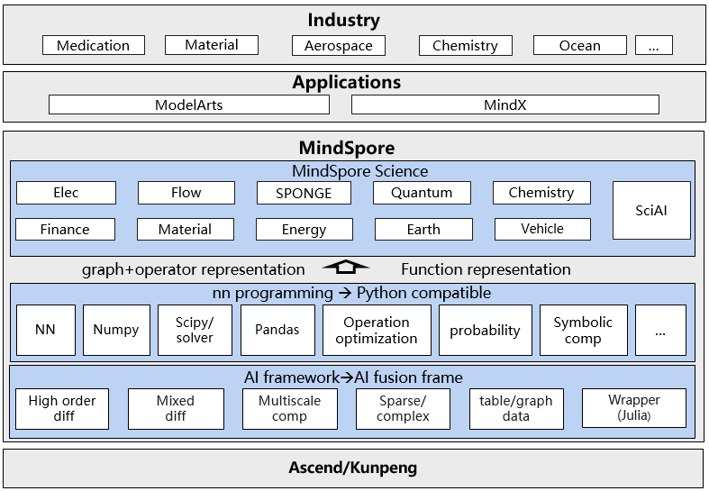

# MindScience

[查看中文](README_CN.md)

- [Overview of MindScience](#Overview)
    - [MindEarth](#mindearth)
    - [MindFlow](#mindflow)
    - [MindElec](#mindelec)
    - [MindChemistry](#mindchemistry)
    - [MindSPONGE](#mindsponge)
    - [SciAI](#sciai)
- [Architecture](#Architecture)
- [Cooperations](#Cooperations)

## Overview

MindScience is a scientific computing industry toolkit based on the MindSpore framework, which contains the industry-leading datasets, foundational models, pretrained checkpoints high-precision models, and pre- and post-processing tools, accelerating the development of scientific computing applications.

### [MindEarth](https://gitee.com/mindspore/mindscience/tree/master/MindEarth)

MindEarth, a suite in the field of Earth sciences, supports tasks such as multi-temporal-spatial-scale meteorological forecasting and data preprocessing, committed to efficiently enabling AI+meteorological/ocean fusion research.

MindEarth provides multiple medium-range weather forecasting models, which improve its forecasting performance by over 1000 times compared to traditional models; it also provides precipitation nowcasting models and DEM super-resolution models. MindEarth also provides ERA5 reanalysis dataset, radar echo dataset and high-resolution DEM dataset, supporting the training and evaluation of nowcasting, medium-range, and other forecasting models.

Based on these functionalities and datasets, MindEarth has successfully incubated a series of influential achievements. It has integrated multi-temporal-spatial-scale meteorological forecasting SOTA models, significantly improving prediction speed.

### [MindFlow](https://gitee.com/mindspore/mindscience/tree/master/MindFlow)

MindFlow, a computational fluid dynamics solver suite, supports AI fluid simulation driven by physics, data, and data-mechanism fusion; it interfaces with the domestic CFD solver PHengLei, achieving the coupling of AI and traditional fluid solvers; it has a built-in differentiable CFD solver, realizing the end-to-end differentiation of flow field simulations.

MindFlow provides common datasets such as airfoil flow field and turbulence, and supports the training and evaluation of AI fluid simulation models.

Based on these functionalities and datasets, MindFlow has successfully incubated a series of influential achievements, including cooperating with Commercial Aircraft Corporation of China, releasing AI fluid simulation models “DongFang·Yufeng” and “DongFang·Yifeng”, reducing the wing aerodynamic simulation from hours to seconds, and helping the domestically-produced aircraft take off; cooperating with Northwestern Polytechnical University, releasing the AI model “QinLing·AoXiang”, achieving high-precision coupled simulation of AI turbulence model.

### [MindElec](https://gitee.com/mindspore/mindscience/tree/master/MindElec)

MindElec is a computational electromagnetic simulation toolkit that supports data construction and conversion, simulation computation, result visualization, and end-to-end AI electromagnetic simulation. It has achieved technical breakthroughs in mobile phone electromagnetic simulation, with simulation accuracy comparable to traditional scientific computing software, and performance improvement by 10 times.

MindElec supports CSG mode geometric construction, such as intersection, union, and difference of structures such as rectangles and circles, and efficient tensor conversion of cst and stp data.

Based on these functionalities and datasets, MindElec has successfully incubated a series of influential achievements. It has cooperated with Huawei Noah’s Ark Lab to realize end-to-end differentiable FDTD, and has verified it in scenarios such as patch antenna, patch filter, and two-dimensional electromagnetic inverse scattering. It is also in cooperation with Southeast University to release the “Jinling·Electromagnetic Brain” AI model, which improved the array antenna simulation efficiency by more than 10X times, and the efficiency increased more significantly as the array size increased.

### [MindChemistry](https://gitee.com/mindspore/mindscience/tree/master/MindChemistry)

MindChemistry is a computational chemistry toolkit that supports multi-system, multi-scale tasks of AI+chemistry simulation, and is committed to enabling efficient integration of AI and chemistry research.

MindChemistry has a built-in isometric computing library, which significantly improves the data representation efficiency and model training efficiency of scientific scenario modeling. MindChemistry also provides rMD17 and other industry-frequently used datasets, supports molecular generation and prediction model training and evaluation, and provides interfaces and abilities such as isometric computing, high-order optimizer, etc.

Based on these functionalities and datasets, MindChemistry has successfully incubated a series of influential achievements. It connects with the state-of-the-art models of molecular generation and prediction, and realizes efficient material design and molecular performance prediction of AI in the field of chemistry.

### [MindSPONGE](https://gitee.com/mindspore/mindscience/tree/master/MindSPONGE)

MindSPONGE is a computational biology toolkit that supports high-performance, modular, end-to-end differentiable, AI-native architecture for molecular simulation, MSA generation, protein folding training and inference, protein structure scoring, NMR data analysis and other basic features.

MindSPONGE provides a million-level protein structure prediction dataset with high coverage and diversity - PSP, which supports protein structure training and inference.

Based on these functionalities and datasets, MindSPONGE has successfully incubated a series of influential achievements. These include collaborating with Professor Yiqin Gao’s team to release a molecular simulation software that supports differentiable programming and high-throughput simulation; releasing a end-to-end protein structure prediction tool MEGA-Protein, which supports high-performance and high-precision prediction of protein structure; and automatic analysis of NMR spectroscopy data by FAAST, which reduces the NMR data analysis time from months to hours.

### [SciAI](https://gitee.com/mindspore/mindscience/tree/master/SciAI)

SciAI is a model library with 60+ built-in most frequently used and cited AI4Science models, cover from physics-informed (PINNs, DeepRitz, PFNN, etc.) to neural operators (FNO, DeepONet), ranking No.1 in the world in terms of coverage, provides the developers and users with high-level APIs, allowing an immediate deployment.

## Architecture

## Cooperations

<!DOCTYPE html>
<html lang="zh">
<head>
    <meta charset="UTF-8">
</head>

<body>
    <table width=100% align="center">
        <tr id='tr1'>
            <td>
                
            </td>
            <td>
                
            </td>
            <td>
                
            </td>
        </tr>
        <tr id='tr2'>
            <td>
                
            </td>
            <td>
                
            </td>
            <td>
                
            </td>
        </tr>
        <tr id='tr3'>
            <td>
                
            </td>
            <td>
                
            </td>
            <td>
                
            </td>
        </tr>
    </table>
</body>
</html>