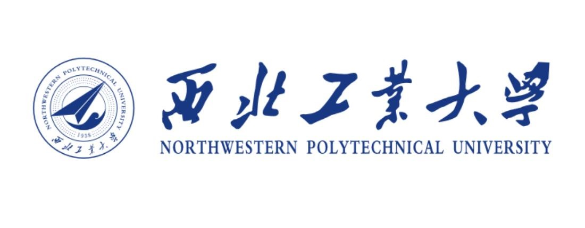
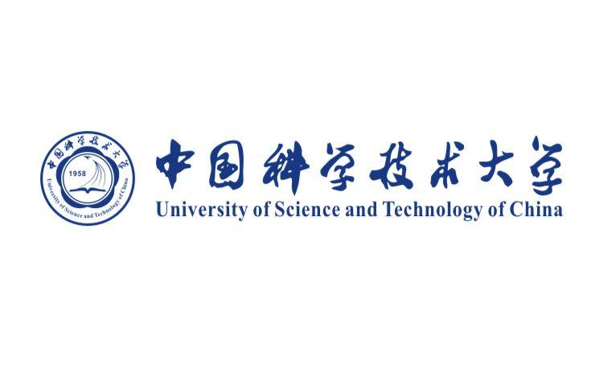
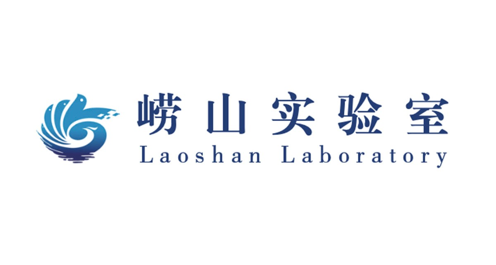
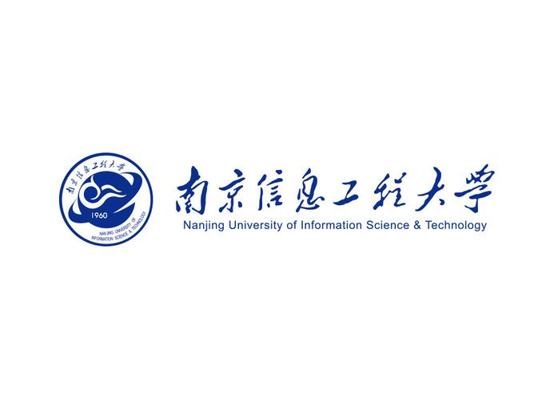
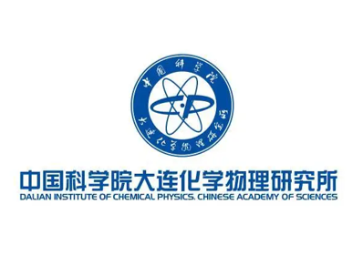
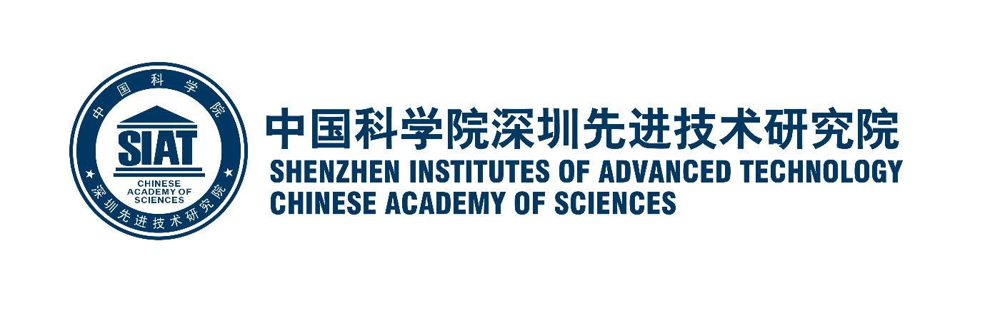

# 通知: 本项目已经正式迁移至 [AomGit](https://atomgit.com/mindspore/mindscience) 平台
# MindScience

[View English](README.md)

- [MindScience概述](#概述)
    - [MindSPONGE](#mindsponge)
    - [MindEarth](#mindearth)
    - [MindChem](#mindchem)
    - [MindEnergy](#MindEnergy)
    - [MindFlow](#mindflow)
    - [MindElec](#mindelec)
    - [SciAI](#sciai)
- [架构图](#架构图)
- [合作伙伴](#合作伙伴)

## 概述

将AI与科学计算相结合，即AI+科学计算，是指利用人工智能技术如机器学习、深度学习等，对科学难题进行实计算和分析。这种结合使得科学计算不再局限于传统的数学模型和算法，而是能够借助AI的强大计算能力，探索未知领域，提升计算效率和准确性。AI+科学计算的计算能力主要来源于大数据的支持和算法的优化，通过不断学习和优化，AI能够更好地应对复杂的科学计算问题。

MindScience是基于MindSpore融合架构打造的高性能科学计算行业套件，提供了业界领先的数据集、SOTA模型、常用模型接口和前后处理工具，面向Ascend开展深度优化，加速科学行业应用开发。

## 架构图

## MindScience-Core

MindScience-Core是MindScience的核心组件，为开发者提供易用性强，昇腾亲和的常用模型接口，加速AI4Science模型开发，主要提供以下几个能力：

[常用模型接口](mindscience/models/):

[图计算](mindscience/gnn/)：由于图的拓扑结构天然适配网格、分子结构等数据形态，AI4Science 领域的模型大量采用以 GNN（Graph Neural Network，图神经网络）为核心的架构。MindScience 为此提供了一套功能完备、与 Ascend 平台深度亲和的 GNN 接口，同时保持与业界主流框架接口的兼容性，有效提升了相关模型的开发效率。

[等变计算](mindscience/e3nn)：等变计算库 e3nn 专为处理具有对称性的数据场景设计，尤其适配分子、晶体等包含旋转、平移等对称属性的结构。它提供了一套完整的等变神经网络构建工具，能精准捕捉数据的对称性特征，研究者可高效开发符合对称性原理的模型，显著提升分子模拟、材料科学等领域的任务表现。

[物理信息神经网络](mindscience/pde/)：物理信息神经网络库 PINNs（Physics-Informed Neural Networks）专为融合物理规律与数据驱动建模设计，尤其适用于流体力学、热传导等偏微分方程（PDE）求解场景。MindScience 的pde模块提供了将物理守恒律、边界条件等约束嵌入神经网络的完整工具链，研究者无需依赖大量标注数据，即可高效构建符合物理规律的模型，大幅提升工程仿真、科学计算等领域的求解效率与泛化能力。

[可微分求解器](mindscience/solvers/)：可微分求解器是一类融合数值计算与自动微分能力的专用工具，核心用于高效求解常微分方程（ODE）、偏微分方程（PDE）等科学与工程问题。它能在输出数值解的同时，反向传播计算梯度信息，完美兼容 MindSpore 深度学习框架。借助这一特性，研究者可将物理方程的求解过程嵌入神经网络训练流程，为科学计算与深度学习的结合提供关键支撑，广泛应用于动力学模拟、控制策略优化等 AI4Science 场景。

[科学计算算子](mindscience/sciops/)：科学计算算子是支撑 AI4Science 模型构建的核心基础组件，算子经过与 Ascend 结合的深度优化，实现复杂科学计算任务的高效执行。

[分布式并行](mindscience/distributed)：分布式并行是应对 AI4Science 大规模任务的核心高效计算方案，通过将海量数据、复杂模型或计算任务拆分到多节点、多设备集群中协同处理，突破单设备的算力与内存瓶颈，为 AI4Science 向更复杂、更精细的研究方向拓展提供了关键算力保障。

## MindScience-Toolkit

针对 AI4Science 不同领域的特征，MindScience提供了领域套件，加速领域创新：

### [MindSPONGE](MindSPONGE/)

计算生物领域套件MindSPONGE支持高性能、模块化，端到端可微，类AI架构编写的分子模拟功能以及MSA生成，蛋白质折叠训练推理和蛋白质结构打分，NMR数据解析等常用功能。

MindSPONGE提供了高覆盖度和多样性的百万级蛋白质结构预测数据集——PSP，支持蛋白质结构训练和推理。

基于上述功能和数据集，MindSPONGE已经成功孵化一系列有影响力的成果。包括与高毅勤老师团队合作，发布分子模拟软件，支持可微分编程和高通量模拟；发布全流程蛋白质结构预测工具
MEGA-Protein，支持高性能高精度预测蛋白质结构；以及核磁共振波谱法数据自动解析FAAST，实现了NMR数据解析时间从数月到数小时的缩短。

### [MindEarth](MindEarth/)

地球科学领域套件MindEarth支持多时空尺度气象预报、数据前后处理等任务，致力于高效使能AI+气象海洋的融合研究。

MindEarth内置多个中期气象预报模型，预报性能较传统模式提升1000+倍；内置短临降水模型与海陆DEM超分模型。MindEarth还提供ERA5再分析模型、雷达回波数据集、高分辨率DEM数据，支持短临、中期等预报模型的训练与评估。

基于上述功能和数据集，MindEarth已成功孵化一系列有影响力的成果，集成多个短临、中期气象预报SOTA模型，显著提升预报速度。

### [MindChem](MindChem/)

计算化学领域套件MindChem支持多体系，多尺度任务的AI+化学仿真，致力于高效使能AI与化学的融合研究。

MindChemistry内置等变计算库，显著提高科学场景建模数据的表征效率和模型的训练效率。MindChemistry还提供rMD17等业界高频使用的数据集，支持分子生成、预测模型的训练与评估，提供等变计算、高阶优化器等接口与功能。

基于上述功能和数据集，MindChemistry已经成功孵化一系列有影响力的成果。对接分子生成与分子预测SOTA模型，实现AI在化学领域的高效材料设计与分子性能预测。

### [MindEnergy](MindEnergy/)

能源领域套件MindEnergy....

### [MindFlow](MindFlow/)

计算流体求解套件MindFlow支持物理驱动、数据驱动和数据机理融合驱动的AI流体仿真；对接国产CFD求解器PHengLei，实现AI和传统流体求解的耦合；支持可微分CFD仿真，实现流场求解的端到端微分。

MindFlow提供了翼型流场、湍流等常用数据集，支持Al流体仿真模型的训练和模型评估。

基于上述功能和数据集，MindFlow已经成功孵化一系列有影响力的成果，包括和中国商飞合作，发布“东方·御风”、“东方·翼风”大模型，机翼气动仿真由小时级降低到秒级，助力国产大飞机起飞；和西北工业大学合作，发布“秦岭·翱翔”大模型，实现AI湍流模型的高精度耦合仿真。

### [MindElec](MindElec/)

计算电磁仿真领域套件MindElec，支持数据建构及转换、仿真计算、结果可视化以及端到端的AI电磁仿真。在手机电磁仿真已取得技术实破，仿真精度媲美传统科学计算软件，同时性能提升10倍。

MindElec支持CSG模式的几何构建，如矩形、圆形等结构的交集、并集和差集，以及cst和stp数据的高效张量转换。

基于上述功能和数据集，MindElec已经成功孵化一系列有影响力的成果。和华为诺亚合作，实现了端到端可微FDTD，并且在贴片天线、贴片滤波器以及二维电磁逆散射等场景进行了验证。和东南大学合作，发布“金陵·电磁脑”基础模型，阵列天线仿真效率提升10X+倍以上，且随着阵列规模增大，效率提升更加显著。

### [SciAI](SciAI/)

AI4Science高频模型套件SciAI，内置60+高频模型，覆盖物理感知（如PINNs、DeepRitz以及PFNN）和神经算子（如FNO、DeepONet）等主流模型，覆盖度全球第一；提供了高阶API，开发者和用户开箱即用。

## 合作伙伴

<!DOCTYPE html>
<html lang="zh">
<head>
    <meta charset="UTF-8">
</head>

<body>
    <table width=100% align="center">
        <tr id='tr1'>
            <td>
                
            </td>
            <td>
                
            </td>
            <td>
                
            </td>
        </tr>
        <tr id='tr2'>
            <td>
                
            </td>
            <td>
                
            </td>
            <td>
                
            </td>
        </tr>
        <tr id='tr3'>
            <td>
                
            </td>
            <td>
                
            </td>
            <td>
                
            </td>
        </tr>
        <tr id='tr4'>
            <td>
                
            </td>
            <td>
                
            </td>
            <td>
                
            </td>
        </tr>
        <tr id='tr5'>
            <td>
                
            </td>
            <td>
                
            </td>
            <td>
                
            </td>
        </tr>
        <tr id='tr6'>
            <td>
                
            </td>
            <td>
                
            </td>
            <td>
                
            </td>
        </tr>
        <tr id='tr7'>
            <td>
                
            </td>
            <td>
                
            </td>
            <td>
                 
            </td>
        </tr>
        <tr id='tr8'>
            <td>
                
            </td>
            <td>
                
            </td>
            <td>
                
            </td>
        </tr>
        <tr id='tr9'>
            <td>
                
            </td>
            <td>
                
            </td>
            <td>
                
            </td>
        </tr>
        <tr id='tr10'>
            <td>
                
            </td>
        </tr>
    </table>
</body>
</html>