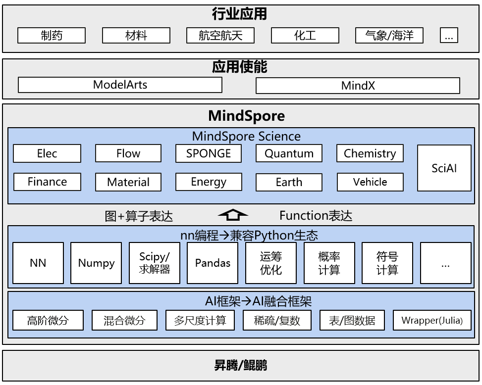

# MindScience

[View English](README.md)

## 概述

MindScience是基于MindSpore融合架构打造的科学计算行业套件，包含了业界领先的数据集、基础模型、预置高精度模型和前后处理工具，加速了科学行业应用开发。目前已推出面向电子信息行业的MindElec套件和面向生命科学行业的MindSPONGE套件，分别实现了电磁仿真性能提升10倍和生物制药化合物模拟效率提升50%。

## 架构图

