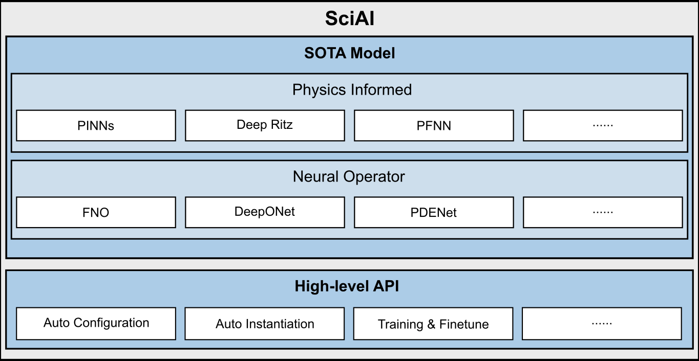

ENGLISH | [简体中文](README_CN.md)

# MindSpore SciAI

- [MindSpore SciAI Introduction](#MindSpore-SciAI-introduction)
- [Model Library](#model-library)
- [Installation Guide](#installation-guide)
    - [Confirming the System Environment Information](#confirming-the-system-environment-information)
    - [Method 1: Install with Pip](#Method-1:-Install-With-Pip)
    - [Method 2: Install From Source Code](#Method-2:-Install-From-Source-Code)
    - [Installation Verification](#Installation-Verification)
- [Quick Start](#quick-start)
    - [Method 1: Launch by Advanced API (recommended)](#Method-1:-Launch-by-Advanced-API-(recommended))
    - [Method 2: Launch by Source code](#Method-2:-Launch-by-Source-code)
- [Documents](#documents)
- [Community](#community)
- [Contribution](#contribution)
- [Release Notes](#release-notes)
- [License](#license)

## MindSpore SciAI Introduction

Based on MindSpore, SciAI is a model library with 60 built-in most frequently used and cited AI4Sci(AI for Science) models, which cover SOTA models from physics-informed (PINNs, DeepRitz, PFNN, etc.) to neural operators (FNO, DeepONet, PDENet), ranking No.1 in the world in terms of coverage.
MindSpore SciAI provides the developers and users with a high-level API (auto configuration, auto instantiation, training and fine-tuning, etc.), allowing an immediate deployment.
With these features, MindSpore SciAI covers a wide variety of scientific computation fields,
including fluid dynamics, electromagnetism, sound, heat, solid and biology, providing developers and users with an efficient and convenient AI4SCI computation platform.

<div align=center>

</div>

The hierarchy of project SciAI is given below.

```text
├── SciAI
│   ├── cmake               # compilation related
│   ├── docs                # documentation
│   │   ├── FAQ             # frequently asked questions
│   ├── sciai               # SciAI framework
│   │   ├── architecture    # base neural networks modules
│   │   ├── common          # common modules
│   │   ├── context         # context functions
│   │   ├── model           # **AI4SCI high-frequency model library**
│   │   ├── operators       # high order derivatives
│   │   └── utils           # Other auxiliary functions
│   └── tutorial            # tutorial models
```

## Model Library

SciAI model library provides a wide variety of models that are frequently used and cited in scientific computation.
The following table summarizes the current available neural networks and their corresponding domains.

| Domain              | Network                                                                                              |                                                                           MindSpore Implementation and Parameters                                                                            | Ascend | GPU |
|---------------------|------------------------------------------------------------------------------------------------------|:--------------------------------------------------------------------------------------------------------------------------------------------------------------------------------------------:|:------:|:---:|
| General Physics     | [auq_pinns](https://www.sciencedirect.com/science/article/pii/S0021999119303584)                     |                                                                 [link](./sciai/model/auq_pinns/README.md#script-parameters)                                                                  |   ✅    |  ✅  |
| General Physics     | [cpinns](https://www.sciencedirect.com/science/article/abs/pii/S0045782520302127)                    |                                                                   [link](./sciai/model/cpinns/README.md#script-parameters)                                                                   |   ✅    |  ✅  |
| General Physics     | [deep_hpms](https://www.jmlr.org/papers/volume19/18-046/18-046.pdf)                                  |                                                                 [link](./sciai/model/deep_hpms/README.md#script-parameters)                                                                  |   ✅    |  ✅  |
| General Physics     | [deep_ritz](https://arxiv.org/abs/1710.00211)                                                        |                                                                 [link](./sciai/model/deep_ritz/README.md#script-parameters)                                                                  |   ✅    |  ✅  |
| General Physics     | [deepbsde](https://www.pnas.org/doi/10.1073/pnas.1718942115)                                         |                                                                  [link](./sciai/model/deepbsde/README.md#script-parameters)                                                                  |        |  ✅  |
| General Physics     | [deeponet](https://www.nature.com/articles/s42256-021-00302-5)                                       |                                                                  [link](./sciai/model/deeponet/README.md#script-parameters)                                                                  |   ✅    |  ✅  |
| General Physics     | [dgm](https://arxiv.org/abs/1708.07469)                                                              |                                                                    [link](./sciai/model/dgm/README.md#script-parameters)                                                                     |   ✅    |  ✅  |
| General Physics     | [fbsnns](https://arxiv.org/abs/1804.07010)                                                           |                                                                   [link](./sciai/model/fbsnns/README.md#script-parameters)                                                                   |   ✅    |  ✅  |
| General Physics     | [fpinns](https://arxiv.org/abs/1811.08967)                                                           |                                                                   [link](./sciai/model/fpinns/README.md#script-parameters)                                                                   |   ✅    |  ✅  |
| General Physics     | [gradient_pathologies_pinns](https://arxiv.org/abs/2001.04536)                                       |                                                         [link](./sciai/model/gradient_pathologies_pinns/README.md#script-parameters)                                                         |   ✅    |  ✅  |
| General Physics     | [hp_vpinns](https://arxiv.org/abs/2003.05385)                                                        |                                                                 [link](./sciai/model/hp_vpinns/README.md#script-parameters)                                                                  |   ✅    |  ✅  |
| General Physics     | [laaf](https://doi.org/10.1016/j.jcp.2019.109136)                                                    |                                                                    [link](./sciai/model/laaf/README.md#script-parameters)                                                                    |   ✅    |  ✅  |
| General Physics     | [mgnet](https://link.springer.com/article/10.1007/s11425-019-9547-2)                                 |                                                                   [link](./sciai/model/mgnet/README.md#script-parameters)                                                                    |   ✅    |  ✅  |
| General Physics     | [multiscale_pinns](https://www.sciencedirect.com/science/article/abs/pii/S0045782521002759)          |                                                              [link](./sciai/model/multiscale_pinns/README.md#script-parameters)                                                              |   ✅    |  ✅  |
| General Physics     | [pfnn](https://www.sciencedirect.com/science/article/abs/pii/S0021999120308597)                      |                                                                         [link](./sciai/model/pfnn/README_CN.md#脚本说明)                                                                         |        |  ✅  |
| General Physics     | [phygeonet](https://www.sciencedirect.com/science/article/abs/pii/S0021999120308536)                 |                                                                 [link](./sciai/model/phygeonet/README.md#script-parameters)                                                                  |   ✅    |  ✅  |
| General Physics     | [pi_deeponet](https://www.sciencedirect.com/science/article/abs/pii/S0021999122009184)               |                                                                [link](./sciai/model/pi_deeponet/README.md#script-parameters)                                                                 |        |  ✅  |
| General Physics     | [pinns](https://www.sciencedirect.com/science/article/abs/pii/S0021999118307125)                     |                                                                   [link](./sciai/model/pinns/README.md#script-parameters)                                                                    |        |  ✅  |
| General Physics     | [pinns_ntk](https://www.sciencedirect.com/science/article/pii/S002199912100663X)                     |                                                                 [link](./sciai/model/pinns_ntk/README.md#script-parameters)                                                                  |   ✅    |  ✅  |
| General Physics     | [ppinns](https://www.sciencedirect.com/science/article/abs/pii/S0045782520304357)                    |                                                                   [link](./sciai/model/ppinns/README.md#script-parameters)                                                                   |   ✅    |  ✅  |
| General Physics     | [xpinns](https://doi.org/10.4208/cicp.OA-2020-0164)                                                  |                                                                   [link](./sciai/model/xpinns/README.md#script-parameters)                                                                   |   ✅    |  ✅  |
| Hamiltonian Systems | [sympnets](https://www.sciencedirect.com/science/article/pii/S0893608020303063)                      |                                                                  [link](./sciai/model/sympnets/README.md#script-parameters)                                                                  |   ✅    |  ✅  |
| Fluid Dynamic       | [hfm](https://www.science.org/doi/abs/10.1126/science.aaw4741)                                       |                                                                    [link](./sciai/model/hfm/README.md#script-parameters)                                                                     |   ✅    |  ✅  |
| Fluid Dynamic       | [label_free_dnn_surrogate](https://www.sciencedirect.com/science/article/pii/S004578251930622X)      |                                                          [link](./sciai/model/label_free_dnn_surrogate/README.md#script-parameters)                                                          |   ✅    |  ✅  |
| Fluid Dynamic       | [nsf_nets](https://www.sciencedirect.com/science/article/pii/S0021999120307257)                      |                                                                  [link](./sciai/model/nsf_nets/README.md#script-parameters)                                                                  |   ✅    |  ✅  |
| Fluid Dynamic       | [*burgers_fno](https://arxiv.org/abs/2010.08895)                                                     |                                                             [link](../MindFlow/applications/data_driven/burgers/fno1d/README.MD)                                                             |   ✅    |  ✅  |
| Fluid Dynamic       | [*burgers_kno](https://arxiv.org/abs/2301.10022)                                                     |                                                             [link](../MindFlow/applications/data_driven/burgers/kno1d/README.md)                                                             |   ✅    |  ✅  |
| Fluid Dynamic       | [*navier_stokes_fno](https://arxiv.org/abs/2010.08895)                                               |                                                          [link](../MindFlow/applications/data_driven/navier_stokes/fno2d/README.md)                                                          |   ✅    |  ✅  |
| Fluid Dynamic       | [*navier_stokes_kno](https://arxiv.org/abs/2301.10022)                                               |                                                          [link](../MindFlow/applications/data_driven/navier_stokes/kno2d/README.md)                                                          |   ✅    |  ✅  |
| Fluid Dynamic       | [*navier_stokes_3d_fno](https://arxiv.org/abs/2010.08895)                                            |                                                          [link](../MindFlow/applications/data_driven/navier_stokes/fno3d/README.md)                                                          |   ✅    |  ✅  |
| Fluid Dynamic       | [*pde_net](https://arxiv.org/abs/1710.09668)                                                         |                                                           [link](../MindFlow/applications/data_mechanism_fusion/pde_net/README.md)                                                           |   ✅    |  ✅  |
| Fluid Dynamic       | [*percnn](https://www.nature.com/articles/s42256-023-00685-7)                                        |                                                          [link](../MindFlow/applications/data_mechanism_fusion/PeRCNN/README_CN.md)                                                          |   ✅    |  ✅  |
| Elastodynamics      | [pinn_elastodynamics](https://arxiv.org/abs/2006.08472)                                              |                                                            [link](./sciai/model/pinn_elastodynamics/README.md#script-parameters)                                                             |   ✅    |  ✅  |
| Thermodynamics      | [pinn_heattransfer](https://arxiv.org/abs/1711.10561)                                                |                                                             [link](./sciai/model/pinn_heattransfer/README.md#script-parameters)                                                              |   ✅    |  ✅  |
| Meteorology         | [enso](https://doi.org/10.1038/s41586-019-1559-7)                                                    |                                                                    [link](./sciai/model/enso/README.md#script-parameters)                                                                    |   ✅    |  ✅  |
| Geology             | [inversion_net](https://ieeexplore.ieee.org/abstract/document/8918045/)                              |                                                               [link](./sciai/model/inversion_net/README.md#script-parameters)                                                                |   ✅    |  ✅  |
| Geology             | [pinn_helmholtz](https://academic.oup.com/gji/article-abstract/228/3/1750/6409132)                   |                                                               [link](./sciai/model/pinn_helmholtz/README.md#script-parameters)                                                               |   ✅    |  ✅  |
| Oceanic Physics     | [ocean_model](https://gmd.copernicus.org/articles/12/4729/2019/)                                     |                                                                [link](./sciai/model/ocean_model/README.md#Model-Description)                                                                 |        |  ✅  |
| Oceanic Physics     | [pinns_swe](https://arxiv.org/abs/2104.00615)                                                        |                                                                 [link](./sciai/model/pinns_swe/README.md#script-parameters)                                                                  |   ✅    |  ✅  |
| Electromagnetism    | [maxwell_net](https://arxiv.org/abs/2107.06164)                                                      |                                                                [link](./sciai/model/maxwell_net/README.md#script-parameters)                                                                 |   ✅    |  ✅  |
| Electromagnetism    | [*AD_FDTD_invert_f](https://www.mindspore.cn/mindelec/docs/en/r0.2/AD_FDTD.html)                     |                                                        [link](../MindElec/examples/AD_FDTD/fdtd_forward/README.md#script-parameters)                                                         |        |  ✅  |
| Electromagnetism    | [*AD_FDTD_microstrip_filter](https://www.mindspore.cn/mindelec/docs/en/r0.2/AD_FDTD.html)            |                                                        [link](../MindElec/examples/AD_FDTD/fdtd_forward/README.md#script-parameters)                                                         |        |  ✅  |
| Electromagnetism    | [*AD_FDTD_inverse](https://www.mindspore.cn/mindelec/docs/en/r0.2/AD_FDTD.html)                      |                                                        [link](../MindElec/examples/AD_FDTD/fdtd_inverse/README.md#script-parameters)                                                         |        |  ✅  |
| Electromagnetism    | [*frequency_domain_maxwell](https://arxiv.org/abs/2107.06164)                                        |                                               [link](../MindElec/examples/physics_driven/frequency_domain_maxwell/README.md#script-parameters)                                               |   ✅    |  ✅  |
| Electromagnetism    | [*frequency_domain_maxwell_3D_dielectric_slab](https://arxiv.org/abs/2107.06164)                     |                                          [link](../MindElec/examples/physics_driven/frequency_domain_maxwell_3D/dielectric_slab_3d/README.md#脚本参数)                                           |   ✅    |  ✅  |
| Electromagnetism    | [*frequency_domain_maxwell_3D_waveguide_cavity](https://arxiv.org/abs/2107.06164)                    |                                          [link](../MindElec/examples/physics_driven/frequency_domain_maxwell_3D/waveguide_cavity_3d/README.md#脚本参数)                                          |   ✅    |  ✅  |
| Electromagnetism    | [*meta_auto_decoder](https://arxiv.org/abs/2111.08823)                                               |                                                 [link](../MindElec/examples/physics_driven/incremental_learning/README.md#script-parameters)                                                 |   ✅    |  ✅  |
| Electromagnetism    | [*pinn_fwi](https://agupubs.onlinelibrary.wiley.com/doi/abs/10.1029/2021JB023120)                    |                                                                [link](../MindElec/examples/physics_driven/pinn_fwi/README.md)                                                                |   ✅    |  ✅  |
| Electromagnetism    | [*SED_ANN](../MindElec/examples/data_driven/sed_ann)                                                 |                                                                [link](../MindElec/examples/data_driven/sed_ann/README_CN.md)                                                                 |   ✅    |  ✅  |
| Electromagnetism    | [*time_domain_maxwell](https://www.ijcai.org/proceedings/2022/533)                                   |                                                 [link](../MindElec/examples/physics_driven/time_domain_maxwell/README.md#script-parameters)                                                  |   ✅    |  ✅  |
| Electromagnetism    | [*metasurface_holograms](https://www.researching.cn/articles/OJ44d3746c3db8c1e1)                     |                                                     [link](../MindElec/examples/metasurface/metasurface_holograms/README.md#parameters)                                                      |   ✅    |  ✅  |
| Biology             | [*MEGA-Fold](https://arxiv.org/abs/2206.12240v1)                                                     |       [link (inference)](../MindSPONGE/applications/MEGAProtein/README.md#mega-fold-inference)  [link (training)](../MindSPONGE/applications/MEGAProtein/README.md#mega-fold-training)       |   ✅    |  ✅  |
| Biology             | [*MEGA-EvoGen](https://arxiv.org/abs/2208.09652)                                                     |                                                        [link](../MindSPONGE/applications/MEGAProtein/README.md#mega-evogen-inference)                                                        |   ✅    |  ✅  |
| Biology             | [*MEGA-Assessment](../MindSPONGE/applications/MEGAProtein/README.md)                                 | [link (inference)](../MindSPONGE/applications/MEGAProtein/README.md#mega-assessment-inference)  [link (training)](../MindSPONGE/applications/MEGAProtein/README.md#mega-assessment-training) |   ✅    |  ✅  |
| Biology             | [*ColabDesign](https://www.biorxiv.org/content/10.1101/2021.11.10.468128.abstract)                   |                                                               [link](../MindSPONGE/applications/model%20cards/ColabDesign.md)                                                                |   ✅    |  ✅  |
| Biology             | [*DeepFRI](https://www.nature.com/articles/s41467-021-23303-9)                                       |                                                                 [link](../MindSPONGE/applications/model%20cards/DeepFri.md)                                                                  |   ✅    |  ✅  |
| Biology             | [*Multimer](https://www.biorxiv.org/content/10.1101/2021.10.04.463034v1)                             |                                                                [link](../MindSPONGE/applications/model%20cards/afmultimer.md)                                                                |   ✅    |  ✅  |
| Biology             | [*ProteinMPNN](https://www.science.org/doi/abs/10.1126/science.add2187)                              |                                                               [link](../MindSPONGE/applications/model%20cards/ProteinMPNN.MD)                                                                |   ✅    |  ✅  |
| Biology             | [*UFold](https://doi.org/10.1093/nar/gkab1074)                                                       |                                                                  [link](../MindSPONGE/applications/model%20cards/UFold.md)                                                                   |   ✅    |  ✅  |
| Biology             | [*esm-if1](https://proceedings.mlr.press/v162/hsu22a.html)                                           |                                                                 [link](../MindSPONGE/applications/model%20cards/ESM-IF1.md)                                                                  |   ✅    |  ✅  |
| Biology             | [*esm2](https://www.biorxiv.org/content/10.1101/2022.07.20.500902v1.full.pdf)                        |                                                                  [link](../MindSPONGE/applications/model%20cards/ESM-2.md)                                                                   |   ✅    |  ✅  |
| Biology             | [*grover](https://proceedings.neurips.cc/paper/2020/file/94aef38441efa3380a3bed3faf1f9d5d-Paper.pdf) |                                                                  [link](../MindSPONGE/applications/model%20cards/GROVER.MD)                                                                  |   ✅    |  ✅  |

Note: the "*" in the model names indicates that these models have already been released at an earlier time by MindSpore
and MindScience.

## Installation Guide

### Confirming the System Environment Information

Due to the dependency between SciAI and MindSpore, please follow the table below and install the corresponding MindSpore
version from [MindSpore Download Guide](https://www.mindspore.cn/versions).

| SciAI Version | Branch  | MindSpore Version | Python Version |
|:--------------|:--------|:------------------|:---------------|
| 0.1.0         | master  | \>=2.2.0          | =3.7           |

For other dependencies, see [requirements.txt](https://gitee.com/mindspore/mindscience/blob/master/requirements.txt),
and they can be installed via the following command.

```bash
pip install -r requirements.txt
```

The supported hardware and operating systems are listed below.

| Hardware      | OS                | Status |
|:--------------|:------------------|:------:|
| Ascend 910    | Ubuntu-x86        |   ✅    |
|               | Ubuntu-aarch64    |   ✅    |
|               | EulerOS-aarch64   |   ✅    |
|               | CentOS-x86        |   ✅    |
|               | CentOS-aarch64    |   ✅    |
| GPU CUDA 11.1 | Ubuntu-x86        |   ✅    |

### Method 1: Install With Pip

This method installs SciAI from .whl package automatically downloaded from MindSpore website,
which does not require the download and compilation of source code.
Note: This installation method is not currently supported.
It will be supported after Mindspore 2.2.0 official release.

```bash
pip install https://ms-release.obs.cn-north-4.myhuaweicloud.com/2.2.0/MindScience/sciai/gpu/{arch}/cuda-11.1/sciai-{version}-cp37-cp37m-linux_{arch}.whl -i https://pypi.tuna.tsinghua.edu.cn/simple
```

> - When the network is connected, dependencies of the SciAI installation package are automatically downloaded during
    the .whl package installation. For details about dependencies, see setup.py.
> - {version} denotes the version of SciAI. For example, when you are installing SciAI 0.1.0, {version} should
    be `0.1.0`.
> - {arch} denotes the system architecture. For example, the Linux system you are using is x86 architecture 64-bit,
    {arch} should be `x86_64`. If the system is ARM architecture 64-bit, then it should be `aarch64`.

The following table provides the corresponding installation commands to each architecture and Python version.

| Device | Architecture | Python     | Command                                                                                                                                                                                            |
|--------|--------------|------------|----------------------------------------------------------------------------------------------------------------------------------------------------------------------------------------------------|
| Ascend | x86_64       | Python=3.7 | `pip install https://ms-release.obs.cn-north-4.myhuaweicloud.com/2.2.0/MindScience/sciai/gpu/x86_64/cuda-11.1/sciai-0.1.0-cp37-cp37m-linux_x86_64.whl -i https://pypi.tuna.tsinghua.edu.cn/simple` |
|        | aarch64      | Python=3.7 | `pip install https://ms-release.obs.cn-north-4.myhuaweicloud.com/2.2.0/MindScience/sciai/ascend/aarch64/sciai-0.1.0-cp37-cp37m-linux_aarch64.whl -i https://pypi.tuna.tsinghua.edu.cn/simple`      |
| GPU    | x86_64       | Python=3.7 | `pip install https://ms-release.obs.cn-north-4.myhuaweicloud.com/2.2.0/MindScience/sciai/gpu/x86_64/cuda-11.1/sciai-0.1.0-cp37-cp37m-linux_x86_64.whl -i https://pypi.tuna.tsinghua.edu.cn/simple` |

Note: If you have other MindScience package(s) installed in your conda or python env, such as `MindElec`, `MindFlow`
, `MindSponge`,
please uninstall the MindScience package(s) in the environment first to avoid pip behavior conflicts.

### Method 2: Install From Source Code

1. Clone the source code from the Git repository of MindScience.

    ```bash
    cd ~
    git clone https://gitee.com/mindspore/mindscience.git
    ```

2. Build SciAI with script `build.sh`.

    ```bash
    cd mindscience/SciAI
    bash build.sh -j8
    ```

3. Install the `.whl` package

    ```bash
    bash install.sh
    ```

### Installation Verification

To verify the installation, run the following commands. If the error message `No module named 'sciai'` is not displayed,
the installation is successful.

```bash
python -c 'import sciai'
```

## Quick Start

The model library SciAI provides two means of model training and evaluation,
providing the developers with flexible and simple usage and development interface.

### Method 1: Launch by Advanced API (recommended)

After installation of SciAI:

- Train and Finetune with AutoModel

Users can call the function `AutoModel.from_pretrained` to get the network models, which are supported in SciAI.
Users can use the function `AutoModel.train` to train the neural networks, and before training,
users can use `AutoModel.update_config` to configure the training parameters
or finetune the model by loading the `.ckpt` file.
The acceptable arguments for `AutoModel.update_config` depend on the model instantiated.
User can refer to the links [Model Library](#model-library),
column `MindSpore Implementation and Parameters` for detailed information.

```python
from sciai.model import AutoModel

# obtain the `cpinns` model.
model = AutoModel.from_pretrained("cpinns")
# train the network with default configuration.
# the figures, data and logs generated will be saved in your execution path.
model.train()
# or load a `.ckpt` file.
model.update_config(load_ckpt=True, load_ckpt_path="./checkpoints/your_checkpoint_file.ckpt", epochs=500)
# continue training the model based on the loaded parameters.
model.train()
```

- Evaluate with AutoModel

Users can evaluate the trained/pre-trained networks with the function `AutoModel.evaluate`.
This function will load the `.ckpt` files provided in SciAI by default.
Alternatively, user can load their own `.ckpt` file with the interface `AutoModel.update_config`.

```python
from sciai.model import AutoModel

# obtain the `cpinns` model
model = AutoModel.from_pretrained("cpinns")
# load the default ckpt file and evaluate the model
model.evaluate()
# or load the ckpt file provided by the user(Optional)
model.update_config(load_ckpt=True, load_ckpt_path="./checkpoints/your_checkpoint_file.ckpt")
# and then evaluate the model
model.evaluate()
```

- View training and validation results

Users can find a directory named `auto_model_xxx` in the script running directory, which contains `checkpoints`, `data`
, `figures`, `logs` four subdirectories, containing checkpoints, data, pictures, and logs respectively.
Users can view training results in these directories. For example:

```text
├── auto_model_cpinns
│   ├── checkpoints                  # checkpoint files
│   ├── data                         # data files
│   ├── figures                      # plot figures
│   └── logs                         # log files
```

- 可配置参数:

`AutoModel.update_config(**kwargs)` 支持修改网络参数，包括学习率、训练周期、混合精度等级、动静态图、数据读取保存路径、checkpoints文件加载路径等，
具体请参考[网络模型库](#网络模型库)中`MindSpore实现与网络参数`链接。常用的可配置参数见下表：

- Configurable parameters:

`AutoModel.update_config(**kwargs)` supports modifying network parameters, including learning rate, training epochs,
auto mixed precision level, graph or pynative mode, data loading and saving path, checkpoints file loading path, etc.
For details, please refer to the link in `MindSpore implementation and network parameters` column
in [Model Library](#Model-Library). Commonly used configurable parameters are shown in the table below:

| parameter      | description                                  | default values                 |
|----------------|----------------------------------------------|--------------------------------|
| save_ckpt      | whether save checkpoint or not               | true                           |
| save_fig       | whether save and plot figures or not         | true                           |
| load_ckpt      | whether load checkpoint or not               | false                          |
| save_ckpt_path | checkpoint saving path                       | ./checkpoints                  |
| load_ckpt_path | checkpoint loading path                      | ./checkpoints/model_final.ckpt |
| load_data_path | path to load data                            | ./data                         |
| save_data_path | path to save data                            | ./data                         |
| figures_path   | figures saving path                          | ./figures                      |
| log_path       | log saving path                              | ./logs                         |
| print_interval | time and loss print interval                 | 10                             |
| ckpt_interval  | checkpoint saving interval                   | 1000                           |
| lr             | learning rate                                | 8e-4                           |
| epochs         | number of epochs                             | 15001                          |
| download_data  | necessary dataset and/or checkpoints         | cpinns                         |
| force_download | whether download the dataset or not by force | false                          |
| amp_level      | MindSpore auto mixed precision level         | O3                             |
| device_id      | device id to set                             | None                           |
| mode           | MindSpore Graph mode(0) or Pynative mode(1)  | 0                              |

- Recover Checkpoints and Dataset

Users may encounter the situation that the automatically downloaded checkpoints or dataset are missing or deleted,
while they can always be re-downloaded by updating the config as follows.

```python
model.update_config(force_download=True)
```

### Method 2: Launch by Source code

Users can clone the whole repository and prepare the environment with the following commands.
Running `.env` will append the path of SciAI directory to the environment variable `PYTHONPATH`.

```bash
git clone https://gitee.com/mindspore/mindscience
source ./mindscience/SciAI/.env
```

Then train or evaluate a model in [Model Library](#model-library) according to the Quick Start in `README.md` of the
model. Let's take model `cpinns` as an example:

- Train the Model:

Users can run script `train.py` to train the model.

```bash
cd ./mindscience/SciAI/sciai/model/cpinns/
python ./train.py [--parameters]
```

- Finetune the Model with `.ckpt` file:

```bash
python ./train.py --load_ckpt true --load_ckpt_path {your_file}.ckpt [--parameters]
```

- Evaluate the Model:

Users can run script `eval.py` to evaluate the trained model. Take `cpinns` as an example:

```bash
python ./eval.py [--parameters]
```

Configurable parameters `[--parameters]` include the learning rate, training epochs, data saving and loading paths,
checkpoint loading path and so on.
For details, see the links provided in the `MindSpore Implementation and Parameters` column
in [Model Library](#model-library).

- Recover Checkpoints and Dataset

Users may encounter with the situation that the automatically downloaded checkpoints or dataset are missing or deleted,
while they can always be re-downloaded with the following solutions:

1. Edit the configuration file `config.yaml` in the model directory, and set the `force_download` to true.
2. Append the extra parameter `--force_download True` when launching `train.py` or `eval.py` in the terminal.

## Documents

For more details about the installation guides, tutorials, and APIs,
see [SciAI Documents](https://www.mindspore.cn/sciai/docs/en/master/index.html).  
If you encounter problems with SciAI, please refer to [FAQ](docs/faq.md).

## Community

[MindSpore Open Governance](https://gitee.com/mindspore/community/blob/master/governance.md)

## Contribution

Make your contribution. For more details, please refer to
out [Contributor Wiki](https://gitee.com/mindspore/mindspore/blob/master/CONTRIBUTING.md)

## Release Notes

[RELEASE](https://gitee.com/mindspore/mindscience/blob/master/SciAI/RELEASE.md)

## License

[Apache License 2.0](LICENSE)