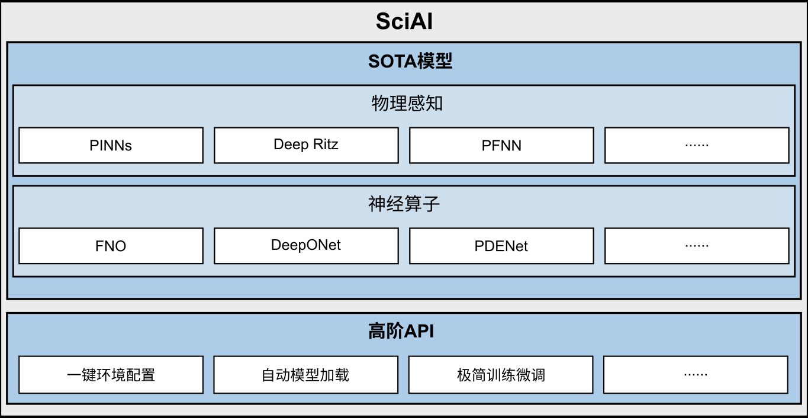

[ENGLISH](README.md) | 简体中文

# MindSpore SciAI

- [MindSpore SciAI介绍](#MindSpore-SciAI介绍)
- [网络模型库](#网络模型库)
- [安装教程](#安装教程)
    - [确认系统环境信息](#确认系统环境信息)
    - [方式一：pip安装](#方式一：pip安装)
    - [方式二：源码安装](#方式二：源码安装)
    - [验证安装](#验证安装)
- [快速使用](#快速使用)
    - [方式一：高阶API启动（推荐）](#方式一：高阶API启动（推荐）)
    - [方式二：源码启动](#方式二：源码启动)
- [文档](#文档)
- [社区](#社区)
- [贡献](#贡献)
- [版本说明](#版本说明)
- [许可证](#许可证)

## MindSpore SciAI介绍

MindSpore SciAI是基于昇思MindSpore打造的AI4SCI高频基础模型套件，内置了60+高频模型，覆盖物理感知（如PINNs、DeepRitz以及PFNN）和神经算子（如FNO、DeepONet、PDENet）等主流模型，覆盖度全球第一；
提供了高阶API（一键环境配置，自动模型加载、极简训练微调等），开发者和用户开箱即用。
MindSpore SciAI应用领域覆盖到了流体、电磁、声、热、固体、生物等众多学科，为广大开发者和用户提供了高效、易用的AI4Science通用计算平台。

<div align=center>

</div>

SciAI由以下主要目录组成。

```text
├── SciAI
│   ├── cmake               # 编译脚本
│   ├── docs                # 文档
│   │   ├── FAQ             # 常见问题解答
│   ├── sciai               # SciAI主目录
│   │   ├── architecture    # 神经网络基本模块
│   │   ├── common          # 通用模块
│   │   ├── context         # 上下文设置
│   │   ├── model           # **AI4SCI高频模型**
│   │   ├── operators       # 高阶微分
│   │   └── utils           # 其他辅助功能
│   └── tutorial            # 教学模型
```

## 网络模型库

SciAI基础模型库提供了丰富的科学计算高频模型，下表中汇总了当前已实现的网络模型及其对应领域。

| 领域    | 模型                                                                                                   |                                                                                                                                                           MindSpore实现与网络参数                                                                                                                                                            | Ascend | GPU |
|-------|------------------------------------------------------------------------------------------------------|:-------------------------------------------------------------------------------------------------------------------------------------------------------------------------------------------------------------------------------------------------------------------------------------------------------------------------------------:|:------:|:---:|
| 通用物理  | [auq_pinns](https://www.sciencedirect.com/science/article/pii/S0021999119303584)                     |                                                                                                                                           [link](./sciai/model/auq_pinns/README_CN.md#脚本参数)                                                                                                                                           |   ✅    |  ✅  |
| 通用物理  | [cpinns](https://www.sciencedirect.com/science/article/abs/pii/S0045782520302127)                    |                                                                                                                                            [link](./sciai/model/cpinns/README_CN.md#脚本参数)                                                                                                                                             |   ✅    |  ✅  |
| 通用物理  | [deep_hpms](https://www.jmlr.org/papers/volume19/18-046/18-046.pdf)                                  |                                                                                                                                           [link](./sciai/model/deep_hpms/README_CN.md#脚本参数)                                                                                                                                           |   ✅    |  ✅  |
| 通用物理  | [deep_ritz](https://arxiv.org/abs/1710.00211)                                                        |                                                                                                                                           [link](./sciai/model/deep_ritz/README_CN.md#脚本参数)                                                                                                                                           |   ✅    |  ✅  |
| 通用物理  | [deepbsde](https://www.pnas.org/doi/10.1073/pnas.1718942115)                                         |                                                                                                                                      [link](./sciai/model/deepbsde/README.md#script-parameters)                                                                                                                                       |        |  ✅  |
| 通用物理  | [deeponet](https://www.nature.com/articles/s42256-021-00302-5)                                       |                                                                                                                                           [link](./sciai/model/deeponet/README_CN.md#脚本参数)                                                                                                                                            |        |  ✅  |
| 通用物理  | [dgm](https://arxiv.org/abs/1708.07469)                                                              |                                                                                                                                              [link](./sciai/model/dgm/README_CN.md#脚本参数)                                                                                                                                              |   ✅    |  ✅  |
| 通用物理  | [fbsnns](https://arxiv.org/abs/1804.07010)                                                           |                                                                                                                                            [link](./sciai/model/fbsnns/README_CN.md#脚本参数)                                                                                                                                             |   ✅    |  ✅  |
| 通用物理  | [fpinns](https://arxiv.org/abs/1811.08967)                                                           |                                                                                                                                            [link](./sciai/model/fpinns/README_CN.md#脚本参数)                                                                                                                                             |   ✅    |  ✅  |
| 通用物理  | [gradient_pathologies_pinns](https://arxiv.org/abs/2001.04536)                                       |                                                                                                                                  [link](./sciai/model/gradient_pathologies_pinns/README_CN.md#脚本参数)                                                                                                                                   |   ✅    |  ✅  |
| 通用物理  | [hp_vpinns](https://arxiv.org/abs/2003.05385)                                                        |                                                                                                                                           [link](./sciai/model/hp_vpinns/README_CN.md#脚本参数)                                                                                                                                           |   ✅    |  ✅  |
| 通用物理  | [laaf](https://doi.org/10.1016/j.jcp.2019.109136)                                                    |                                                                                                                                             [link](./sciai/model/laaf/README_CN.md#脚本参数)                                                                                                                                              |   ✅    |  ✅  |
| 通用物理  | [mgnet](https://link.springer.com/article/10.1007/s11425-019-9547-2)                                 |                                                                                                                                             [link](./sciai/model/mgnet/README_CN.md#脚本参数)                                                                                                                                             |   ✅    |  ✅  |
| 通用物理  | [multiscale_pinns](https://www.sciencedirect.com/science/article/abs/pii/S0045782521002759)          |                                                                                                                                       [link](./sciai/model/multiscale_pinns/README_CN.md#脚本参数)                                                                                                                                        |   ✅    |  ✅  |
| 通用物理  | [pfnn](https://www.sciencedirect.com/science/article/abs/pii/S0021999120308597)                      |                                                                                                                                             [link](./sciai/model/pfnn/README_CN.md#脚本说明)                                                                                                                                              |        |  ✅  |
| 通用物理  | [phygeonet](https://www.sciencedirect.com/science/article/abs/pii/S0021999120308536)                 |                                                                                                                                           [link](./sciai/model/phygeonet/README_CN.md#脚本参数)                                                                                                                                           |   ✅    |  ✅  |
| 通用物理  | [pi_deeponet](https://www.sciencedirect.com/science/article/abs/pii/S0021999122009184)               |                                                                                                                                          [link](./sciai/model/pi_deeponet/README_CN.md#脚本参数)                                                                                                                                          |        |  ✅  |
| 通用物理  | [pinns](https://www.sciencedirect.com/science/article/abs/pii/S0021999118307125)                     |                                                                                                                                             [link](./sciai/model/pinns/README_CN.md#脚本参数)                                                                                                                                             |        |  ✅  |
| 通用物理  | [pinns_ntk](https://www.sciencedirect.com/science/article/pii/S002199912100663X)                     |                                                                                                                                           [link](./sciai/model/pinns_ntk/README_CN.md#脚本参数)                                                                                                                                           |   ✅    |  ✅  |
| 通用物理  | [ppinns](https://www.sciencedirect.com/science/article/abs/pii/S0045782520304357)                    |                                                                                                                                            [link](./sciai/model/ppinns/README_CN.md#脚本参数)                                                                                                                                             |   ✅    |  ✅  |
| 通用物理  | [xpinns](https://doi.org/10.4208/cicp.OA-2020-0164)                                                  |                                                                                                                                            [link](./sciai/model/xpinns/README_CN.md#脚本参数)                                                                                                                                             |   ✅    |  ✅  |
| 哈密顿系统 | [sympnets](https://www.sciencedirect.com/science/article/pii/S0893608020303063)                      |                                                                                                                                           [link](./sciai/model/sympnets/README_CN.md#脚本参数)                                                                                                                                            |   ✅    |  ✅  |
| 流体力学  | [hfm](https://www.science.org/doi/abs/10.1126/science.aaw4741)                                       |                                                                                                                                              [link](./sciai/model/hfm/README_CN.md#脚本参数)                                                                                                                                              |   ✅    |  ✅  |
| 流体力学  | [label_free_dnn_surrogate](https://www.sciencedirect.com/science/article/pii/S004578251930622X)      |                                                                                                                                   [link](./sciai/model/label_free_dnn_surrogate/README_CN.md#脚本参数)                                                                                                                                    |   ✅    |  ✅  |
| 流体力学  | [nsf_nets](https://www.sciencedirect.com/science/article/pii/S0021999120307257)                      |                                                                                                                                           [link](./sciai/model/nsf_nets/README_CN.md#脚本参数)                                                                                                                                            |   ✅    |  ✅  |
| 流体力学  | [*burgers_fno](https://arxiv.org/abs/2010.08895)                                                     |                                                                                                                                 [link](../MindFlow/applications/data_driven/burgers/fno1d/README.MD)                                                                                                                                  |   ✅    |  ✅  |
| 流体力学  | [*burgers_kno](https://arxiv.org/abs/2301.10022)                                                     |                                                                                                                                 [link](../MindFlow/applications/data_driven/burgers/kno1d/README.md)                                                                                                                                  |   ✅    |  ✅  |
| 流体力学  | [*navier_stokes_fno](https://arxiv.org/abs/2010.08895)                                               |                                                                                                                              [link](../MindFlow/applications/data_driven/navier_stokes/fno2d/README.md)                                                                                                                               |   ✅    |  ✅  |
| 流体力学  | [*navier_stokes_kno](https://arxiv.org/abs/2301.10022)                                               |                                                                                                                              [link](../MindFlow/applications/data_driven/navier_stokes/kno2d/README.md)                                                                                                                               |   ✅    |  ✅  |
| 流体力学  | [*navier_stokes_3d_fno](https://arxiv.org/abs/2010.08895)                                            |                                                                                                                              [link](../MindFlow/applications/data_driven/navier_stokes/fno3d/README.md)                                                                                                                               |   ✅    |  ✅  |
| 流体力学  | [*pde_net](https://arxiv.org/abs/1710.09668)                                                         |                                                                                                                              [link](../MindFlow/applications/data_mechanism_fusion/pde_net/README_CN.md)                                                                                                                              |   ✅    |  ✅  |
| 流体力学  | [*percnn](https://www.nature.com/articles/s42256-023-00685-7)                                        |                                                                                                                              [link](../MindFlow/applications/data_mechanism_fusion/PeRCNN/README_CN.md)                                                                                                                               |   ✅    |  ✅  |
| 弹性动力学 | [pinn_elastodynamics](https://arxiv.org/abs/2006.08472)                                              |                                                                                                                                      [link](./sciai/model/pinn_elastodynamics/README_CN.md#脚本参数)                                                                                                                                      |   ✅    |  ✅  |
| 热力学   | [pinn_heattransfer](https://arxiv.org/abs/1711.10561)                                                |                                                                                                                                       [link](./sciai/model/pinn_heattransfer/README_CN.md#脚本参数)                                                                                                                                       |   ✅    |  ✅  |
| 气象学   | [enso](https://doi.org/10.1038/s41586-019-1559-7)                                                    |                                                                                                                                             [link](./sciai/model/enso/README_CN.md#脚本参数)                                                                                                                                              |   ✅    |  ✅  |
| 地质学   | [inversion_net](https://ieeexplore.ieee.org/abstract/document/8918045/)                              |                                                                                                                                         [link](./sciai/model/inversion_net/README_CN.md#脚本参数)                                                                                                                                         |   ✅    |  ✅  |
| 地质学   | [pinn_helmholtz](https://academic.oup.com/gji/article-abstract/228/3/1750/6409132)                   |                                                                                                                                        [link](./sciai/model/pinn_helmholtz/README_CN.md#脚本参数)                                                                                                                                         |   ✅    |  ✅  |
| 海洋物理  | [ocean_model](https://gmd.copernicus.org/articles/12/4729/2019/)                                     |                                                                                                                                          [link](./sciai/model/ocean_model/README_CN.md#模型说明)                                                                                                                                          |        |  ✅  |
| 海洋物理  | [pinns_swe](https://arxiv.org/abs/2104.00615)                                                        |                                                                                                                                           [link](./sciai/model/pinns_swe/README_CN.md#脚本参数)                                                                                                                                           |   ✅    |  ✅  |
| 电磁学   | [maxwell_net](https://arxiv.org/abs/2107.06164)                                                      |                                                                                                                                          [link](./sciai/model/maxwell_net/README_CN.md#脚本参数)                                                                                                                                          |   ✅    |  ✅  |
| 电磁学   | [*AD_FDTD_invert_f](https://www.mindspore.cn/mindelec/docs/zh-CN/r0.2/AD_FDTD.html)                  |                                                                                                                                  [link](../MindElec/examples/AD_FDTD/fdtd_forward/README_CN.md#脚本参数)                                                                                                                                  |        |  ✅  |
| 电磁学   | [*AD_FDTD_microstrip_filter](https://www.mindspore.cn/mindelec/docs/zh-CN/r0.2/AD_FDTD.html)         |                                                                                                                                  [link](../MindElec/examples/AD_FDTD/fdtd_forward/README_CN.md#脚本参数)                                                                                                                                  |        |  ✅  |
| 电磁学   | [*AD_FDTD_inverse](https://www.mindspore.cn/mindelec/docs/zh-CN/r0.2/AD_FDTD.html)                   |                                                                                                                                  [link](../MindElec/examples/AD_FDTD/fdtd_inverse/README_CN.md#脚本参数)                                                                                                                                  |        |  ✅  |
| 电磁学   | [*frequency_domain_maxwell](https://arxiv.org/abs/2107.06164)                                        |                                                                                                                        [link](../MindElec/examples/physics_driven/frequency_domain_maxwell/README_CN.md#脚本参数)                                                                                                                         |   ✅    |  ✅  |
| 电磁学   | [*frequency_domain_maxwell_3D_dielectric_slab](https://arxiv.org/abs/2107.06164)                     |                                                                                                               [link](../MindElec/examples/physics_driven/frequency_domain_maxwell_3D/dielectric_slab_3d/README.md#脚本参数)                                                                                                               |   ✅    |  ✅  |
| 电磁学   | [*frequency_domain_maxwell_3D_waveguide_cavity](https://arxiv.org/abs/2107.06164)                    |                                                                                                              [link](../MindElec/examples/physics_driven/frequency_domain_maxwell_3D/waveguide_cavity_3d/README.md#脚本参数)                                                                                                               |   ✅    |  ✅  |
| 电磁学   | [*meta_auto_decoder](https://arxiv.org/abs/2111.08823)                                               |                                                                                                                          [link](../MindElec/examples/physics_driven/incremental_learning/README_CN.md#脚本参数)                                                                                                                           |   ✅    |  ✅  |
| 电磁学   | [*pinn_fwi](https://agupubs.onlinelibrary.wiley.com/doi/abs/10.1029/2021JB023120)                    |                                                                                                                                  [link](../MindElec/examples/physics_driven/pinn_fwi/README.md#脚本参数)                                                                                                                                  |   ✅    |  ✅  |
| 电磁学   | [*SED_ANN](../MindElec/examples/data_driven/sed_ann)                                                 |                                                                                                                                  [link](../MindElec/examples/data_driven/sed_ann/README_CN.md#脚本参数)                                                                                                                                   |   ✅    |  ✅  |
| 电磁学   | [*time_domain_maxwell](https://www.ijcai.org/proceedings/2022/533)                                   |                                                                                                                           [link](../MindElec/examples/physics_driven/time_domain_maxwell/README_CN.md#脚本参数)                                                                                                                           |   ✅    |  ✅  |
| 电磁学   | [*metasurface_holograms](https://www.researching.cn/articles/OJ44d3746c3db8c1e1)                     |                                                                                                                           [link](../MindElec/examples/metasurface/metasurface_holograms/README_CN.md#脚本参数)                                                                                                                            |   ✅    |  ✅  |
| 生物    | [*MEGA-Fold](https://arxiv.org/abs/2206.12240v1)                                                     |        [link (推理)](../MindSPONGE/applications/MEGAProtein/README_CN.md#mega-fold%E8%9B%8B%E7%99%BD%E8%B4%A8%E7%BB%93%E6%9E%84%E9%A2%84%E6%B5%8B%E6%8E%A8%E7%90%86) [link (训练)](../MindSPONGE/applications/MEGAProtein/README_CN.md#mega-fold%E8%9B%8B%E7%99%BD%E8%B4%A8%E7%BB%93%E6%9E%84%E9%A2%84%E6%B5%8B%E8%AE%AD%E7%BB%83)        |   ✅    |  ✅  |
| 生物    | [*MEGA-EvoGen](https://arxiv.org/abs/2208.09652)                                                     |                                                                                                   [link](../MindSPONGE/applications/MEGAProtein/README_CN.md#mega-evogen-msa%E7%94%9F%E6%88%90%E5%A2%9E%E5%BC%BA%E6%8E%A8%E7%90%86)                                                                                                   |   ✅    |  ✅  |
| 生物    | [*MEGA-Assessment](../MindSPONGE/applications/MEGAProtein/README_CN.md)                              | [link (推理)](../MindSPONGE/applications/MEGAProtein/README_CN.md#mega-assessment-%E8%9B%8B%E7%99%BD%E8%B4%A8%E7%BB%93%E6%9E%84%E8%AF%84%E5%88%86%E6%8E%A8%E7%90%86) [link (训练)](../MindSPONGE/applications/MEGAProtein/README_CN.md#mega-assessment-%E8%9B%8B%E7%99%BD%E8%B4%A8%E7%BB%93%E6%9E%84%E8%AF%84%E5%88%86%E8%AE%AD%E7%BB%83) |   ✅    |  ✅  |
| 生物    | [*ColabDesign](https://www.biorxiv.org/content/10.1101/2021.11.10.468128.abstract)                   |                                                                                                                                    [link](../MindSPONGE/applications/model%20cards/ColabDesign.md)                                                                                                                                    |   ✅    |  ✅  |
| 生物    | [*DeepFRI](https://www.nature.com/articles/s41467-021-23303-9)                                       |                                                                                                                                      [link](../MindSPONGE/applications/model%20cards/DeepFri.md)                                                                                                                                      |   ✅    |  ✅  |
| 生物    | [*Multimer](https://www.biorxiv.org/content/10.1101/2021.10.04.463034v1)                             |                                                                                                                                    [link](../MindSPONGE/applications/model%20cards/afmultimer.md)                                                                                                                                     |   ✅    |  ✅  |
| 生物    | [*ProteinMPNN](https://www.science.org/doi/abs/10.1126/science.add2187)                              |                                                                                                                                    [link](../MindSPONGE/applications/model%20cards/ProteinMPNN.MD)                                                                                                                                    |   ✅    |  ✅  |
| 生物    | [*UFold](https://doi.org/10.1093/nar/gkab1074)                                                       |                                                                                                                                       [link](../MindSPONGE/applications/model%20cards/UFold.md)                                                                                                                                       |   ✅    |  ✅  |
| 生物    | [*esm-if1](https://proceedings.mlr.press/v162/hsu22a.html)                                           |                                                                                                                                      [link](../MindSPONGE/applications/model%20cards/ESM-IF1.md)                                                                                                                                      |   ✅    |  ✅  |
| 生物    | [*esm2](https://www.biorxiv.org/content/10.1101/2022.07.20.500902v1.full.pdf)                        |                                                                                                                                       [link](../MindSPONGE/applications/model%20cards/ESM-2.md)                                                                                                                                       |   ✅    |  ✅  |
| 生物    | [*grover](https://proceedings.neurips.cc/paper/2020/file/94aef38441efa3380a3bed3faf1f9d5d-Paper.pdf) |                                                                                                                                      [link](../MindSPONGE/applications/model%20cards/GROVER.MD)                                                                                                                                       |   ✅    |  ✅  |

注： 带有“*”的网络模型为MindSpore与MindScience先前已发布网络。

## 安装教程

### 确认系统环境信息

由于SciAI与MindSpore有依赖关系，请根据下表中所指示的对应关系，
在[MindSpore下载页面](https://www.mindspore.cn/versions)下载并安装对应的`.whl`包。

| SciAI 版本 | 分支     | MindSpore 版本 | Python 版本 |
|:---------|:-------|:-------------|:----------|
| 0.1.0    | master | \>=2.2.0     | =3.7      |

其他依赖项请参照 [requirements.txt](./requirements.txt)，
并且可通过如下命令安装。

```bash
pip install -r requirements.txt
```

已支持的硬件平台和操作系统见下表。

| 硬件平台          | 操作系统            | 状态  |
|:--------------|:----------------|:----|
| Ascend 910    | Ubuntu-x86      | ✅   |
|               | Ubuntu-aarch64  | ✅   |
|               | EulerOS-aarch64 | ✅   |
|               | CentOS-x86      | ✅   |
|               | CentOS-aarch64  | ✅   |
| GPU CUDA 11.1 | Ubuntu-x86      | ✅   |

### 方式一：pip安装

此方式不用克隆源码编译，而是自动下载安装MindSpore官方提供的whl包。注：此安装方式目前暂不支持，将于Mindspore 2.2.0正式发布后支持。

```bash
pip install https://ms-release.obs.cn-north-4.myhuaweicloud.com/2.2.0/MindScience/sciai/gpu/{arch}/cuda-11.1/sciai-{version}-cp37-cp37m-linux_{arch}.whl -i https://pypi.tuna.tsinghua.edu.cn/simple
```

> - 在联网状态下，安装whl包时会自动下载SciAI安装包的依赖项（依赖项详情参见setup.py）。
> - {version}表示SciAI版本号，例如下载0.1.0版本SciAI时，{version}应写为`0.1.0`。
> - {arch}表示系统架构，例如使用的Linux系统是x86架构64位时，{arch}应写为`x86_64`。如果系统是ARM架构64位，则写为`aarch64`。

下表提供了各架构和Python版本对应的安装命令。

| 设备     | 架构      | Python     | 安装命令                                                                                                                                                                                               |
|--------|---------|------------|----------------------------------------------------------------------------------------------------------------------------------------------------------------------------------------------------|
| Ascend | x86_64  | Python=3.7 | `pip install https://ms-release.obs.cn-north-4.myhuaweicloud.com/2.2.0/MindScience/sciai/gpu/x86_64/cuda-11.1/sciai-0.1.0-cp37-cp37m-linux_x86_64.whl -i https://pypi.tuna.tsinghua.edu.cn/simple` |
|        | aarch64 | Python=3.7 | `pip install https://ms-release.obs.cn-north-4.myhuaweicloud.com/2.2.0/MindScience/sciai/ascend/aarch64/sciai-0.1.0-cp37-cp37m-linux_aarch64.whl -i https://pypi.tuna.tsinghua.edu.cn/simple`      |
| GPU    | x86_64  | Python=3.7 | `pip install https://ms-release.obs.cn-north-4.myhuaweicloud.com/2.2.0/MindScience/sciai/gpu/x86_64/cuda-11.1/sciai-0.1.0-cp37-cp37m-linux_x86_64.whl -i https://pypi.tuna.tsinghua.edu.cn/simple` |

注意：如果您的conda或python env中已经安装了其他MindScience套件，如`MindElec`，`MindFlow`，`MindSponge`,
请先卸载环境中的MindScience套件避免pip行为冲突。

### 方式二：源码安装

1. 克隆MindScience代码Git仓库。

    ```bash
    cd ~
    git clone https://gitee.com/mindspore/mindscience.git
    ```

2. 使用脚本`build.sh`编译SciAI。

    ```bash
    cd mindscience/SciAI
    bash build.sh -j8
    ```

3. 编译完成后，通过如下命令安装编译所得`.whl`包。

    ```bash
    bash install.sh
    ```

### 验证安装

执行如下命令，如果没有报错`No module named 'sciai'`，则说明安装成功。

```bash
python -c 'import sciai'
```

## 快速使用

SciAI基础模型库对外提供两种模型的训练和评估方式，为开发者提供灵活且简洁的使用方式和高阶开发接口。

### 方式一：高阶API启动（推荐）

- 使用AutoModel训练、微调模型

使用`AutoModel.from_pretrained`接口获取已支持的网络模型。
使用`AutoModel.train`实现模型的训练，并且在执行训练之前，
可使用`AutoModel.update_config`调整训练参数或加载`.ckpt`文件实现模型微调。
接口`AutoModel.update_config`可选参数依赖于模型类型，
具体可参考[网络模型库](#网络模型库)中`MindSpore实现与网络参数`链接。

```python
from sciai.model import AutoModel

# 获取`cpinns`网络模型
model = AutoModel.from_pretrained("cpinns")
# 使用默认参数训练网络，生成的图片、数据与日志将保存至用户的执行目录中
model.train()
# 或者加载`.ckpt`文件
model.update_config(load_ckpt=True, load_ckpt_path="./checkpoints/your_file.ckpt", epochs=500)
# 基于新加载的参数，继续训练模型，实现微调
model.train()
```

- 使用AutoModel评估模型

用户可以使用`AutoModel.evaluate`评估训练结果。
该接口将默认加载SciAI模型库中提供的`.ckpt`文件用于评估，用户也可以调用`model.update_config`接口自定义加载的文件。

```python
from sciai.model import AutoModel

# 获取`cpinns`网络模型
model = AutoModel.from_pretrained("cpinns")
# 加载网络默认的ckpt文件，评估网络模型
model.evaluate()
# 自定义加载ckpt文件(可选)
model.update_config(load_ckpt=True, load_ckpt_path="./checkpoints/your_file.ckpt")
# 评估网络模型
model.evaluate()
```

- 查看训练与验证结果

用户可以在脚本运行目录下发现名为 `auto_model_xxx` 的目录，该目录下包含 `checkpoints` 、 `data` 、 `figures` 、 `logs`
四个子目录，分别
包含检查点、数据、图片、日志，用户可在这些目录中查看训练结果。例如：

```text
├── auto_model_cpinns
│   ├── checkpoints                  # checkpoint文件
│   ├── data                         # 数据文件
│   ├── figures                      # 结果图片
│   └── logs                         # 日志文件
```

- 可配置参数:

`AutoModel.update_config(**kwargs)` 支持修改网络参数，包括学习率、训练周期、混合精度等级、动静态图、数据读取保存路径、checkpoints文件加载路径等，
具体请参考[网络模型库](#网络模型库)中`MindSpore实现与网络参数`链接。常用的可配置参数见下表：

| parameter      | description                                                                                                            | default value                  |
|----------------|------------------------------------------------------------------------------------------------------------------------|--------------------------------|
| save_ckpt      | 是否保存checkpoint                                                                                                         | true                           |
| save_fig       | 是否保存和绘制图片                                                                                                              | true                           |
| load_ckpt      | 是否加载checkpoint                                                                                                         | false                          |
| save_ckpt_path | checkpoint保存路径                                                                                                         | ./checkpoints                  |
| load_data_path | 加载数据的路径                                                                                                                | ./data                         |
| save_data_path | 保存数据的路径                                                                                                                | ./data                         |
| load_ckpt_path | checkpoint加载路径                                                                                                         | ./checkpoints/model_final.ckpt |
| figures_path   | 图片保存路径                                                                                                                 | ./figures                      |
| log_path       | 日志保存路径                                                                                                                 | ./logs                         |
| print_interval | 时间与loss打印间隔                                                                                                            | 10                             |
| ckpt_interval  | checkpoint保存间隔                                                                                                         | 1000                           |
| lr             | 学习率                                                                                                                    | 8e-4                           |
| epochs         | 时期（迭代次数）                                                                                                               | 15001                          |
| download_data  | 模型所需数据集与(或)checkpoints                                                                                                 | cpinns                         |
| force_download | 是否强制下载数据                                                                                                               | false                          |
| amp_level      | MindSpore[自动混合精度](https://www.mindspore.cn/docs/zh-CN/master/api_python/amp/mindspore.amp.auto_mixed_precision.html)等级 | O3                             |
| device_id      | 需要设置的设备号，None则为默认设备号                                                                                                   | None                           |
| mode           | MindSpore[静态图模式（0）或动态图模式（1）](https://www.mindspore.cn/docs/zh-CN/master/design/dynamic_graph_and_static_graph.html)    | 0                              |

- 恢复参数文件与数据集

用户可能会遇到自动下载的模型参数`.ckpt`文件或数据集被误删的情况，可以通过如下方式更新参数，强制重新下载：

```python
model.update_config(force_download=True)
```

### 方式二：源码启动

如果您希望查看源码逻辑或对模型做出自定义修改，可通过源码的`train.py`与`eval.py`入口运行模型。

- 环境准备：

首先使用如下命令直接克隆整个仓库并准备环境变量，运行文件`.env`会将SciAI项目目录添加至环境变量`PYTHONPATH`中。

```bash
git clone https://gitee.com/mindspore/mindscience
source ./mindscience/SciAI/.env
```

完成后，可以参考[网络模型库](#网络模型库)中各个模型`README_CN.md`
的快速开始章节，使用源码进行训练与推理。以下介绍以模型`cpinns`为例：

- 网络模型训练：

使用训练脚本`train.py`进行网络模型训练

```bash
cd ./mindscience/SciAI/sciai/model/cpinns/
python ./train.py [--parameters]
```

- 网络模型加载`.ckpt`文件微调：

```bash
python ./train.py --load_ckpt true --load_ckpt_path {your_ckpt_file.ckpt} [--parameters]
```

- 网络模型评估：

使用脚本`eval.py`对已完成训练的网络模型进行评估。

```bash
python ./eval.py [--parameters]
```

- 可配置参数:

可配置参数`[--parameters]`包括学习率、训练周期、数据读取保存路径、checkpoints文件加载路径等，
具体请参考[网络模型库](#网络模型库)中`MindSpore实现与网络参数`链接。

## 文档

有关安装指南、教程和API的更多详细信息，请参阅[用户文档](https://www.mindspore.cn/sciai/docs/zh-CN/master/index.html)。
如果在使用问题中遇到问题，可以参考[FAQ](docs/faq_CN.md)。

## 社区

查看MindSpore如何进行[开放治理](https://gitee.com/mindspore/community/blob/master/governance.md)。

## 贡献

欢迎参与贡献。更多详情，请参阅我们的[贡献者Wiki](https://gitee.com/mindspore/mindspore/blob/master/CONTRIBUTING.md)。

## 版本说明

版本说明请参阅[RELEASE](https://gitee.com/mindspore/mindscience/blob/master/SciAI/RELEASE.md)。

## 许可证

[Apache License 2.0](LICENSE)