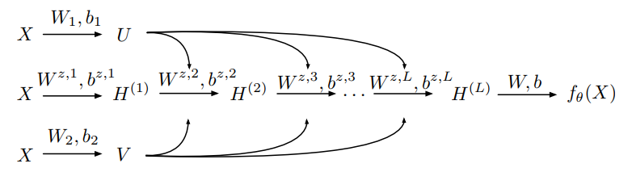

ENGLISH | [简体中文](README_CN.md)

# Contents

- [Understanding and mitigating gradient pathologies in PINNs](#understanding-and-mitigating-gradient-pathologies-in-PINNs)
- [Dataset](#dataset)
- [Improved Fully-connected Architecture](#improved-fully-connected-architecture)
- [Environment Requirements](#environment-requirements)
- [Quick Start](#quick-start)
- [Script Description](#script-description)
    - [Script and Sample Code](#script-and-sample-code)
    - [Script Parameters](#script-parameters)
    - [Training Process](#training-process)
    - [Evaluation Process](#evaluation-process)

## [Understanding and mitigating gradient pathologies in PINNs](#contents)

This work reviews recent advances in scientific machine learning with a specific focus on the effectiveness of
physics-informed neural networks in predicting outcomes of physical systems and discovering hidden physics from noisy
data. We identify a fundamental mode of failure related to numerical stiffness leading to unbalanced back-propagated
gradients during model training. To address this limitation we present a learning rate annealing algorithm that utilizes
gradient statistics during model training to balance the interplay between different terms in composite loss functions.
We also propose a novel neural network architecture that is more resilient to such gradient pathologies.

> [paper](https://arxiv.org/pdf/2001.04536.pdf): Wang, S., Teng, Y. & Perdikaris, P. Understanding and mitigating
> gradient pathologies in physics-informed neural networks. arXiv:2001.04536 [cs.LG] (2020).

Example case: 2d Helmholtz equations.

## [Dataset](#contents)

No external dataset used, random sampling points from the domain boundary and inner areas for both train and validation.
The size of sampling points is controlled by parameter `batch_size` in `config.yaml`, and by default is 128.

The pretrained checkpoint files will be downloaded automatically at the first launch.
If you need to download the checkpoint files manually,
please visit [this link](https://download.mindspore.cn/mindscience/SciAI/sciai/model/gradient_pathologies_pinns/).

## [Improved Fully-connected Architecture](#contents)



An improved fully-connected architecture for physics-informed neural networks: Introducing residual connections and
accounting for multiplicative interactions between the inputs can lead to improved predictive performance.

## [Environment Requirements](#contents)

- Hardware(Ascend/GPU)
    - Prepare hardware environment with Ascend or GPU processor.
- Framework
    - [MindSpore](https://www.mindspore.cn/install/en)
- For more information, please check the resources below:
    - [MindSpore Tutorials](https://www.mindspore.cn/tutorials/en/master/index.html)
    - [MindSpore Python API](https://www.mindspore.cn/docs/en/master/index.html)

## [Quick Start](#contents)

After installing MindSpore via the official website, you can start training and evaluation as follows:

- running on Ascend or on GPU

Default:

```bash
python train.py
```

Full command:

```bash
python train.py \
    --method M4 \
    --layers 2 50 50 50 1 \
    --save_ckpt true \
    --save_fig true \
    --load_ckpt false \
    --save_ckpt_path ./checkpoints \
    --load_ckpt_path ./checkpoints/helmholtz_M4_float32.ckpt \
    --figures_path ./figures \
    --log_path ./logs \
    --lr 1e-3 \
    --epochs 40001 \
    --batch_size 128 \
    --download_data gradient_pathologies_pinns \
    --force_download false \
    --amp_level O3 \
    --device_id 0 \
    --mode 0
```

## [Script Description](#contents)

### [Script and Sample Code](#contents)

```text
├── gradient_pathologies_pinns
│   ├── checkpoints          # checkpoints files
│   ├── data                 # data files
│   ├── figures              # plot figures
│   ├── logs                 # log files
│   ├── src                  # source codes
│   │   ├── network.py       # model for 2d helmholtz
│   │   ├── plot.py          # plotting results
│   │   └── process.py       # data process
│   ├── config.yaml          # hyper-parameters configuration
│   ├── README.md            # English model descriptions
│   ├── README_CN.md         # Chinese model description
│   ├── train.py             # python training script
│   └── eval.py              # python evaluation script
```

### [Script Parameters](#contents)

Important parameters in train.py are as follows:

| parameter      | description                                    | default value                           |
|----------------|------------------------------------------------|-----------------------------------------|
| method         | choice of model (M1-M4) as stated in the paper | M4                                      |
| layers         | layer-wise width for FC net                    | 2 50 50 50 1                            |
| save_ckpt      | whether save checkpoint or not                 | true                                    |
| save_fig       | whether save and plot figures or not           | true                                    |
| load_ckpt      | whether load checkpoint or not                 | false                                   |
| save_ckpt_path | checkpoint saving path                         | ./checkpoints                           |
| load_ckpt_path | checkpoint loading path                        | ./checkpoints/helmholtz_M4_float32.ckpt |
| figures_path   | figures saving path                            | ./figures                               |
| log_path       | log saving path                                | ./logs                                  |
| lr             | learning rate                                  | 1e-3                                    |
| epochs         | number of epochs                               | 40001                                   |
| batch_size     | number of sampled data points per batch        | 128                                     |
| download_data  | necessary dataset and/or checkpoints           | gradient_pathologies_pinns              |
| force_download | whether download the dataset or not by force   | false                                   |
| amp_level      | MindSpore auto mixed precision level           | O3                                      |
| device_id      | device id to set                               | None                                    |
| mode           | MindSpore Graph mode(0) or Pynative mode(1)    | 0                                       |

### [Training Process](#contents)

- running on GPU/Ascend

  ```bash
  python train.py
  ```

  The loss values during training will be printed in the console, which can also be inspected after training in log
  file.

  ```bash
  It: 10, Loss: 6.098e+03, Loss_bcs: 1.628e+00, Loss_res: 6.096e+03, Adaptive_Constant: 15.26 ,Time: 0.39
  It: 20, Loss: 6.325e+03, Loss_bcs: 1.391e+00, Loss_res: 6.324e+03, Adaptive_Constant: 16.20 ,Time: 0.23
  It: 30, Loss: 8.256e+03, Loss_bcs: 1.173e+00, Loss_res: 8.255e+03, Adaptive_Constant: 20.49 ,Time: 0.22
  It: 40, Loss: 6.699e+03, Loss_bcs: 1.749e+00, Loss_res: 6.697e+03, Adaptive_Constant: 22.41 ,Time: 0.22
  It: 50, Loss: 6.904e+03, Loss_bcs: 2.115e+00, Loss_res: 6.902e+03, Adaptive_Constant: 25.56 ,Time: 0.21
  It: 60, Loss: 6.896e+03, Loss_bcs: 3.768e+00, Loss_res: 6.892e+03, Adaptive_Constant: 28.76 ,Time: 0.22
  It: 70, Loss: 6.982e+03, Loss_bcs: 8.551e+00, Loss_res: 6.974e+03, Adaptive_Constant: 29.38 ,Time: 0.22
  It: 80, Loss: 7.389e+03, Loss_bcs: 1.350e+01, Loss_res: 7.375e+03, Adaptive_Constant: 30.37 ,Time: 0.22
  ...
  ```

- After training, you can still review the training process through the log file saved in `log_path`, `./logs` directory
  by default.

- The model checkpoint will be saved in `save_ckpt_path`, `./checkpoint` directory by default.

### [Evaluation Process](#contents)

Before running the command below, please check the checkpoint loading path `load_ckpt_path` specified
in `config.yaml` for evaluation.

- running on Ascend

  ```bash
  python eval.py
  ```

You can view the process and results through the `log_path`, `./logs` by default.
The result pictures are saved in `figures_path`, [`./figures`](./figures) by default.
