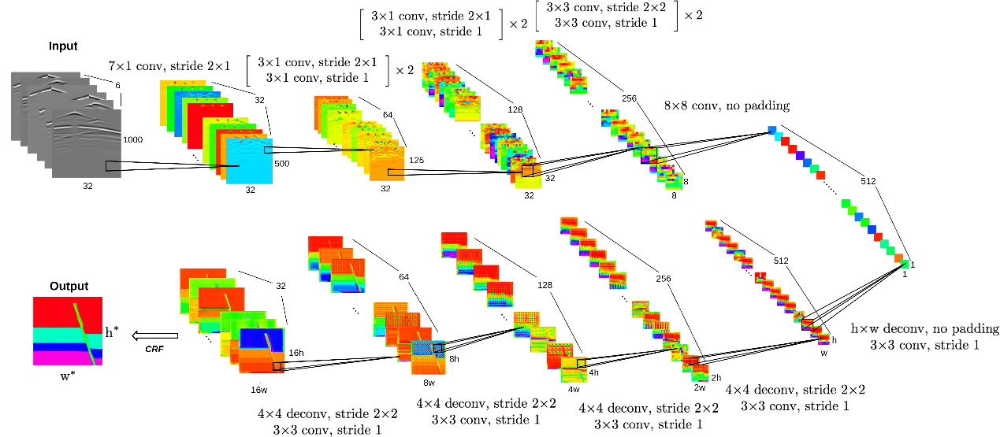
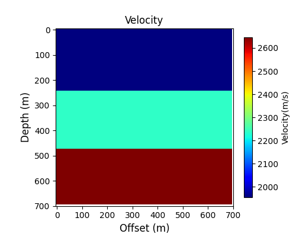
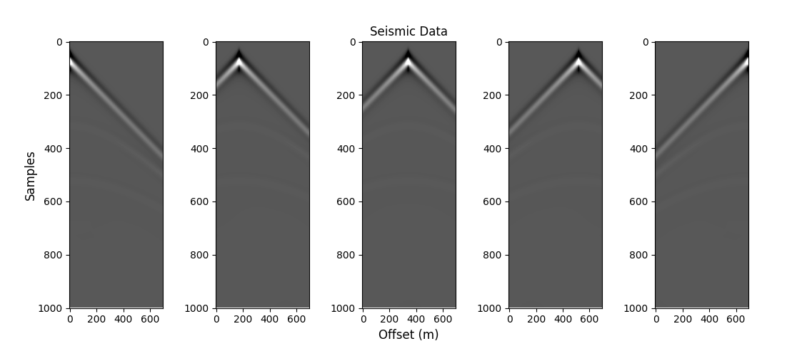
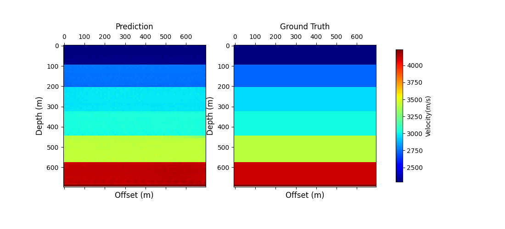

[ENGLISH](README.md) | 简体中文

# 目录

- [Inversion Net 描述](#inversion-net-描述)
- [数据集](#数据集)
- [环境要求](#环境要求)
- [快速开始](#快速开始)
- [脚本说明](#脚本说明)
    - [脚本和示例代码](#脚本和示例代码)
    - [脚本参数](#脚本参数)
    - [训练流程](#训练流程)
    - [推理流程](#推理流程)
- [References](#References)

## [Inversion Net 描述](#目录)

为了解决地震数据全波形反演（FWI）中计算成本高昂、分辨率低等问题，Wu 和 Lin在2020 年提出一种新颖的深度卷积神经网络——InversionNet^[1]^ 。这个网络是一个具有编码器-解码器结构的卷积神经网络（convolutional neural network，CNN），可以从输入的地震数据中提取高层次的特征，然后将这些特征转化为速度模型。其中编码器采用卷积块提取输入地震数据的高层次特征，并将其压缩到单个高维向量中。解码器采用混合卷积和反卷积块将特征转化为速度模型。

在合成数据FlatVel 和 CurvedVel的数值实验中，InversionNet可以快速预测地下的速度结构。并且相比于传统算法，InversionNet 在减少计算凉的同时，显著提高的反演结果的精确性。

<center class="half">
    <br>
<div style="color:orange; border-bottom: 1px solid #d9d9d9;    display: inline-block;    color: #999;    padding: 2px;">InversionNet网络结构</div> </center>

> [论文](https://ieeexplore.ieee.org/document/8918045#:~:text=InversionNet:%20An%20Efficient%20and%20Accurate%20Data-Driven%20Full%20Waveform,maps%20the%20subsurface%20velocity%20structures%20to%20seismic%20signals.)：
> Wu, Yue, and Youzuo Lin.
> "InversionNet: An efficient and accurate data-driven full waveform inversion."
> IEEE Transactions on Computational Imaging 6 (2019): 419-433.

## [数据集](#目录)

该论文中使用了两种数据集：FlatVel 和 CurvedVel。FlatVel 是模拟平坦的层状速度模型，CurvedVel 则是模拟地下弯曲的速度模型。这里我们使用的是OpenFWI提供的[FlatVel-A](https://openfwi-lanl.github.io/docs/data.html)和[CurveVel-A](https://openfwi-lanl.github.io/docs/data.html)数据集，其中FlatVel是实例如下图所示。此外OpenFWI还提供了多种数据集，包括**Vel family**, **Fault family**, and **Style family**。

<center class="half">
    
    <br>
<div style="color:orange; border-bottom: 1px solid #d9d9d9;display:inline-block; color: #999; padding: 2px;">速度模型和模拟地震数据<br></div> </center>

## [环境要求](#目录)

- 硬件（Ascend/GPU）
    - 使用 Ascend 或 GPU 处理器准备硬件环境。
- 框架
    - [MindSpore](https://www.mindspore.cn/install)
- 欲了解更多信息，请查看以下资源:
    - [MindSpore教程](https://www.mindspore.cn/tutorials/zh-CN/master/index.html)
    - [MindSpore Python API](https://www.mindspore.cn/docs/zh-CN/master/index.html)

## [快速开始](#目录)

通过官网安装好MindSpore和上面需要的[数据集](#数据集)后，就可以开始训练和验证如下:

- 在 Ascend 或 GPU 上运行

默认:

```bash
python train.py
```

完整命令:

```bash
python train.py \
    --case flatvel-a
    --anno_path split_files
    --train_anno flatvel_a_train.txt
    --val_anno flatvel_a_val.txt
    --print_freq 100 \
    --epoch_block 40 \
    --num_block 3 \
    --save_fig true \
    --save_ckpt true \
    --load_ckpt false \
    --save_ckpt_path ./checkpoints \
    --load_ckpt_path ./checkpoints/your_file.ckpt \
    --figures_path ./figures \
    --lr 1e-4 \
    --data_type float32
```

## [脚本说明](#目录)

### [脚本和示例代码](#目录)

文件结构如下:

```text
├── inversion_net
│   ├── data                         # 数据文件
│   │   └── README.md                # 数据集下载地址
│   ├── figures                      # 结果图片
│   ├── src                          # 源代码
│   │   ├── network.py               # 网络架构
│   │   ├── plot.py                  # 绘制结果
│   │   ├── process.py               # 数据处理
│   │   ├── scheduler.py             # 动态学习率
│   │   ├── ssim.py                  # 结构相似性
│   │   └── utils.py                 # utils
│   ├── config.json                  # 超参数配置
│   ├── README.md                    # 英文模型说明
│   ├── README_CN.md                 # 中文模型说明
│   ├── train.py                     # python训练脚本
│   └── eval.py                      # python验证脚本
```

### [脚本参数](#目录)

`train.py`中的重要参数如下:

| 参数           | 描述                                      | 默认值                              |
| -------------- | ----------------------------------------- | ----------------------------------- |
| case           | 使用数据集的名称                          | flatvel-a (flatvel-a or curvevel-a) |
| anno_path      | 注释文件所在文件夹                        | ./data                              |
| train_anno     | 训练数据注释文件                          | flatvel_a_train.txt                 |
| val_anno       | 验证数据注释文件                          | flatvel_a_val.txt                   |
| device_target  | 训练设备                                  | GPU (CPU, GPU, Ascend )             |
| device_num     | 训练设备编号                              | 0                                   |
| mode           | 训练模式 GRAPH_MODE(0) 或PYNATIVE_MODE(1) | 0                                   |
| amp_level      | 混合精度模式                              | O0 ( "O0", "O1", "O2", "O3")        |
| dims           | 神经网络宽度                              | [32, 64, 128, 256, 512]             |
| lambda_g1v     | L1代价函数的权重                          | 1.0                                 |
| lambda_g2v     | L2代价函数的权重                          | 1.0                                 |
| batch_size     | 批大小                                    | 128                                 |
| lr             | 学习率                                    | 1e-4                                |
| start_epoch    | 开始训练的回合                            | 0                                   |
| epoch_block    | 训练区间的大小                            | 40                                  |
| num_block      | 训练区间的数量                            | 3                                   |
| print_freq     | 时间与loss打印间隔                        | 50                                  |
| save_fig       | 是否保存和绘制图片                        | true                                |
| save_ckpt      | 是否保存checkpoint                        | true                                |
| load_ckpt      | 是否加载checkpoint                        | false                               |
| save_ckpt_path | checkpoint保存路径                        | ./checkpoints                       |
| load_ckpt_path | checkpoint加载路径                        | ./checkpoints/your_file.ckpt        |
| vis_path       | 图片保存路径                              | ./figures                           |

### [训练流程](#目录)

- 数据准备

1. 下载数据集

   从[OpenFWI Benchmarks](https://openfwi-lanl.github.io/docs/data.html)下载FlatVel-A或CurveVel-A数据集。

2. 准备训练集和测试集

   为了便于加载数据需要从`.txt`文件中读取所有`.npy`文件的路径（*文件夹+文件名*）。以 **[FlatVel-A](https://openfwi-lanl.github.io/docs/data.html)**数据集为例，我们分别为训练集合验证集创建`flatvel-a-train.txt`和`flatvel-a-test.txt`，其中文件的实例如下：

   ```bash
   Dataset_directory/data1.npy  Dataset_directory/model1.npy
   Dataset_directory/data2.npy  Dataset_directory/model2.npy
   Dataset_directory/data3.npy  Dataset_directory/model3.npy
   Dataset_directory/data4.npy  Dataset_directory/model4.npy
   ...
   ```

   **为了对比性能，建议从[OpenFWI](https://github.com/lanl/OpenFWI)中的`split_files`文件夹下载`.txt`文件，然后修改`.txt`文件中数据的路径为自己数据的存储路径。**

- 在 GPU/Ascend 上运行

  ```bash
  python train.py
  ```

  训练期间的损失值将打印在控制台中。

  ```bash
  mindspore version:  2.0.0
  Loading data
  Loading validation data
  Loading training data
  Epoch: [0]  [  0/187]  samples/s: 19.009  loss: 1.3781 (1.3781)  loss_g1v: 0.6870 (0.6870)  loss_g2v: 0.6911 (0.6911)  time: 7.5583  data: 0.8247
  Epoch: [0]  [ 50/187]  samples/s: 258.307  loss: 0.2868 (0.4019)  loss_g1v: 0.2039 (0.2623)  loss_g2v: 0.0847 (0.1396)  time: 0.7549  data: 0.2765
  Epoch: [0]  [100/187]  samples/s: 265.484  loss: 0.2583 (0.3328)  loss_g1v: 0.1835 (0.2248)  loss_g2v: 0.0745 (0.1080)  time: 0.8730  data: 0.3957
  Epoch: [0]  [150/187]  samples/s: 266.433  loss: 0.2463 (0.3051)  loss_g1v: 0.1750 (0.2090)  loss_g2v: 0.0711 (0.0961)  time: 0.5796  data: 0.1002
  Epoch: [0] Total time: 0:02:12
  Test:  [   0/46]  loss: 0.2594 (0.2594)  loss_g1v: 0.1849 (0.1849)  loss_g2v: 0.0745 (0.0745)  time: 2.3954  data: 0.5047
  Test:  [  20/46]  loss: 0.2596 (0.2597)  loss_g1v: 0.1844 (0.1846)  loss_g2v: 0.0752 (0.0751)  time: 0.6590  data: 0.4941
  Test:  [  40/46]  loss: 0.2612 (0.2609)  loss_g1v: 0.1853 (0.1852)  loss_g2v: 0.0760 (0.0757)  time: 0.7450  data: 0.5813
  Test: Total time: 0:00:34
   * Loss 0.26126102
  ```

- 模型checkpoint将保存在 `save_ckpt_path`中，默认为`./checkpoints` 目录中。

### [推理流程](#目录)

在运行下面的命令之前，请检查使用的`config.json` 中的checkpoint加载路径`load_ckpt_path`
进行推理。

- 在 GPU/Ascend 上运行

   ```bash
   python eval.py --load_ckpt_path ./checkpoints/model.ckpt --val_anno flatvel_a_val.txt
   ```

  结果图片存放于`figures_path`中，默认位于`./figures`。

<center class="half">
    <br>
<div style="color:orange; border-bottom: 1px solid #d9d9d9;    display: inline-block;    color: #999;    padding: 2px;">InversionNet网络的预测结果</div> </center>
