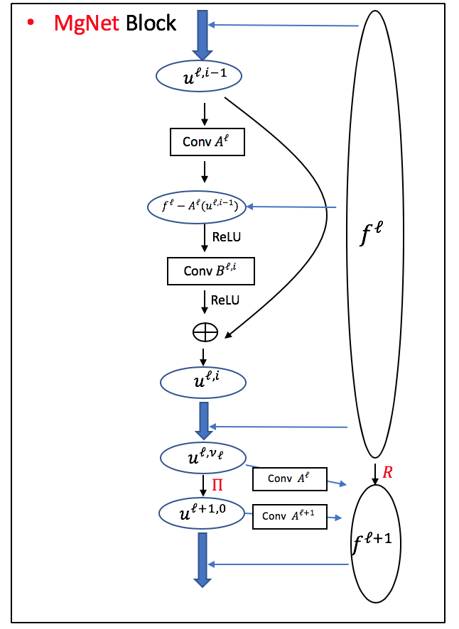

[ENGLISH](README.md) | 简体中文

# 目录

- [MgNet 描述](#mgnet-描述)
- [数据集](#数据集)
- [环境要求](#环境要求)
- [快速开始](#快速开始)
- [脚本说明](#脚本说明)
    - [脚本和示例代码](#脚本和示例代码)
    - [脚本参数](#脚本参数)
    - [训练流程](#训练流程)
    - [推理流程](#推理流程)

## [MgNet 描述](#目录)

MgNet是一个统一的模型，它可以同时利用卷积神经网络（CNN）的图像分类能力
以及多网格（MG）方法求解离散偏微分方程（PDE）的能力，它的网络架构如下:

 

> [论文](https://link.springer.com/article/10.1007/s11425-019-9547-2): He J, Xu J. MgNet: A unified framework of
> multigrid and convolutional neural network[J]. Science china mathematics, 2019, 62: 1331-1354.

## [数据集](#目录)

用于训练的数据集和预训练checkpoints文件将会在首次启动时自动下载。

数据集: [cifar10]/[cifar100]/[mnist]

- 下载数据集并且解压到`./data`目录下，目录结构如下:

```text
├── data
│   ├── cifar-10-batches-bin
│   ├── cifar-100-binary
│   ├── t10k-images.idx3-ubyte
│   ├── t10k-labels.idx1-ubyte
│   ├── train-images.idx3-ubyte
│   └── train-labels.idx1-ubyte
```

您如果需要手动下载数据集或checkpoints文件，
请访问[此链接](https://download.mindspore.cn/mindscience/SciAI/sciai/model/mgnet/)。

## [环境要求](#目录)

- 硬件（Ascend/GPU）
    - 使用 Ascend 或 GPU 处理器准备硬件环境。
- 框架
    - [MindSpore](https://www.mindspore.cn/install)
- 欲了解更多信息，请查看以下资源:
    - [MindSpore教程](https://www.mindspore.cn/tutorials/zh-CN/master/index.html)
    - [MindSpore Python API](https://www.mindspore.cn/docs/zh-CN/master/index.html)

## [快速开始](#目录)

通过官网安装好MindSpore和上面需要的[数据集](#数据集)后，就可以开始训练和验证如下:

- 在 Ascend 或 GPU 上运行

默认:

```bash
python train.py
```

完整命令:

```bash
python train.py \
    --dataset cifar100 \
    --save_ckpt true \
    --load_ckpt false \
    --save_ckpt_path ./checkpoints \
    --load_ckpt_path ./checkpoints/model_300.ckpt \
    --load_data_path ./data/cifar-100-binary \
    --log_path ./logs \
    --print_interval 10 \
    --ckpt_interval 2000 \
    --num_ite 2 2 2 2 \
    --num_channel_u 256 \
    --num_channel_f 256 \
    --wise_b true \
    --batch_size 128 \
    --epochs 300 \
    --lr 1e-1 \
    --download_data mgnet \
    --force_download false \
    --amp_level O3 \
    --device_id 0 \
    --mode 0
```

## [脚本说明](#目录)

### [脚本和示例代码](#目录)

文件结构如下:

```text
├── mgnet
│   ├── checkpoints                                 # checkpoints文件
│   ├── data                                        # 数据文件
│   │   ├── cifar-10-batches-bin                    # cifar-10 数据集目录
│   │   ├── cifar-100-binary                        # cifar-100 数据集目录
│   │   ├── t10k-images.idx3-ubyte                  # mnist 测试集-图像
│   │   ├── t10k-labels.idx1-ubyte                  # mnist 测试集-标签
│   │   ├── train-images.idx3-ubyte                 # mnist 训练集-图像
│   │   └── train-labels.idx1-ubyte                 # mnist 训练集-标签
│   ├── figures                                     # 图片目录
│   ├── logs                                        # 日志文件
│   ├── src                                         # 源代码目录
│   │   ├── network.py                              # 网络架构
│   │   └── process.py                              # 数据处理
│   ├── config.yaml                                 # 超参数配置
│   ├── README.md                                   # 英文模型说明
│   ├── README_CN.md                                # 中文模型说明
│   ├── train.py                                    # python训练脚本
│   └── eval.py                                     # python评估脚本
```

### [脚本参数](#目录)

train.py中的重要参数如下:

| 参数名            | 含义                                 | 默认值                          |
|----------------|------------------------------------|------------------------------|
| dataset        | 使用的数据集: cifar10, cifar100, 或 mnist | cifar100                     |
| save_ckpt      | 是否保存checkpoint                     | true                         |
| load_ckpt      | 是否加载checkpoint                     | false                        |
| save_ckpt_path | checkpoint保存路径                     | ./checkpoints                |
| load_ckpt_path | checkpoint加载路径                     | ./checkpoints/model_300.ckpt |
| load_data_path | 数据加载路径                             | ./data/cifar-100-binary      |
| log_path       | 日志保存路径                             | ./logs                       |
| print_interval | 时间与loss打印间隔                        | 10                           |
| ckpt_interval  | checkpoint保存间隔                     | 2000                         |
| num_ite        | 每层的iter数量, 使用 2 2 2 2 或 3 4 5 6    | 2 2 2 2                      |
| num_channel_u  | u的通道数                              | 256                          |
| num_channel_f  | f的通道数                              | 256                          |
| wise_b         | 不同的grid使用不同的B值                     | true                         |
| lr             | 学习率                                | 1e-1                         |
| epochs         | 时期（迭代次数）                           | 300                          |
| batch_size     | 批次大小                               | 128                          |
| download_data  | 模型所需数据集与(或)checkpoints             | mgnet                        |
| force_download | 是否强制下载数据                           | false                        |
| amp_level      | MindSpore自动混合精度等级                  | O0                           |
| device_id      | 需要设置的设备号                           | None                         |
| mode           | MindSpore静态图模式（0）或动态图模式（1）         | 0                            |

### [训练流程](#目录)

- 在 GPU/Ascend 上运行

   ```bash
   python train.py
   ```

  经过训练，loss值会输出如下:

  ```bash
  # grep "loss:" log
  total 10661220 parameters
  start training ...
  epoch: 0/300, step: 10/390, loss:5.592, interval: 66.312 ms, total: 7.027 s
  epoch: 0/300, step: 20/390, loss:6.389, interval: 66.504 ms, total: 7.725 s
  epoch: 0/300, step: 30/390, loss:4.639, interval: 83.561 ms, total: 8.464 s
  epoch: 0/300, step: 40/390, loss:4.428, interval: 68.359 ms, total: 9.181 s
  epoch: 0/300, step: 50/390, loss:4.408, interval: 70.381 ms, total: 9.897 s
  ...
  ```

- 训练结束后，您仍然可以通过保存在`log_path`下面的日志文件回顾训练过程，默认为`./logs`目录中。

- 模型checkpoint将保存在 `save_ckpt_path`中，默认为`./checkpoints` 目录中。

### [推理流程](#目录)

在使用下面的命令进行推理之前，请检查`config.yaml`中的checkpoint加载路径`load_ckpt_path`。

- 在 GPU/Ascend 上运行

   ```bash
   python eval.py
   ```

  您可以通过日志文件`log_path`查看过程与结果，默认位于`./logs` 。
  结果图片存放于`figures_path`中，默认位于[`./figures`](./figures)。