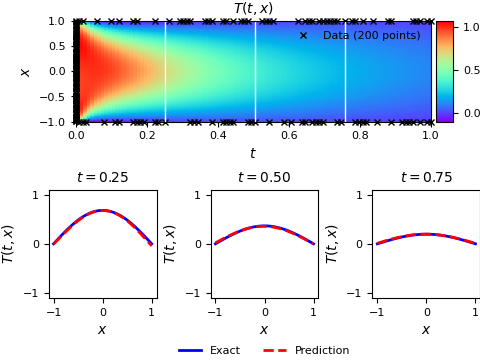

ENGLISH | [简体中文](README_CN.md)

# Contents

- [Heat Transfer PINNs Description](#heat-transfer-pinns-description)
- [Dataset](#dataset)
- [Environment Requirements](#environment-requirements)
- [Quick Start](#quick-start)
- [Script Description](#script-description)
    - [Script and Sample Code](#script-and-sample-code)
    - [Script Parameters](#script-parameters)
    - [Training Process](#training-process)
    - [Evaluation Process](#evaluation-process)

## [Heat Transfer PINNs Description](#contents)

By designing a custom loss function for standard fully-connected deep neural networks,
enforcing the known laws of physics governing the different setups, work of Raissi et al.
showed that it was possible to either solve or discover with surprisingly good accuracy Partial Differential Equations
from noisy and scarce data. The very kind that is widespread in real-life applications.

This repository reproduces the heat transfer scenario with Physics Informed Neural Networks (PINN).

<div align="center">



Figure 1. Domain results with three slices.
</div>

> [paper](https://arxiv.org/abs/1711.10561):Raissi M, Perdikaris P, Karniadakis G E.
> Physics informed deep learning (part i): Data-driven solutions of nonlinear partial differential equations[J].
> arXiv preprint arXiv:1711.10561, 2017.

## [Dataset](#contents)

The training dataset and pretrained checkpoint files will be downloaded automatically at the first launch.

The dataset is provided in file `./data/1d_transient_100.mat`, including the following variables:

- Dataset size
    - tau: (100, 1) in [0, 1]
    - eta: (256, 1) in [-1, 1]
    - theta: (100, 256)
- Data format: `.mat` files
    - Note: Data will be processed in `process.py`
- The dataset is in the `./data` directory, the directory structure is as follows:

```text
├── data
│   └── 1d_transient_100.mat
```

If you need to download the dataset and checkpoint files manually,
please visit [this link](https://download.mindspore.cn/mindscience/SciAI/sciai/model/pinn_heattransfer/).

## [Environment Requirements](#contents)

- Hardware(Ascend/GPU)
    - Prepare hardware environment with Ascend or GPU processor.
- Framework
    - [MindSpore](https://www.mindspore.cn/install/en)
- For more information, please check the resources below:
    - [MindSpore Tutorials](https://www.mindspore.cn/tutorials/en/master/index.html)
    - [MindSpore Python API](https://www.mindspore.cn/docs/en/master/index.html)

## [Quick Start](#contents)

After installing MindSpore via the official website and the required [dataset](#dataset) above, you can start training
and valuation as follows:

- running on Ascend or on GPU

Default:

```bash
python train.py
```

Full command:

```bash
python train.py \
    --layers 2 20 20 20 20 20 20 20 20 1 \
    --save_ckpt true \
    --save_fig true \
    --load_ckpt false \
    --save_ckpt_path ./checkpoints \
    --load_data_path ./data \
    --load_ckpt_path ./checkpoints/model_200adam_float32.ckpt \
    --figures_path ./figures \
    --log_path ./logs \
    --print_interval 10 \
    --ckpt_interval 10 \
    --lr 0.03 \
    --n_t 200 \
    --n_f 10000 \
    --b1 0.9 \
    --epochs 200 \
    --lbfgs false \
    --nt_epochs 200 \
    --download_data pinn_heattransfer \
    --force_download false \
    --amp_level O0 \
    --device_id 0 \
    --mode 0
```

## [Script Description](#contents)

### [Script and Sample Code](#contents)

File structures are as follows:

```text
├── pinn_heattransfer
│   ├── checkpoints                       # checkpoints files
│   ├── data                              # data files
│   │   └── 1d_transient_100.mat          # 1d transient 100 matlab dataset
│   ├── figures                           # plot figures
│   ├── logs                              # log files
│   ├── src                               # source codes
│   │   ├── network.py                    # neural network definition
│   │   ├── plot.py                       # plotting functions
│   │   └── process.py                    # data and network preparations
│   ├── config.yaml                       # hyper-parameters configuration
│   ├── README.md                         # English model descriptions
│   ├── README_CN.md                      # Chinese model description
│   ├── train.py                          # python training script
│   └── eval.py                           # python evaluation script
```

### [Script Parameters](#contents)

| parameter      | description                                  | default value                            |
|----------------|----------------------------------------------|------------------------------------------|
| layers         | neural network widths                        | 2 20 20 20 20 20 20 20 20 1              |
| save_ckpt      | whether save checkpoint or not               | true                                     |
| save_fig       | whether save and plot figures or not         | true                                     |
| load_ckpt      | whether load checkpoint or not               | false                                    |
| save_ckpt_path | checkpoint saving path                       | ./checkpoints                            |
| load_data_path | path to load data                            | ./data                                   |
| load_ckpt_path | checkpoint loading path                      | ./checkpoints/model_200adam_float32.ckpt |
| figures_path   | figures saving path                          | ./figures                                |
| log_path       | log saving path                              | ./logs                                   |
| print_interval | time and loss print interval                 | 10                                       |
| ckpt_interval  | checkpoint save interval                     | 10                                       |
| lr             | learning rate                                | 0.03                                     |
| n_t            | sampling number of training data             | 200                                      |
| n_f            | sampling number of positions in the domain   | 10000                                    |
| b1             | decay rate for first moment estimation       | 0.9                                      |
| epochs         | number of epochs                             | 200                                      |
| lbfgs          | whether use L-BFGS or not                    | false                                    |
| nt_epochs      | number pf L-BFGS epochs                      | 200                                      |
| download_data  | necessary dataset and/or checkpoints         | pinn_heattransfer                        |
| force_download | whether download the dataset or not by force | false                                    |
| amp_level      | MindSpore auto mixed precision level         | O0                                       |
| device_id      | device id to set                             | None                                     |
| mode           | MindSpore Graph mode(0) or Pynative mode(1)  | 0                                        |

### [Training Process](#contents)

- running on GPU/Ascend

  ```bash
  python train.py
  ```

  The loss values during training will be printed in the console, which can also be inspected after training in log
  file.

  ```bash
  # grep "loss:" log
  step: 0, loss: 1.1074585, interval: 23.024836778640747s, total: 23.024836778640747s
  step: 10, loss: 0.24028176, interval: 29.892443895339966s, total: 52.91728067398071s
  step: 20, loss: 0.2183091, interval: 29.853577613830566s, total: 82.77085828781128s
  step: 30, loss: 0.14730139, interval: 29.850199937820435s, total: 112.62105822563171s
  step: 40, loss: 0.068295084, interval: 29.85150957107544s, total: 142.47256779670715s
  step: 50, loss: 0.045247488, interval: 29.851693391799927s, total: 172.32426118850708s
  step: 60, loss: 0.093925714, interval: 29.878837823867798s, total: 202.20309901237488s
  step: 70, loss: 0.04949145, interval: 29.850360870361328s, total: 232.0534598827362s
  ...
  ```

- After training, you can still review the training process through the log file saved in `log_path`, `./logs` directory
  by default.

- The model checkpoint will be saved in `save_ckpt_path`, `./checkpoint` directory by default.

### [Evaluation Process](#contents)

Before running the command below, please check the checkpoint loading path `load_ckpt_path` specified
in `config.yaml` for evaluation.

- running on GPU/Ascend

  ```bash
  python eval.py
  ```

  You can view the process and results through the `log_path`, `./logs` by default.
  The result pictures are saved in `figures_path`, [`./figures`](./figures) by default.