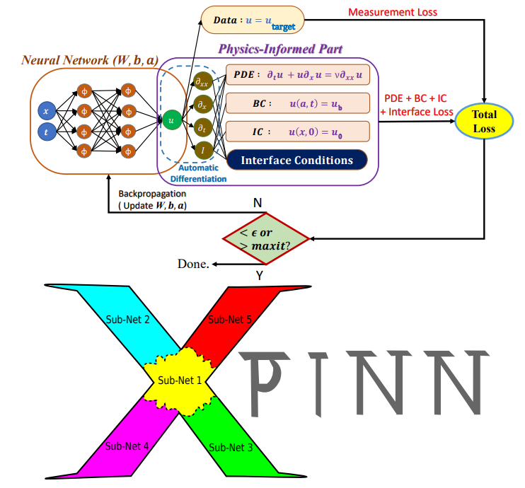

ENGLISH | [简体中文](README_CN.md)

# Contents

- [Extended PINNs (XPINNs) Description](#extended-pinns--xpinns--description)
- [Model Architecture](#model-architecture)
- [Dataset](#dataset)
- [Environment Requirements](#environment-requirements)
- [Quick Start](#quick-start)
- [Script Description](#script-description)
    - [Script and Sample Code](#script-and-sample-code)
    - [Script Parameters](#script-parameters)
    - [Training Process](#training-process)
    - [Evaluation Process](#evaluation-process)

## [Extended PINNs (XPINNs) Description](#contents)

Extended PINNs (XPINNs) is a generalized space-time domain decomposition approach for the physics-informed neural
networks (PINNs) to solve nonlinear partial differential equations (PDEs) on arbitrary complex-geometry domains.
The proposed XPINN method is the generalization of PINN and cPINN methods,
both in terms of applicability and domain decomposition approach,
which efficiently lends itself to parallelized computation.

> [paper](https://doi.org/10.4208/cicp.OA-2020-0164): A.D.Jagtap, G.E.Karniadakis, Extended Physics-Informed Neural
> Networks (XPINNs): A Generalized Space-Time Domain Decomposition Based Deep Learning Framework for Nonlinear Partial
> Differential Equations, Commun. Comput. Phys., Vol.28, No.5, 2002-2041, 2020.

Example details: XPINN code with 3 spatial subdomains for 2d Poisson‘s equations.

## [Model Architecture](#contents)



The top figure is the schematic of XPINNs subnet employed in a subdomain where neural network and physics-informed part
for viscous Burgers equation are shown.
The bottom figure shows the irregularly shaped subdomain divisions in 'X'-shaped domain, where subnet is employed in
each subdomain, and they are stitched together using the interface conditions.
In this case, the domain boundary is shown by black continuous line, whereas the interface is shown by black dash line.

## [Dataset](#contents)

The training dataset and pretrained checkpoint files will be downloaded automatically at the first launch.

Dataset used: [XPINN 2D_PoissonEqn]

- Dataset overview
    - u_exact: (1, 22387)
    - u_exact1: (1, 18211)
    - u_exact2: (1, 2885)
    - u_exact3: (1, 1291)
    - ub: (1, 6284)
    - x_f1: (1, 18211)
    - x_f2: (1, 2885)
    - x_f3: (1, 1291)
    - x_total: (1, 22387)
    - xb: (1, 6284)
    - xi1: (1, 6284)
    - xi2: (1, 6284)
    - y_f1: (1, 18211)
    - y_f2: (1, 2885)
    - y_f3: (1, 1291)
    - y_total: (1, 22387)
    - yb: (1, 6284)
    - yi1: (1, 6284)
    - yi1: (1, 6284)
- Data format: `.mat` files
    - Note: Data will be processed in process.py
- The dataset is in the `./data` directory, the directory structure is as follows:

```text
├── data
│   └─XPINN_2D_PoissonEqn.mat
```

If you need to download the dataset or checkpoint files manually,
please visit [this link](https://download.mindspore.cn/mindscience/SciAI/sciai/model/xpinns/).

## [Environment Requirements](#contents)

- Hardware(Ascend/GPU)
    - Prepare hardware environment with Ascend or GPU processor.
- Framework
    - [MindSpore](https://www.mindspore.cn/install/en)
- For more information, please check the resources below:
    - [MindSpore Tutorials](https://www.mindspore.cn/tutorials/en/master/index.html)
    - [MindSpore Python API](https://www.mindspore.cn/docs/en/master/index.html)

## [Quick Start](#contents)

After installing MindSpore via the official website and the required [dataset](#dataset) above, you can start training
and evaluation as follows:

- running on Ascend or on GPU

Default:

```bash
python train.py
```

Full command:

```bash
python train.py \
    --layers1 2 30 30 1 \
    --layers2 2 20 20 20 20 1 \
    --layers3 2 25 25 25 1 \
    --save_ckpt true \
    --save_fig true \
    --load_ckpt false \
    --save_ckpt_path ./checkpoints \
    --load_data_path ./data \
    --load_ckpt_path ./checkpoints/model_final_float32.ckpt \
    --figures_path ./figures \
    --log_path ./logs \
    --print_interval 20 \
    --ckpt_interval 20 \
    --lr 8e-4 \
    --epochs 501 \
    --download_data xpinns \
    --force_download false \
    --amp_level O3 \
    --device_id 0 \
    --mode 0
```

## [Script Description](#contents)

### [Script and Sample Code](#contents)

```text
├── xpinns
│   ├── checkpoints                                 # checkpoints files
│   ├── data                                        # data files
│   │   └── XPINN_2D_PoissonEqn.mat                 # XPINN 2D_PoissonEqn matlab dataset
│   ├── figures                                     # plot figures
│   ├── logs                                        # log files
│   ├── src                                         # source codes
│   │   ├── network.py                              # network architecture
│   │   ├── plot.py                                 # plotting results
│   │   └── process.py                              # data process
│   ├── config.yaml                                 # hyper-parameters configuration
│   ├── README.md                                   # English model descriptions
│   ├── README_CN.md                                # Chinese model description
│   ├── train.py                                    # python training script
│   └── eval.py                                     # python evaluation script
```

### [Script Parameters](#contents)

Important parameters in train.py are as follows:

| parameter      | description                                     | default value                          |
|----------------|-------------------------------------------------|----------------------------------------|
| layers1        | layer-wise width for DNN network of subdomain 1 | 2 30 30 1                              |
| layers2        | layer-wise width for DNN network of subdomain 2 | 2 20 20 20 20 1                        |
| layers3        | layer-wise width for DNN network of subdomain 3 | 2 25 25 25 1                           |
| save_ckpt      | whether save checkpoint or not                  | true                                   |
| save_fig       | whether save and plot figures or not            | true                                   |
| load_ckpt      | whether load checkpoint or not                  | false                                  |
| save_ckpt_path | checkpoint saving path                          | ./checkpoints                          |
| load_data_path | path to load data                               | ./data                                 |
| load_ckpt_path | checkpoint loading path                         | ./checkpoints/model_final_float32.ckpt |
| figures_path   | figures saving path                             | ./figures                              |
| log_path       | log saving path                                 | ./logs                                 |
| print_interval | time and loss print interval                    | 20                                     |
| ckpt_interval  | checkpoint save interval                        | 20                                     |
| lr             | learning rate                                   | 8e-4                                   |
| epochs         | number of epochs                                | 501                                    |
| download_data  | necessary dataset and/or checkpoints            | xpinns                                 |
| force_download | whether download the dataset or not by force    | false                                  |
| amp_level      | MindSpore auto mixed precision level            | O3                                     |
| device_id      | device id to set                                | None                                   |
| mode           | MindSpore Graph mode(0) or Pynative mode(1)     | 0                                      |

### [Training Process](#contents)

- running on GPU/Ascend

  ```bash
  python train.py
  ```

  The loss values during training will be printed in the console, which can also be inspected after training in log
  file.

  ```bash
  # grep "loss:" log
  step: 0, total loss: 302.36923, Loss1: 284.04446, Loss2: 1.6917802, Loss3: 16.633005, interval: 220.22029280662537s, total: 220.22029280662537s
  step: 20, total loss: 172.39247, Loss1: 155.68967, Loss2: 1.4727805, Loss3: 15.230027, interval: 11.906857013702393s, total: 232.12714982032776s
  step: 40, total loss: 49.625393, Loss1: 34.234493, Loss2: 2.4619372, Loss3: 12.928962, interval: 7.346828460693359s, total: 239.47397828102112s
  step: 60, total loss: 31.988087, Loss1: 21.279911, Loss2: 2.394319, Loss3: 8.313857, interval: 7.111770391464233s, total: 246.58574867248535s
  step: 80, total loss: 28.279648, Loss1: 19.259611, Loss2: 2.5380166, Loss3: 6.4820194, interval: 6.57047700881958s, total: 253.15622568130493s
  step: 100, total loss: 25.35678, Loss1: 17.901184, Loss2: 2.6389856, Loss3: 4.816611, interval: 6.642438173294067s, total: 259.798663854599s
  ...
  ```

- After training, you can still review the training process through the log file saved in `log_path`, `./logs` directory
  by default.

- The model checkpoint will be saved in `save_ckpt_path`, `./checkpoint` directory by default.

### [Evaluation Process](#contents)

Before running the command below, please check the checkpoint loading path `load_ckpt_path` specified
in `config.yaml` for evaluation.

- running on Ascend

  ```bash
  python eval.py
  ```

  You can view the process and results through the `log_path`, `./logs` by default.
  The result pictures are saved in `figures_path`, [`./figures`](./figures) by default.