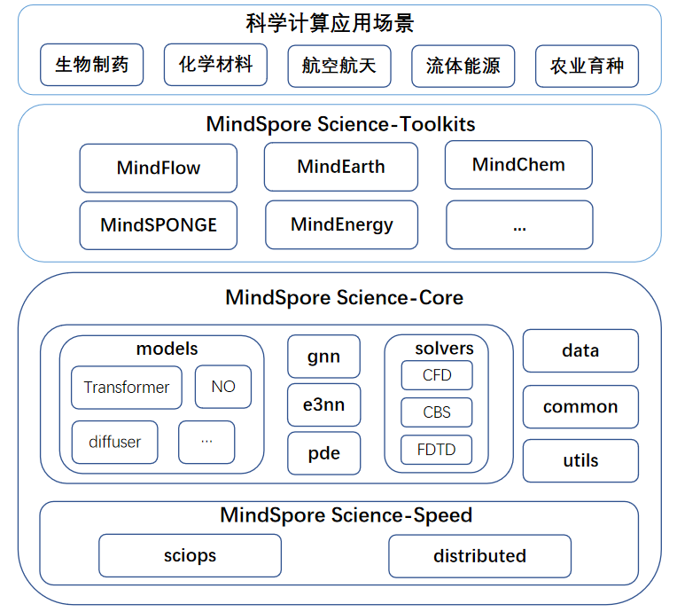

# **重构设计：  分层架构与模块化方案**

## **1. 顶层设计**

### 顶层设计目标

提供一个基于昇腾+MindSpore的高性能、高拓展性、灵活易用的针对科学计算场景的训练框架。

- **统一基础层**：抽象通用算子、网络模块、数据工具、API接口等模块，减少重复开发，统一开发维护。
- **领域专注性**：各领域套件（如MindFlow、MindEarth、MindElec）仅关注领域特定模型与案例。
- **灵活扩展**：重要功能点如混合精度、显存优化、并行策略、性能监测等，模块化、可插拔设计，自由组合，支持新领域快速接入，最小化开发成本。
- **生态兼容**：与MindSpore框架、昇腾硬件深度集成，利用MindSpore框架的图优化、自动并行等特性，基于昇腾硬件深度优化算子性能。

### 设计原则

1.开放扩展性
- 提供清晰的接口规范（`ParallelStrategy`、`MemoryTechnique`、`PrecisionManager`、`GradientController`等）
- 支持注册自定义实现（`register_strategy()`，`register_memory_tech()`）

2.透明可观测
- 内置详尽的性能分析工具
- 所有优化操作可追溯、可禁用

3.渐进式抽象
- 基础模式：直接配置驱动（YAML）
- 高级模式：细粒度API控制
- 专家模式：直接访问底层组件

4.领域友好
- 物理约束、数值方法等作为可插拔组件
- 保留科学计算特有的控制流（如PINNS）

5.性能优先
- 所有抽象层保持零开销原则
- 关键路径直接调用MindSpore原生接口

### 整体架构设计

MindSpore Science-Core的代码架构设计如下图：



MindScience套件的核心框架为`MindSpore Science-Core`，`MindSpore Science-Core`之上为领域套件，包括`MindFlow`、`MindEarth`等。
- **注意**：`gnn`和`e3nn`库包含了数据接口/网络等，内容较多，作为独立模块统一开发管理更为合理，能对齐业界方式。
- `MindSpore Science-Core`框架的底层为`speed`加速模块，包含了`sciops`和`distributed`。
- `sciops`目录包含两部分，区别于MindSpore的ops库，使用方式：`from mindscience import sciops`。
- - 对接了`speed`模块.so文件的自定义算子接口，对应ccsrc目录，使用AscendC实现了`EvoformerAttn`、`FFT`等底层加速算子，不开源的代码开放.so文件。
- - Python算子接口为基于Python开发的算子，如自动微分、`FFT`、`Irreps`、`SSM`、`FA`等算子。
- `distributed`为并行加速模块，提供科学计算领域常用的并行接口，包括DP/OP/TP/PP等功能。
- `gnn`模块包含了图数据接口和常用GNN网络。
- `pde`模块包含了PINNs网络接口。
- `e3nn`模块包含了等变计算的数据接口和网络层。
- `models`为通用模型库，包含`transformer`、`diffusion`、`FNO`等模型。
- `data`为数据接口模块，`data`目录下按照套件区分子目录，如`elec`包含电磁领域通用数据集，`flow`包含流体领域通用数据集，`earth`包含气象领域通用数据集。
- `solvers`为求解器模块，包含`CFD`、`CBS`等接口。
- `common`为通用接口模块，包含`optimizer`、`scheduler`、`math`、`loss`等通用接口。
- `utils`为工具模块，包含工具类接口，如`logging`、文件读取接口等。

`tests`为测试模块，包含框架的UT、ST用例，大部分为UT用例，由于门禁对用例时长有限制，端到端的ST用例主要在本地看护。

## **2. 目录结构重构**

```bash
mindscience/
├── docs/                       # 统一文档
│   ├── architecture/           # 软件架构
│   ├── feature/                # 特性文档
├── cmake/                      # 编译配置
├── setup.py                    # 版本依赖
├── build.sh                    # 编译脚本
├── docker/                     # docker配置
│   ├── Dockerfile     
├── mindscience/
│   ├── common/                 # 通用基础模块
│   │   ├── schedulers          # Learning rate schedulers
│   │   ├── geometry            # 统一物理层接口
│   │   │   ├── primitives_1d/  # Interval
│   │   │   ├── primitives_2d/  # Rectangle, Disk, Triangle, Polygon
│   │   │   ├── primitives_3d/  # Cuboid, Cylinder, Cone, Tetrahedron
│   │   │   ├── primitives_nd/  # HyperCube, FixedPoint
│   │   ├── optimizers/         # 优化器（如LBFGS/PINNs优化器，AdaHessian二阶优化器）   
│   │   ├── metrics/            # 领域指标
│   │   │   ├── fid.py
│   │   │   ├── accuracy        
│   │   ├── losses/             # 损失函数（L2、物理约束损失）
│   ├── data/                   # 通用数据集模块
│   │   ├── elec/               # 通用电磁数据接口    
│   │   ├── earth/              # 通用气象数据接口
│   │   ├── flow/               # 通用流体数据接口
│   ├── ccsrc/                  # 底层算子文件
│   │   ├── api/                # api实现
│   │   │   ├── python/         # 链接代码
│   │   │   ├── so/             # 预编译so文件
│   │   ├── include/            # 预编译so文件
│   │   ├── CMakeLists.txt      # CMAKE
│   ├── sciops/                 # 通用算子库（加速算子、融合算子等）
│   │   ├── einsum.py           # einsum实现
│   │   ├── differential.py     # gradient, divergence    
│   │   ├── evoformer_attention.py  # evoformer实现    
│   │   ├── dft.py              # DFT实现
│   ├── gnn/                    # GNN模型库
│   │   ├── graph.py            # 图数据接口
│   │   ├── gat.py              
│   │   ├── gcn.py          
│   ├── e3nn/                   # 等变计算库
│   │   ├── equivariant.py      # 等变网络层
│   │   ├── irreps.py           # 不可约表示（Irreps）定义
│   ├── pde/                    # PINNS库
│   │   ├── pde_node.py         # PDE定义
│   │   ├── pde_loss.py         # PDE类实现
│   ├── models/                 # 跨领域可复用基础神经网络模块
│   │   ├── neural_operator/    # 通用神经算子库
│   │   │   ├── fno.py              
│   │   │   ├── kno.py          
│   │   │   └── sno.py 
│   │   ├── transformer/        # transformer模型
│   │   │   ├── attention.py    # 自注意力网络层
│   │   │   ├── ViT.py          # ViT
│   │   │   ├── DiT.py          # DiT
│   │   ├── diffuser/           # 扩散模型
│   │   │   ├── ddpm.py/        # DDPM扩散模型
│   │   │   ├── ddim.py/        # DDIM扩散模型
│   │   ├── layers/             # 扩散模型
│   │   │   ├── mlp.py          # MLP
│   │   │   ├── kan.py          # KAN
│   │   │   ├── siren.py        # siren
│   │   ├── PDEFormer/ 
│   │   ├── GraphCast/
│   │   └── pangu/  
│   ├── solvers/                # 通用求解器框架
│   │   ├── base_solver.py      # Solver抽象基类
│   │   ├── cbs.py              
│   │   ├── cfd.py   
│   │   ├── fdtd.py              
│   │   └── ...                 # 通用求解策略（如迭代求解、自适应步长）
│   ├── utils/                  # 统一工具API入口
│   │   ├── logging/            # 日志
│   │   ├── config/  
│   │   ├── visualization/      # 画图
│   │   ├── io/                 # IO
│   │   ├── config.py           # 配置管理
│   │   └── export.py           # 模型导出工具（ONNX、MindIR）
│   ├── constants.py            # 常量   
│   │ 
├── mindflow/                   # 计算流体动力学套件
│   ├── utils/                  # 领域模型（如PINNs、FNO）
│   ├── applications/           # 应用案例（圆柱绕流、湍流模拟）
│   │   ├──src/                 # 案例源文件
│   │   ├──train.py             # 训练脚本
│   └── ...                     # 领域特定工具（如边界条件生成）
│   │
├── mindelec/                   # 计算电磁套件
│   ├── utils/                  # 电磁模型
│   ├── applications/       
│   │   ├──src/                 # 案例源文件
│   │   ├──train.py             # 训练脚本
│   └── ...                 
│   │ 
├── mindchemistry/              # 计算化学套件
│   ├── utils/                  # 化学模型
│   ├── applications/      
│   │   ├──src/                 # 案例源文件
│   │   ├──train.py             # 训练脚本
│   └── ...        
│  
├── owner                         
│
├── tests/                          # 分层测试
│   ├── utils/                      # 辅助函数
│   ├── ut/                         # 单元测试用例
│   │   ├── common/                 # 通用接口
│   │   ├── data/                   # 数据接口
│   │   ├── sciops/                 # 底层算子
│   │   ├── models/                 # 模型库
│   │   ├── solvers/                # 求解器
│   │   ├── e3nn/                   # 等变计算库
│   │   ├── gnn/                    # GNN
│   │   ├── pde/                    # pinns
│   │   ├── distributed/            # 并行策略
│   │   ├── utils/                  # 工具
│   ├── st/                         # ST测试用例
│   │   ├── sciops/                 # 底层算子
│   │   ├── models/                 # 模型库
│   │   ├── solvers/                # 求解器
│   │   ├── e3nn/                   # 等变计算库
│   │   ├── gnn/                    # GNN
│   │   ├── pde/                    # pinns
│   │   ├── distributed/            # 并行策略

```


## **3. 核心模块设计**

### **(1) 通用API接口（mindscience/common）**
- **功能**：提供通用接口，如学习率、数学运算、优化器、并行等接口。
- **示例**：
```python
    # mindscience/core/lr.py
    def get_warmup_cosine_annealing_lr():
    ...

    # mindscience/core/math.py
    def get_grid_2d(resolution):

    class AdaHessian():

    ...

```

### **(2) 通用数据接口（mindscience/data）**
- **功能**：提供数据通用接口，包括流体/气象数据等接口。
- **示例**：
  ```python
    # mindscience/data/base.py
    class BaseDataset:
        def __init__(self, data_path, split_ratio=(0.7, 0.2, 0.1)):
            self.data_path = data_path
            self.split_ratio = split_ratio
        
        @abstractmethod
        def load_data(self):
            """加载原始数据（需子类实现）"""
        
        def preprocess(self):
            """默认预处理（子类可覆盖）"""
        
        def split(self):
            """按比例划分数据集"""

    # 领域套件实现示例（MindSponge）
    class ProteinDataset(BaseDataset):
        def load_data(self):
            self.raw_data = read_pdb(self.data_path)
        
        def preprocess(self):
            self.graph_data = pdb_to_graph(self.raw_data)
  ```

### 算子层（mindscience/sciops）**
- **功能**：提供基于MindSpore开发的科学计算算子，包括底层融合算子和Python算子。

#### 算子层（mindscience/sciops）**
- **功能**：提供基于Python开发的科学计算算子。
- **示例**：
  ```python
  # mindscience/models/ops/fno.py
  def hessian():

  ```
#### **(3) 底层融合算子（mindscience/ccsrc）**
- **功能**：提供自定义算子的共享so文件，不开源，供给`sciops`层调用。主要涉及核心数值计算、物理仿真和科学计算基础算子等计算密集型、需要高度优化的算子，如DFT、矩阵分解、微分、信号处理等算子。MindSpore使用pybind11连接Python侧的接口和C++侧的接口，兼顾Python的简单便捷和C++的高性能，无缝继承numpy，减少数据拷贝。采用CPython解释器实现，会有GIL(Global Interpreter Lock，全局解释器锁)，多线程并不能利用多核优势。可以通过换其他解释器，或者通过c++实现真正的多线程。
- **示例**：
  ```C++
    #include "frontend/ops/ops.h"
    #include <string>
    #include "include/core/utils/python_adapter.h"
    #include "pipeline/jit/ps/parse/data_converter.h"

    namespace mindspore {
    // namespace to support primitive operators
    namespace prim {
    ValuePtr GetPythonOps(const std::string &op_name, const std::string &module_name, bool use_signature) {
    py::object obj = python_adapter::GetPyFn(module_name, op_name);
    ValuePtr node = nullptr;
    bool succ = parse::ConvertData(obj, &node, use_signature);
    if (!succ) {
        MS_LOG(INTERNAL_EXCEPTION) << "Get Python op " << op_name << " from " << module_name << " fail.";
    }
    return node;
    }
    }  // namespace prim
    }  // namespace mindspore

  ```


### 通用PINNS库（mindscience/pde）**
- **功能**：封装可复用的PINNS接口，供各个领域使用。
- **示例**：
  ```python
  # mindscience/models/transformer/attention.py
  class PdeNode:
      """PDE节点定义"""
      def __init__(self, use_flash=False):
          ...
      
      def construct(self, q, k, v):
          ...

  # mindscience/models/pde/diffusion.py
  class PDEWithLoss:
      def __init__(self, use_flash=False):
          ...
      
    def pde(self):
        """
        Governing equation based on sympy, abstract method.
        This function must be overridden, if the corresponding constraint is governing equation.
        """
        return None

    def get_loss(self):
        """
        Compute all loss from user-defined derivative equations. This function must be overridden.
        """
        return None

    def parse_node(self, formula_nodes, inputs=None, norm=None):
        ...
  ```


#### 并行加速库（mindscience/distributed）**
- **功能**：并行训练接口。
- **示例**：
  ```python
  # mindscience/models/transformer/attention.py
  class Op:
      """PDE节点定义"""
      def __init__(self, use_flash=False):
          ...

  # mindscience/models/pde/diffusion.py
  class Tp:
      def __init__(self,):
          ...
      

  ```

### **(4) 神经网络基础层（mindscience/models）**
在`sciops`层之上，封装可复用的网络模块，继承自`nn.Cell`，供各个领域使用。

#### 通用Transformer库（mindscience/models/transformer）**
- **功能**：封装可复用的Transformer模块，供各个领域使用。
- **示例**：
  ```python
  # mindscience/models/gnn/Gat.py
  class Transformer:
      def __init__(self, use_flash=False):
          ...
      
      def construct(self, q, k, v):
          ...

  # mindscience/models/gnn/Gcn.py
  class Attention:
      def __init__(self, use_flash=False):
          ...
      
      def construct(self, q, k, v):
          ...
  ```

#### 通用diffusion库（mindscience/models/diffuser）**
- **功能**：封装可复用的diffusion模块，供各个领域使用。
- **示例**：
  ```python
  # mindscience/models/diffusion/ddpm.py
  class DDPM:
      def __init__(self, use_flash=False):
          ...
      
      def add_noise(self, q, k, v):
          ...

  ```

#### 通用网络层库（mindscience/models/layers）**
- **功能**：封装可复用的diffusion模块，供各个领域使用。
- **示例**：
  ```python
  # mindscience/models/diffusion/ddpm.py
  class MLP:
      def __init__(self,):
          ...
      
      def add_noise(self, x):
          ...

  ```

### 通用等变计算库（mindscience/e3nn）**
- **功能**：封装可复用的等变计算接口，供各个领域使用。
- **示例**：
  ```python
    # mindscience/models/e3nn/irreps.py
    class Irreps:
        """不可约表示（兼容e3nn语法）"""
        def __init__(self, irreps_str):
            self.irreps = self._parse(irreps_str)
        
        def _parse(self, s):
            # 解析字符串如 "5x0e + 3x1o"
            ...

    # core/nn/layers/equivariant/modules/gated_block.py
    class GatedEquivariantBlock(nn.Cell):
        """门控等变块（类似e3nn.GatedBlock）"""
        def __init__(self, irreps_in, irreps_out):
            super().__init__()
            self.scalar_nn = nn.SequentialCell([
                nn.Dense(irreps_in.scalar_dim, 64),
                nn.GELU(),
                nn.Dense(64, irreps_out.scalar_dim)
            ])
            self.gate_nn = nn.Dense(irreps_in.vector_dim, irreps_out.gate_dim)
        
        def construct(self, x_scalar, x_vector):
            gate = self.gate_nn(x_vector)
            scalar_out = self.scalar_nn(x_scalar) * gate
            return scalar_out, x_vector

    # core/nn/layers/equivariant/e3nn_adapter.py
    def einsum(equation, *tensors):
        """兼容PyTorch的einsum语法"""
        return ops.Einsum(equation)(*tensors)

    def spherical_harmonics(l, x):
        """球谐函数（基于MindSpore实现）"""
        # 替换e3nn的PyTorch实现
        ...
  ```

### 通用GNN库（mindscience/gnn）**
- **功能**：封装可复用的GNN模块，供各个领域使用。
- **示例**：
  ```python
    class Graph:
        def __init__(self, nodes, edges, node_feat, edge_feat):
            self.nodes = nodes          # 节点ID列表
            self.edges = edges          # 边列表 (, dst)
            self.node_feat = node_feat  # 节点特征张量
            self.edge_feat = edge_feat  # 边特征张量
        
        def to_mindspore_tensor(self):
            """转换为MindSpore张量格式"""

    # 图采样器示例
    class NeighborSampler:
        def sample(self, graph, target_nodes, k_hop=2):
            """从图中采样k-hop邻居子图"""
  ```


### **(5) 求解器框架（mindscience/solvers）**
- **功能**：定义通用求解器框架。
- **示例**：
  ```python
  # core/solvers/base_solver.py
  class BaseSolver(nn.Cell):
      def __init__(self, model, optimizer, loss_fn):
          self.model = model
          self.optimizer = optimizer
          self.loss_fn = loss_fn
      
      def train_step(self, data):
          # 标准训练步骤（前向、损失、反向）
          ...
      
      def solve(self, inputs):
          # 推理接口
          return self.model(inputs)
  ```

### **(6) 工具接口（mindscience/utils）**
- **功能**：定义通用求解器框架。
- **示例**：
  ```python
  # mindscience/utils/logging.py
  class Logger(nn.Cell):
      def __init__(self, ):
          ...

  ```

---

## **4. 领域套件设计（以MindFlow为例）**

### **(1) 领域工具（mindflow/utils）**
- **职责**：领域专用工具（如流场可视化、边界条件生成）。
- **示例**：
  ```python
  # mindflow/utils/visualization.py
  def plot_velocity_field(data, pred):
      """绘制速度场对比图"""
      ...
  ```

### **(2) 应用案例（mindflow/applications）**
- **职责**：提供端到端案例（数据、训练、可视化）。
- **示例**：
  ```python
  # mindflow/applications/cylinder_flow/train.py
  def train_cylinder_flow():
      # 加载数据
      data = load_data("cylinder_dataset.h5")
      # 初始化模型（使用core模块组件）
      model = PINNs(MLP(input_dims=3, hidden_dims=[128, 128]))
      solvers = BaseSolver(model, Adam(model.params()), MSE())
      # 训练与评估
      solvers.train(data, epochs=1000)
      solvers.export("cylinder_model.mindir")
  ```

---

## **5. 依赖管理与构建优化**
### **(1) 模块化安装**
- **setup.py 配置**：
  ```python
  # 支持按需安装
  extras_require={
      "mindflow": ["matplotlib", "h5py"],
      "mindsponge": ["biopython"],
      "all": ["matplotlib", "h5py", "biopython"]
  }
  ```

### **(2) 动态导入机制**
- **延迟加载领域模块**：
  ```python
  # core/api/__init__.py
  def get_solver(solver_type):
      if solver_type == "mindflow":
          from mindflow.solvers import FlowSolver
          return FlowSolver
      elif solver_type == "mindsponge":
          from mindsponge.solvers import MDsolver
          return MDsolver
  ```

---

## **6. 测试与文档策略**

### **(1) 门禁测试**
gitee门禁上需要大修改，要联系门禁组增加需求。
- **基础模块测试**：覆盖core下的所有算子与组件。
  ```python
  # tests/core/test_attention.py
  def test_multihead_attention():
      attn = MultiHeadAttention(use_flash=True)
      output = attn(q, k, v)
      assert output.shape == expected_shape
  ```
测试目录

- **领域测试**：验证领域模型与案例。
  ```python
  # tests/mindflow/test_pinn.py
  def test_pinn_convergence():
      loss = train_pinn(...)
      assert loss < 1e-3
  ```

### **(2) 文档统一化**

当前每个领域套件都有自己的一个页面，展示案例和API，重构后每个套件只展示领域案例，框架的API统一展示。

- **API文档**：使用Sphinx自动生成，按模块分层展示。
- **案例教程**：为每个领域套件提供Jupyter Notebook示例。

---

## **7. 性能优化与生态集成**

### **(1) MindSpore特性利用**
- **图算融合**：通过`nn.Cell`、`@ms_function`、`@lazy_inline`、`@jit`、`@jit_class`优化计算图。
- **原生并行**：在底层集成分布式策略，领域套件无需关注细节。
  ```python
  # core/parallel/config.py
  def auto_parallel(model, data_parallel=4, model_parallel=2):
      model = auto_parallel(model)
      ...
  ```

### **(2) 软硬件适配**

主要针对Ascend910B+Mindspore2.6.0版本

- **多后端支持**：在core层封装CPU/Ascend算子差异。
  ```python
  # mindscience/models/ops/math_ops/fft.py
  def fft2d(x):
      if get_device() == "CPU":
          return cufft.fft2d(x)
      else:
          return ascend_fft.fft2d(x)
  ```

---

## **8. 实施步骤**
由于`MindEnergy`套件开源的需求急迫，因此先按照重构后的方式开发`MindEnergy`套件。
1. **代码分层拆分**  
   - 将现有代码按功能拆分为`mindscience`核心模块和领域套件。
2. **接口标准化**
   - 定义通用基类（如`BaseSolver`）并重构现有模型。
3. **依赖解耦**  
   - 确保领域套件仅依赖`mindscience`，无横向依赖。
4. **测试迁移**  
   - 将原有测试按模块归属迁移到对应的`tests/modules`和`tests/mindflow`等。
5. **CI/CD适配**  
   - 更新CI流程，分模块运行测试与构建。
6. **文档迁移与更新**  
   - 重构文档结构，突出分层设计。

## **9. 负责人**

### 责任田负责人：

责任田负责人负责模块的开发合入，相关代码的重构和合入优先找特性的第一责任人开发，其次找对应领域的开发人员。

```bash
│   │   ├── common/             # 通用接口，负责人：王博
│   │   ├── data/               # 数据接口，负责人：思宇
│   │   ├── sciops/             # 底层算子，负责人：敬恒
│   │   ├── e3nn/               # 等变计算库，负责人：思宇
│   │   ├── gnn/                # GNN库，负责人：孟庆鹤
│   │   ├── pde/                # GNN库，负责人：孟庆鹤
│   │   ├── models/             # 模型，负责人：郭伯强
│   │   ├── distributed/        # 求解器，负责人：海宁
│   │   ├── solvers/            # 求解器，负责人：海宁
│   │   ├── utils/              # 工具接口，负责人：敏妍
│   │   ├── docs/               # 文档，负责人：阳扬
```

### 领域负责人

领域owner：流体—孟庆鹤，气象—周传赛，化学—杨思宇，生物—王博

### committer

committer：刘红升、郭伯强、张毅、龚玥

---

## **总结**
通过以上设计，MindScience将实现**高内聚、低耦合**的架构，各领域套件可快速复用核心能力，同时专注于领域创新。此方案平衡了灵活性与统一性，为后续扩展（如新增MindEnergy套件）提供了清晰路径。