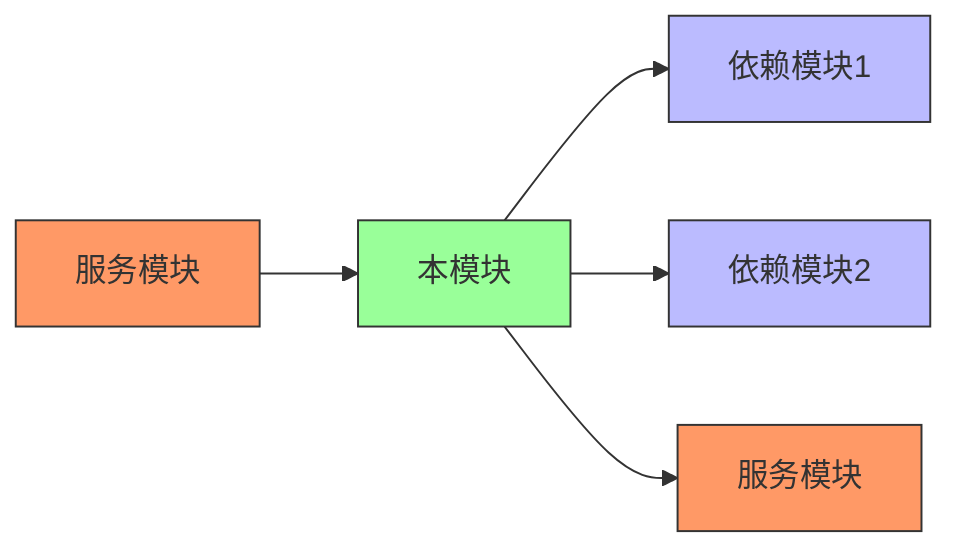
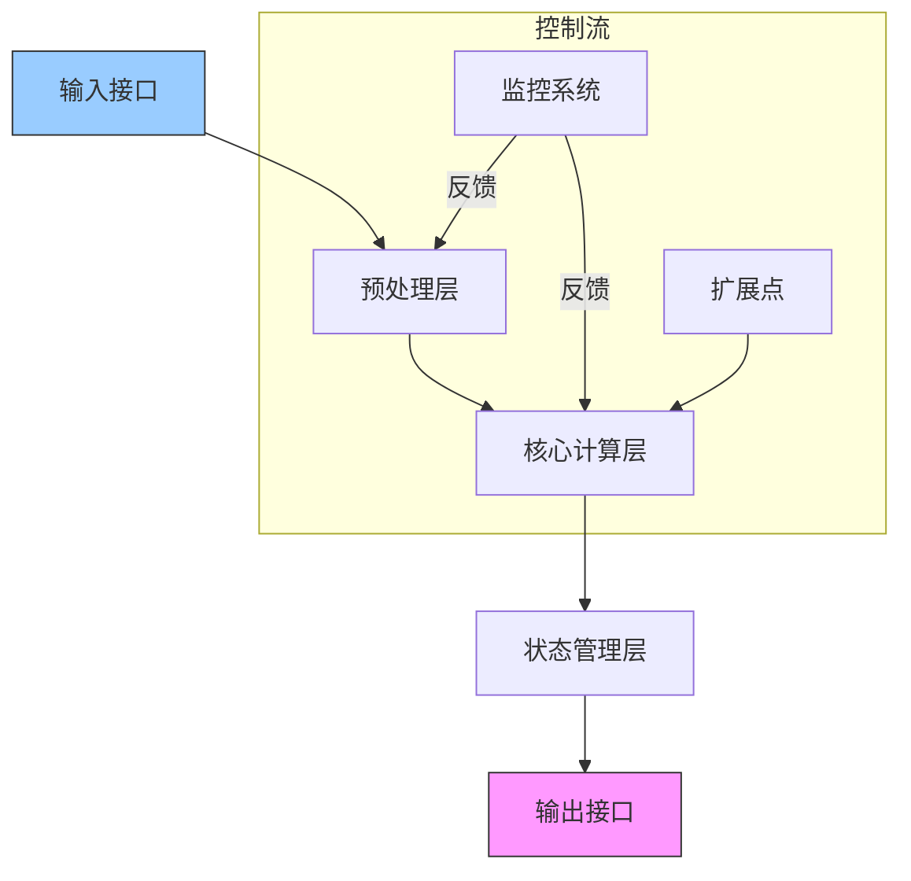
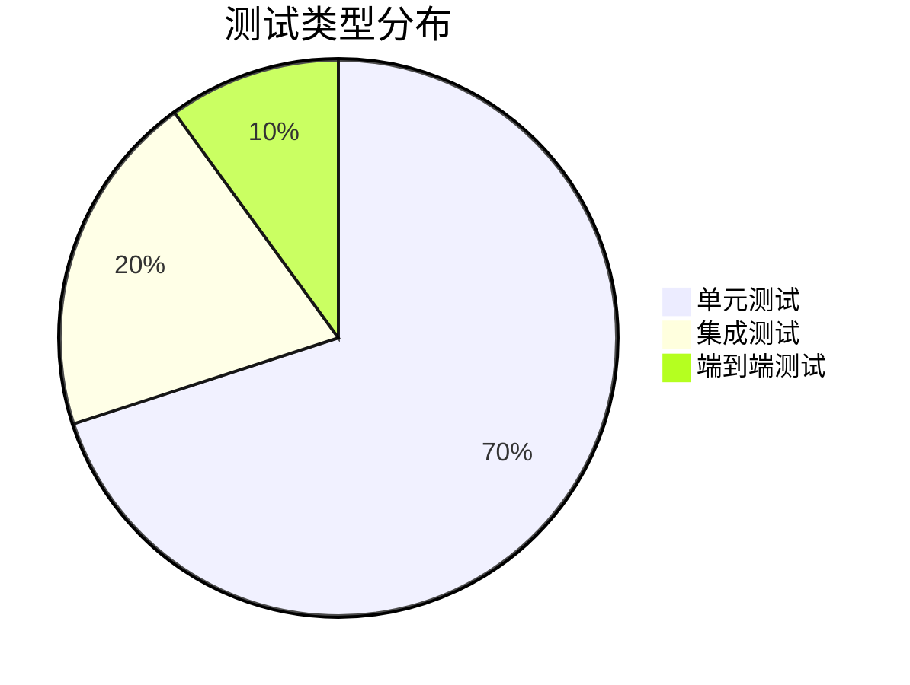

# MindScience 模块设计文档模板

```markdown
# [模块名称] 设计文档

**模块路径**: `mindscience/[module_name]`  
**最新版本**: v1.0.0  
**维护者**: [负责人姓名]  
**最后更新**: YYYY-MM-DD
```

## 1. 模块概述

### 1.1 定位与职责
> 描述本模块在MindScience框架中的核心定位和主要职责

- **核心功能**：
  - 功能点1
  - 功能点2
  - 功能点3

- **边界范围**：
  - 包含的功能
  - 不包含的功能（由其他模块负责）

### 1.2 设计目标
> 明确本模块的设计目标和关键指标

| 目标类型 | 具体目标 | 衡量指标 |
|----------|----------|----------|
| 性能 | 高效处理科学计算任务 | 计算延迟 ≤ 50ms (典型场景) |
| 扩展性 | 支持新算法/模型快速接入 | 新增组件时间 ≤ 2人日 |
| 易用性 | 提供简洁API接口 | API复杂度评分 ≤ 3.0 |
| 内存效率 | 优化显存使用 | 显存占用减少 ≥ 30% |

### 1.3 模块关系


## 2. 架构设计

### 2.1 整体架构


### 2.2 核心组件

| 组件名称 | 职责 | 设计原则 | 性能要求 |
|----------|------|----------|----------|
| 组件A | 核心计算功能 | 单一职责 | 吞吐量 ≥ 1000 ops/s |
| 组件B | 状态管理 | 无状态设计 | 访问延迟 ≤ 5ms |
| 组件C | 预处理 | 可插拔架构 | 处理速度 ≥ 500 MB/s |

## 3. 接口设计

### 3.1 公共API接口

```python
class CoreModule:
    """
    核心功能模块
    
    Args:
        config: 模块配置字典或文件路径
        precision: 计算精度 ('fp32', 'fp16', 'bf16')
    
    Example:
        >>> module = CoreModule(config='default.yaml')
        >>> result = module.process(input_data)
    """
    
    def __init__(self, config: Union[dict, str], precision: str = 'fp32'):
        self.config = self._load_config(config)
        self.precision = precision
        
    @mindspore.jit
    def process(self, inputs: Tensor) -> Tensor:
        """
        核心处理方法
        
        Args:
            inputs: 输入张量，形状为 [B, C, H, W]
            
        Returns:
            处理结果张量，形状为 [B, O]
        """
    
    def save_state(self, path: str):
        """保存模块状态"""
    
    def load_state(self, path: str):
        """加载模块状态"""
```

### 3.2 配置参数规范

```yaml
# 模块配置示例
module:
  core_param: 0.5  # 核心参数说明
  optimization:
    level: 2       # 优化级别 (1-3)
    memory_save: true
  extensions:
    - name: custom_plugin
      params: {...}
```

### 3.3 回调接口

```python
def register_callback(self, event: str, callback: Callable):
    """
    注册事件回调
    
    Args:
        event: 事件类型 ('pre_process', 'post_update', ...)
        callback: 回调函数，签名为 func(data: dict) -> None
    """
```

## 4. 测试策略

### 4.1 测试金字塔



### 4.2 性能基准

| 测试场景 | 输入规模 | 预期延迟 | 内存占用 | 通过标准 |
|----------|----------|----------|----------|----------|
| 场景A | 1024x1024 | ≤50ms | ≤500MB | 波动<10% |
| 场景B | 2048x2048 | ≤200ms | ≤1.5GB | 波动<5% |
| 极限场景 | 4096x4096 | ≤800ms | ≤4GB | 不崩溃 |

### 4.3 科学正确性验证

```python
def test_scientific_correctness():
    """科学正确性验证用例"""
    # 给定已知输入
    test_input = create_test_case() 
    
    # 执行计算
    result = module.process(test_input)
    
    # 验证物理约束
    assert conservation_law(result) == expected_value
    assert boundary_condition(result) is_satisfied
```

## 5. 使用示例

### 5.1 基础用法

```python
from mindscience.[module] import CoreModule

# 初始化模块
config = {
    'param1': 0.7,
    'optimization': {'level': 2}
}
module = CoreModule(config, precision='fp16')

# 执行计算
input_data = load_scientific_data()
result = module.process(input_data)

# 保存状态
module.save_state('model_state.ckpt')
```

### 5.2 高级用法

```python
# 自定义插件
class CustomPlugin(ExtensionPoint):
    def apply(self, data):
        # 自定义处理逻辑
        return enhanced_data

# 注册插件
module.add_extension('data_enhancer', CustomPlugin())

# 分布式执行
dist_module = module.to_distributed(strategy='model_parallel')
dist_result = dist_module.process(large_dataset)
```

### 5.3 典型科学计算场景

```python
# 物理仿真场景
def physics_simulation():
    # 初始化求解器
    solver = SolverModule(physics_config)
    
    # 设置初始条件
    initial_state = load_initial_conditions()
    
    # 时间步进求解
    for t in time_steps:
        state = solver.step(state, dt)
        
        # 实时监控
        if t % 100 == 0:
            visualize(state)
    
    return final_state
```

## 6. 未来规划

### 6.1 短期路线图 (v1.x)

| 功能 | 优先级 | 预期版本 | 状态 |
|------|--------|----------|------|
| GPU加速优化 | 高 | v1.1 | 规划中 |
| 新增算法X | 中 | v1.2 | 设计中 |
| API简化 | 高 | v1.1 | 开发中 |

### 6.2 长期愿景 (v2.0+)

- 量子计算支持
- 跨平台部署能力
- 自动微分增强
- 科学知识图谱集成

## 附录

### A. 术语表

| 术语 | 解释 |
|------|------|
| PDE | 偏微分方程 |
| FNO | 傅立叶神经算子 |
| PINN | 物理信息神经网络 |

### B. 参考资源

1. [MindSpore官方文档](https://www.mindspore.cn)
2. [科学计算最佳实践]()
3. [模块设计原理]()
```
---

## 各模块设计要点指南

### 通用设计原则
1. **模块化**：每个模块保持高内聚、低耦合
2. **可配置**：通过配置文件控制模块行为
3. **可扩展**：提供标准扩展接口
4. **性能优先**：科学计算场景性能敏感
5. **科学正确**：确保数值计算准确性

```
### 模块特定要点

#### 1. models 模块
```markdown
### 1.1 定位与职责
- 提供科学计算领域预置模型架构
- 实现模型生命周期管理

### 1.2 公共API接口
class ModelFactory:
    @staticmethod
    def create(model_type: str, config: dict) -> nn.Cell:
```

#### 2. solver 模块
```markdown
### 2.1 定位与职责
- 微分方程求解器实现
- 提供统一求解接口

### 2.2 关键算法
- 有限元法(FEM)
- 有限体积法(FVM)
- 谱方法
```

#### 3. sciops 模块
```markdown
### 3.1 定位与职责
- 科学计算专用算子库
- 高性能数学运算实现

### 3.2 性能优化技术
- 自动微分优化
- 稀疏矩阵加速
```

#### 4. data 模块
```markdown
### 4.1 定位与职责
- 科学数据加载与预处理
- 数据增强管道

### 4.2 数据格式规范
- 支持HDF5/NetCDF科学数据格式
- 统一数据接口规范
```

#### 5. common 模块
```markdown
### 5.1 定位与职责
- 框架基础组件
- 工具函数集合

### 5.2 公共API接口
class ScientificConfig:
    @classmethod
    def load(cls, path: str) -> dict:
```

#### 6. distributed 模块
```markdown
### 6.1 定位与职责
- 分布式训练支持
- 混合并行策略

### 6.2 分布式支持
- 数据并行
- 模型并行
- 流水线并行
```

### 文档维护要求
1. **版本同步**：代码变更时及时更新文档
2. **示例验证**：所有文档示例需通过测试
3. **接口完整**：公共API 100%文档覆盖
4. **性能追踪**：记录关键性能指标历史
5. **变更记录**：维护文档变更日志

此模板为MindScience重构提供了标准化的设计文档结构，确保各模块设计一致性和开发效率。每个模块设计时应重点关注其科学计算领域的特殊需求，同时保持框架整体的统一架构。